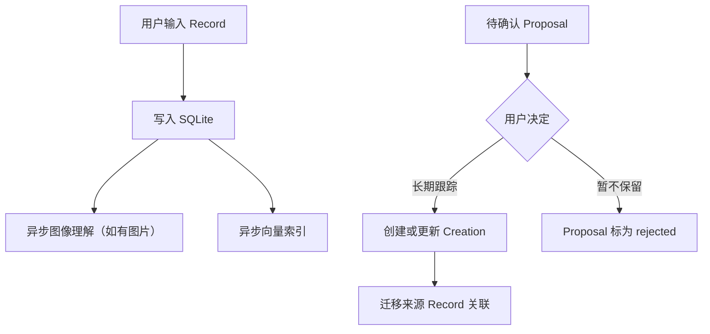

# Fanto

Fanto 是一个 AI 碎片思考助手，帮助用户随手留下想法，并把零散记录逐渐整理成可以继续生长的长期话题。

它不是一个要求你先分类、先打标签、先写完整的笔记工具。Fanto 的设计出发点是：人在真实生活里产生想法时，往往只有一句话、一个判断、一段情绪或一个还没成形的念头。记录应该先发生，整理可以交给后台慢慢完成。

## 项目目标

Fanto 想验证一件事：

> 如果用户只负责自然表达，AI 是否能持续理解这些碎片，并把它们连接成有价值的 Topic？

MVP 重点关注三类体验：

- 快速捕获：不分类、不选择模板，直接输入。
- 后台整理：AI 判断 Record 应该合并到已有 Topic、创建新 Topic，或暂时保留。
- 持续思考：用户可以打开 Topic 阅读整理后的内容，也可以继续对话、补充和修正。

## 核心价值

- 降低记录门槛，让想法先留下来。
- 保留原文，不用 AI 覆盖用户真实表达。
- 把孤立记录整理成长期主题，而不是只做标签分类。
- 让 Topic 成为可以继续讨论、迭代和沉淀的思考空间。

## 当前形态

项目当前处于 MVP 验证阶段：

- 后端：Hono + TypeScript + SQLite + Kysely + pi-agent-core。
- 向量索引：`sqlite-vec`，与业务数据保存在同一个 SQLite 文件中。
- 客户端：当前已保留并接入的是 `apps/ios/fanto` 原生 iOS 客户端。旧 `apps/h5` 源码已从工作区移除，重建方案见 `plan/2026-09-14-h5-ios-server-parity/`；微信小程序、Android 仍是后续范围。

## 当前运行链路



Record 是用户原始输入；Creation 是长期跟踪的脉络。当前运行入口不自动整理 Record 或生成 Proposal，Proposal 由现有数据提供读取和用户确认流程。

## 本地启动

安装依赖：

```bash
pnpm install
```

准备环境变量：

```bash
cp apps/server/.env.example apps/server/.env
```

执行数据库迁移：

```bash
pnpm db:migrate
```

启动后端：

```bash
pnpm dev
```

默认服务地址：

```text
http://127.0.0.1:3000
```

健康检查：

```bash
curl http://127.0.0.1:3000/health
```

## 常用命令

```bash
pnpm typecheck
pnpm db:migrate
pnpm vector:rebuild
pnpm dev
```

## 文档

- [当前实现文档](docs/README.md)
- [架构与运行边界](docs/architecture.md)
- [HTTP API](docs/api/http-api.md)
- [已知边界](docs/known-limitations.md)

## MVP 取舍

当前阶段优先简单但功能完整：

- 不单独启动向量数据库服务。
- 不引入分布式任务队列。
- 不把 Agent Runtime 拆成独立服务。
- 不提供自动生成脉络的运行入口；现有 Proposal 只支持读取与用户决策。
- 向量索引可重建，业务真相保存在 SQLite 主表。
