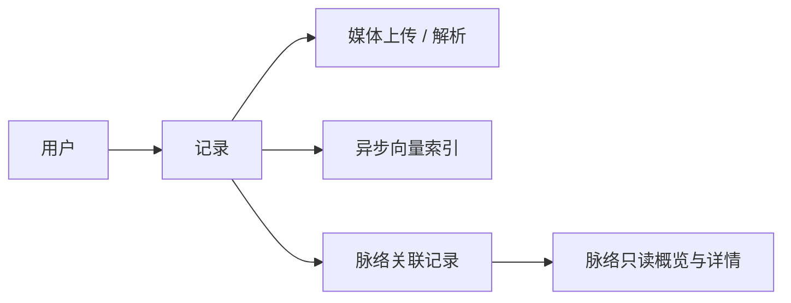

# Fanto 当前实现文档

本文档描述仓库中**当前已接入运行入口的能力**。它不把设计稿、旧代码或尚未接入的 Agent 工作流当作可用功能。

## 产品定位

Fanto 用于收下用户的碎片记录，并把已经形成的长期线索以「脉络」展示出来。当前实现以两条链路为主：



## 产品方向（规划）

[Fanto 产品方向：认识你的陪伴型个人智能](product-direction.md) 描述中长期定位、AI 介入层级、用户控制、MVP 验证重点与信任边界；该文档不代表当前已实现能力。

## 文档导航

| 文档 | 内容 |
| --- | --- |
| [架构与运行边界](architecture.md) | 运行入口、模块关系、遗留代码边界 |
| [记录与媒体](domain/records.md) | Record、附件、图像理解、音频转写、向量索引 |
| [脉络](domain/creations.md) | Creation、类型、记录关联、Proposal 决策与读取能力 |
| [HTTP API](api/http-api.md) | 当前服务实际注册的接口与请求约定 |
| [H5 客户端](clients/h5.md) | H5 当前缺失的工程及重建边界 |
| [iOS 客户端](clients/ios.md) | 当前 iOS 页面、数据来源与限制 |
| [本地开发](operations/local-development.md) | 环境变量、启动、迁移、种子数据和校验 |
| [已知边界](known-limitations.md) | 尚未接入或仅保留代码的能力 |

## 快速启动

```bash
pnpm install
cp apps/server/.env.example apps/server/.env
pnpm db:migrate
pnpm dev:server
```

服务默认监听 `http://127.0.0.1:3000`，健康检查为 `GET /health`。当前工作区没有可独立运行的 H5 工程。

所有 `/api/*` 请求均须传递合法的 `x-user-id`。开发演示的脉络数据用户为 `creation-demo-user`。
