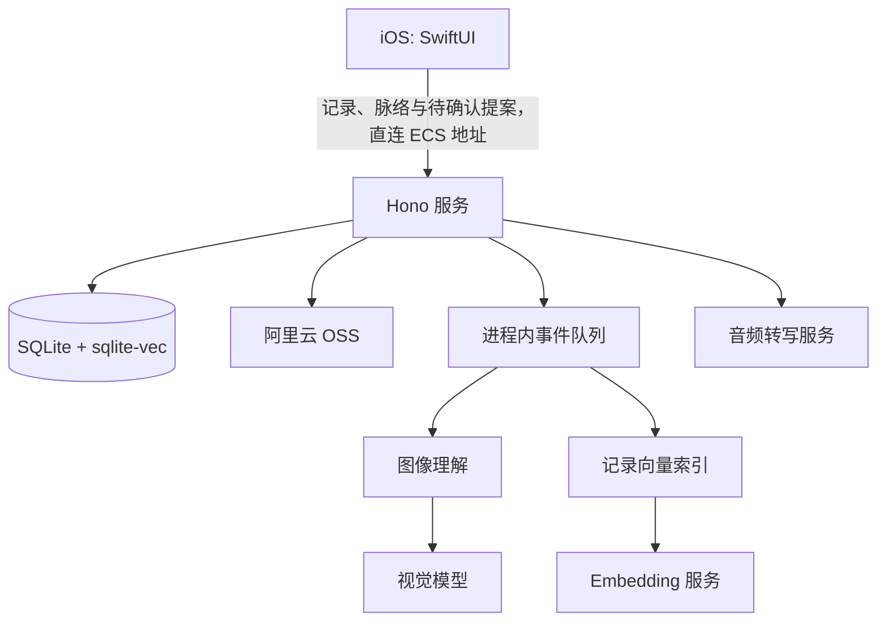

# 架构与运行边界

## 运行时组成



服务入口是 `apps/server/src/bootstrap/main.ts`：启动时读取环境变量、执行迁移、创建默认用户 `default-user`，然后挂载 HTTP 应用。数据库使用 SQLite / Kysely，开启 WAL 与 5 秒 busy timeout；`sqlite-vec` 不可用时会记录告警。

## 服务端目录边界

```text
apps/server/src/
├── bootstrap/       # 进程入口、配置、迁移命令和 Hono 装配
├── routes/          # HTTP 校验、响应映射与路由注册
├── domain/          # records、media、creations、memory 的实体、规则与仓储
├── infrastructure/ # SQLite 初始化、外部 clients、队列、日志与时间
├── listeners/       # 进程内队列的事件处理
├── migrations/      # 当前 schema 的单份 Kysely 基线
```

常规读写 Route 直接调用所属 Domain Repository；不会经过仅转发调用的 Service。`infrastructure/clients` 只容纳对外依赖适配器：`oss-client.ts`、`audio-client.ts`、`image-client.ts` 与 `embeddings-client.ts`。有副作用的音频转写与记录索引作为明确 operation 留在各自业务域。

`migrations/create_current_schema.ts` 只支持空 SQLite 数据库初始化，不保留历史 schema 或数据升级逻辑。已有数据库须删除后重建，不能直接执行迁移升级。

## 当前注册的服务模块

| 模块 | 路由前缀 | 职责 |
| --- | --- | --- |
| 健康检查 | `/health` | 返回服务状态与时间 |
| 上传 | `/api/uploads` | 申请直传、确认上传、音频转写 SSE |
| 记录 | `/api/records` | 新建、更新、分页读取、单条读取 |
| 脉络 | `/api/creation-kinds`、`/api/creations` | 类型目录、概览、按类型完整列表、详情、关联记录分页 |
| 待确认提案 | `/api/creation-proposals` | 列表、详情、长期跟踪、暂不保留 |
| 媒体读取 | `/api/media/:id` | 对已就绪媒体 302 到 OSS 读取地址 |

除健康检查外，所有 API 都经过 CORS、中间件日志与 `x-user-id` 格式校验。日志会递归脱敏名称中包含 key、token、secret、password、authorization 的字段。

## 数据与异步处理

- 记录和媒体的业务真相保存在 SQLite；向量索引可重建。
- 图片创建记录后，如果尚无描述，会发布进程内图像理解任务；仅在记录版本和媒体归属仍匹配时写回图片描述。
- 记录创建、更新后会发布进程内向量任务。索引文本仅包括用户文本和保存时已完成的音频转写，不包含图片描述。
- 这些队列使用 Node `EventEmitter`，无持久化、重试和跨进程能力；服务重启时未执行任务不会恢复。

## 当前客户端边界与未接入代码

`apps/ios/fanto` 是当前保留的客户端，直接访问 ECS 服务。`apps/h5` 源码已移除，尚未成为可运行客户端；其重建计划不代表已实现功能。

历史 Agent harness、任务仓储与主动生成 Proposal 的 workflow 已从业务服务删除。当前自动生成能力不是服务对外能力，不能据此设计客户端流程；如需恢复，应以新的 Creation/Proposal 数据模型重新设计。
