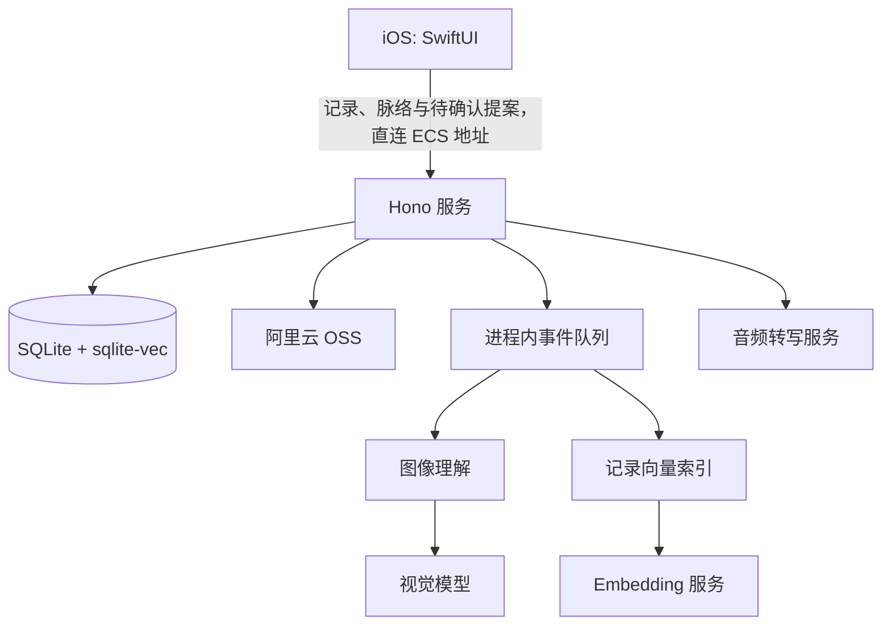

# 架构与运行边界

## 运行时组成

服务入口是 `apps/server/src/main.ts`：启动时读取环境变量、执行迁移、创建默认用户 `default-user`，然后挂载 HTTP 应用。数据库使用 SQLite / Kysely，开启 WAL 与 5 秒 busy timeout；`sqlite-vec` 不可用时会记录告警。

## 当前注册的服务模块

| 模块 | 路由前缀 | 职责 |
| --- | --- | --- |
| 健康检查 | `/health` | 返回服务状态与时间 |
| 上传 | `/api/uploads` | 申请直传、确认上传、音频转写 SSE |
| 记录 | `/api/records` | 新建、更新、分页读取、单条读取 |
| 脉络 | `/api/creation-kinds`、`/api/creations` | 类型目录、概览、按类型完整列表、详情、关联记录分页 |
| 待确认提案 | `/api/creation-proposals` | 列表、详情、长期跟踪、暂不保留 |
| 媒体读取 | `/api/media/:id` | 对已就绪媒体 302 到 OSS 读取地址 |

除健康检查外，所有 API 都经过 CORS、中间件日志与 `x-user-id` 格式校验。日志会递归脱敏名称中包含 key、token、secret、password、authorization 的字段。

## 数据与异步处理

- 记录和媒体的业务真相保存在 SQLite；向量索引可重建。
- 图片创建记录后，如果尚无描述，会发布进程内图像理解任务；仅在记录版本和媒体归属仍匹配时写回图片描述。
- 记录创建、更新后会发布进程内向量任务。索引文本仅包括用户文本和保存时已完成的音频转写，不包含图片描述。
- 这些队列使用 Node `EventEmitter`，无持久化、重试和跨进程能力；服务重启时未执行任务不会恢复。

## 当前客户端边界与未接入代码

`apps/ios/fanto` 是当前保留的客户端，直接访问 ECS 服务。`apps/h5` 源码已移除，尚未成为可运行客户端；其重建计划不代表已实现功能。

仓库中仍保留 Agent harness、任务仓储、主动生成脉络 Proposal 的 workflow，以及 `routes/creations.ts`。`main.ts` / `server.ts` 没有构造或挂载它们，因此自动生成能力不是当前服务对外能力，不能据此设计客户端流程。
