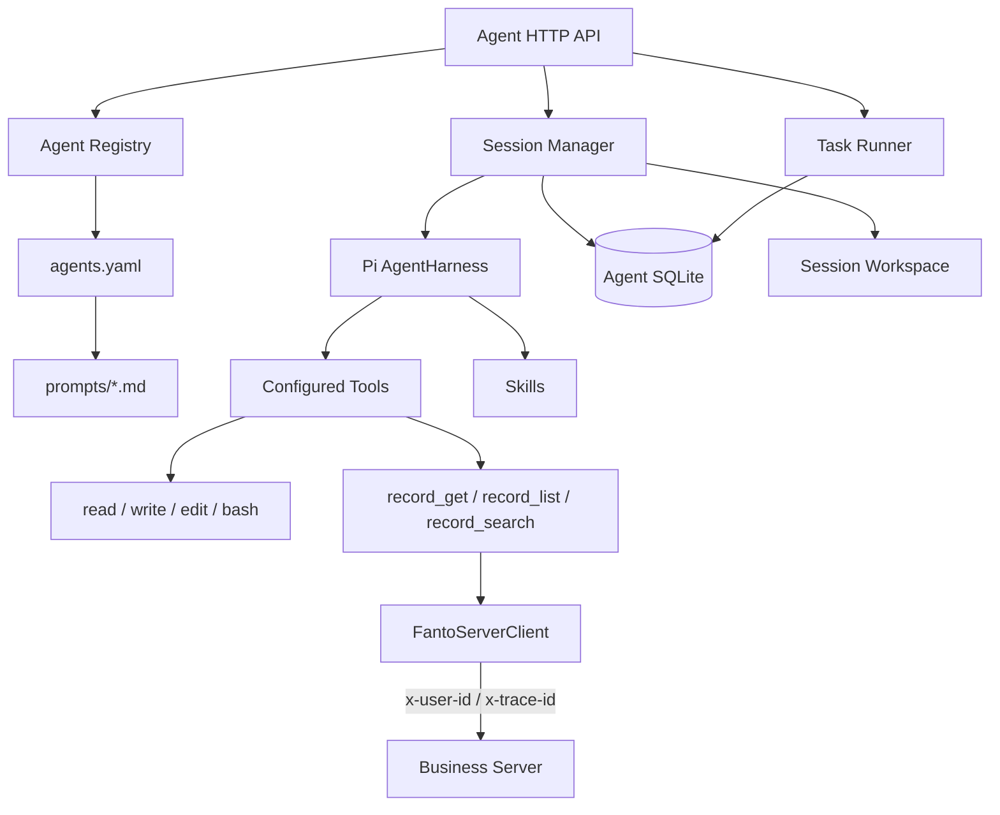

# Agent Runtime

目录：`apps/agent/`。它是独立于 Business Server 的 Hono + Pi `AgentHarness` 服务。

## 组成



## Agent Definition

`apps/agent/agents.yaml` 是 Agent 定义入口；YAML 及其引用的 Prompt 文件都只在服务启动时读取。定义包含：

- provider / model；
- systemPrompt 或 systemPromptFile；
- tools；
- skills；
- compaction 配置。

当前 Tool schema 接受：

```text
read
write
edit
bash
record_get
record_list
record_search
```

当前 `main` 是 Fanto 面向用户的长期对话 Agent，只开启三个只读 Record Tool；`coding` 只开启 `read / write / edit / bash`。Fanto 的 Prompt 独立位于 `apps/agent/prompts/fanto.md`，通过 `systemPromptFile` 引用；其内容定义长期记忆、对话人格、工具隐身与 Markdown / Media 行为。Tool 权限仍由 Agent definition 显式声明。

`systemPromptFile` 必须是相对 `agents.yaml` 的路径，不能逃逸出配置目录。Loader 会把文件内容解析为最终 `systemPrompt`，并基于解析后的完整 Agent definition 计算 revision，所以只修改 Prompt 文件也会产生新的 revision。

Skill 通过 ID 映射到 `apps/agent/skills/<id>/SKILL.md`。密钥不写入 YAML。

## Session

调用方必须先通过 `POST /api/agent/sessions` 创建 Session，再用同一 `sessionId` 发起 stream 或 task。

每个 Session 绑定：

- `userId`；
- 当前 `agentId`；
- Agent definition revision；
- 独立 workspace。

绑定信息保存在 Pi Session 的 `fanto.session_owner` custom entry。旧 Session 在下一次执行时可以应用当前 Agent revision；如果调用方指定另一个 Agent，空闲 Session 可以切换 Agent，同时保留历史和工作区。

同一 Session 同时只允许一个运行。

## 执行方式

### Stream

`POST /api/agent/stream` 使用 POST 响应体 SSE。除 `start`、`delta`、`done` / `error` 外，还会发送 Pi 运行阶段的 `turn_start`、`tool_start` 和 `tool_end`。工具事件只公开 `toolCallId`、`toolName` 与成功/失败状态，供客户端映射无内容的活动提示；不公开工具参数、结果、内部错误或 reasoning。断连会取消执行，单次请求有超时限制。

### Task

`POST /api/agent/tasks` 创建异步任务，任务状态持久化在 Agent SQLite：

```text
pending -> running -> completed | failed
```

当前 Runner 只适合单实例。进程重启后遗留的 running task 会标记失败，不自动重放。

## 历史

Session History 直接读取 Pi Session entry，以 `seq` 倒序分页。内部 `fanto.*` 条目和 compaction 记录不作为普通可见历史返回，敏感字段在对外响应前脱敏。

## Workspace 与安全

文件工具固定工作在 `AGENT_WORKSPACE_ROOT/<sessionId>`。bash 使用该目录作为 cwd、最小环境、超时和危险命令限制。

这些措施不等于宿主机隔离。生产环境如果启用 bash，需要使用无特权容器或微虚拟机，将 Session 工作区作为受控挂载，并限制 CPU、内存、进程与磁盘。

## 与 Fanto 业务数据的当前关系

Agent Runtime 不连接 Business Server 数据库。当前只读 Record 能力通过 `FantoServerClient` 调用已有 Business Server HTTP API：

```text
record_list   → GET  /api/records
record_get    → GET  /api/records/:id
record_search → POST /api/records/search
```

每次 prompt 已把 Session owner 的 `userId` 与可选 `traceId` 写入 Pi Run Context。Record Tool 从当前 Tool execution Context 读取这些值，再由 Client 转为 `x-user-id` / `x-trace-id`；LLM Tool schema 不包含 `userId`。

Client 统一负责 Business Server base URL、JSON envelope、15 秒 timeout、运行取消和安全错误映射。当前 Business Server 的 `x-user-id` 仍是开发期用户隔离，不是正式的 service-to-service authentication。

接口和运行示例见 [apps/agent/README.md](../../apps/agent/README.md)。
