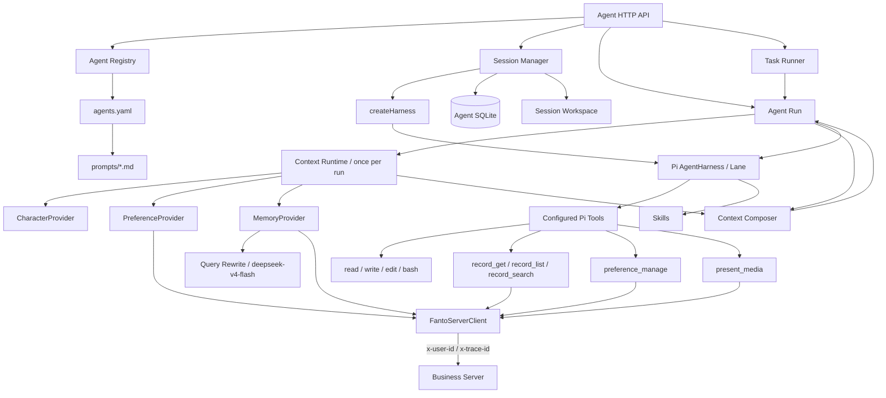

# Agent Runtime

目录：`apps/agent/`。它是独立于 Business Server 的 Hono + Pi `AgentHarness` 服务。

## 组成



## Agent Definition

`apps/agent/agents.yaml` 是 Agent 定义入口；YAML 及其引用的 Prompt 文件都只在服务启动时读取。顶层 `models` 定义 Pi `provider` / `model` 组合，Agent 用 `model_id` 引用其中一项。定义包含：

- model_id；
- systemPrompt 或 systemPromptFile；
- tools；
- skills；
- compaction 配置。

`main` 是必需的默认 Agent；配置缺少它时服务启动失败。创建 Session、stream 与 task 请求可省略 `agentId`，此时固定使用 `main`。

当前 Tool schema 接受：

```text
read
write
edit
bash
record_get
record_list
record_search
present_media
preference_manage
```

当前 `main` 是 Fanto 面向用户的长期对话 Agent，开启三个只读 Record Tool、`present_media` 与 `preference_manage`；`coding` 只开启 `read / write / edit / bash`。Fanto 的认识与关系 Core 位于 `apps/agent/prompts/core.md`，操作规则与动态插槽位于 `apps/agent/prompts/operational.md`；分别通过 `corePromptFile` 与 `systemPromptFile` 在启动期拼成最终 Prompt。操作模板包含 `{{character}}`、`{{current_time}}`、`{{user_preferences}}`、`{{relevant_memory}}` 四个运行时插槽。Tool 权限仍由 Agent definition 显式声明。

`systemPromptFile` 与可选 `corePromptFile` 必须是相对 `agents.yaml` 的路径，不能逃逸出配置目录。Loader 会把文件内容解析为最终 `systemPrompt`，并基于解析后的完整 Agent definition 计算 revision，所以只修改 Prompt 文件也会产生新的 revision。

Skill 通过 ID 映射到 `apps/agent/skills/<id>/SKILL.md`。密钥不写入 YAML。

## Context Runtime

Context Runtime 是每次 Agent Run 的前置准备阶段，不属于 Pi Agent Loop。`agent/run.ts` 是唯一执行入口：它在调用 `lane.prompt()` 前构建一次 Context，并由 Composer 将 Context fragments 注入 Prompt 模板：

```text
current message + recent conversation
             |
             v
       Context Runtime
       /      |      \
Character  Time  Preference  Memory
             |
             v
      Context Fragments
             |
             v
       Context Composer
             |
             v
 fill operational prompt slots
             |
             v
      one system prompt
             |
             v
       Pi Agent Loop
```

当前只有包含 Context 插槽的 Prompt 才会触发 Provider；因此 `coding` Agent 不会执行用户 Preference / Memory 查询。

- CharacterProvider 返回当前默认 `natural` 表达风格，不使用数据库。
- CurrentTimeProvider 以请求的 `X-Time-Zone` 生成当前日期、时间和星期；缺失或无效时使用 UTC。
- PreferenceProvider 读取当前用户最多 20 条已保存 Preference。
- MemoryProvider 先用 `deepseek-v4-flash` 结合当前消息与最近最多约 4 轮对话重写 0–2 条语义查询，再复用 Business Server 的 `POST /api/records/search`；跨查询按真实 `recordId` 去重并只注入最相关 2 条。
- Relevant Memory 直接包含真实 `recordId`、片段和按该时区格式化的 `eventAt`；命中媒体原子单元时还会提示可能有可展示媒体。需要完整内容或展示媒体时主模型可继续调用已有 `record_get`。

Context Build 失败采用降级策略：单个 Provider 普通失败只使对应 fragment 为空，用户取消则中止 Run。Context Runtime 的产物是独立 fragments；Composer 再生成本次 Run 使用的 System Prompt，并写入 Pi Run Context。后续 Tool / Model turn 不重新执行 Provider，也不会因为 `preference_manage` 成功而刷新本轮 Context。

## Session

调用方必须先通过 `POST /api/agent/sessions` 创建 Session，再用同一 `sessionId` 发起 stream 或 task。

每个 Session 绑定：

- `userId`；
- 当前 `agentId`；
- Agent definition revision；
- 独立 workspace。

绑定信息保存在 Pi Session 的 `fanto.session_owner` custom entry。旧 Session 在下一次执行时可以应用当前 Agent revision；如果调用方指定另一个 Agent，空闲 Session 可以切换 Agent，同时保留历史和工作区。

同一 Session 同时只允许一个运行。Session Manager 不负责执行 Prompt；stream 与 Task 都调用同一个 `runAgent()`。

## 执行方式

### Stream

`POST /api/agent/stream` 使用 POST 响应体 SSE。除 `start`、`delta`、`done` / `error` 外，还会发送 Pi 运行阶段的 `turn_start`、`tool_start` 和 `tool_end`。普通工具事件只公开 `toolCallId`、`toolName` 与成功/失败状态；唯一例外是成功的 `present_media`，其 `tool_end` 会额外返回经过白名单映射的稳定媒体 metadata，供客户端渲染。Record Tool 参数、结果、内部错误与 reasoning 仍不对客户端公开。断连会取消执行，单次请求有超时限制。

### Task

`POST /api/agent/tasks` 创建异步任务，任务状态持久化在 Agent SQLite：

```text
pending -> running -> completed | failed
```

当前 Runner 只适合单实例。进程重启后遗留的 running task 会标记失败，不自动重放。

## 历史

Session History 直接读取 Pi Session entry，以 `seq` 倒序分页。内部 `fanto.*` 条目和 compaction 记录不作为普通可见历史返回，敏感字段在对外响应前脱敏。

## Workspace 与安全

文件工具固定工作在 `AGENT_WORKSPACE_ROOT/<sessionId>`。bash 使用该目录作为 cwd、最小环境、超时和危险命令限制。

这些措施不等于宿主机隔离。生产环境如果启用 bash，需要使用无特权容器或微虚拟机，将 Session 工作区作为受控挂载，并限制 CPU、内存、进程与磁盘。

## 与 Fanto 业务数据的当前关系

Agent Runtime 不连接 Business Server 数据库。Record 能力与媒体展示校验都通过 `FantoServerClient` 调用 Business Server HTTP API：

```text
record_list   → GET  /api/records
record_get    → GET  /api/records/:id
record_search      → POST   /api/records/search
preference_manage → GET/POST/PATCH/DELETE /api/preferences
present_media      → GET    /api/media/:id/meta
```

每次 prompt 已把 Session owner 的 `userId` 与可选 `traceId` 写入 Pi Run Context。Record Tool、`present_media` 与 `preference_manage` 都从当前 Tool execution Context 读取这些值，再由 Client 转为 `x-user-id` / `x-trace-id`；LLM Tool schema 不包含 `userId`。Preference Tool 的 `sessionId` / `sourceMessageId` 同样来自当前 Run Context，模型只提供动作、业务 ID/version、偏好内容与当前用户消息中的逐字 `sourceQuote`。其中 `present_media` 的 Tool Call 只接受 `mediaIds`，Business Server 返回的真实 `mediaType / mimeType / capture` 被写入原生 Tool Result `details`，不会保存短期 OSS signed URL。

Client 统一负责 Business Server base URL、JSON envelope、15 秒 timeout、运行取消和安全错误映射。当前 Business Server 的 `x-user-id` 仍是开发期用户隔离，不是正式的 service-to-service authentication。

接口和运行示例见 [apps/agent/README.md](../../apps/agent/README.md)。
