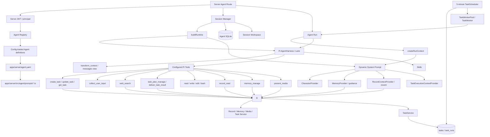

# Agent Runtime

当前 Agent Runtime 位于 `apps/server/src/agent/`，由 Business Server 同一 Hono 进程提供 `/api/agent/*`。

Record 自动提议与接受后的图片创作使用内部 proposal-agent / creator-agent，复用同一 Pi Runtime、Session 与 Business Services；独立后台执行与恢复见 [创作运行](creative-runtime.md)。内部 Agent 不允许公共 Session、stream 或历史访问。

## 组成


```mermaid
flowchart TD
  HTTP[Server Agent Route] --> AUTH[Server JWT / principal]
  AUTH --> REG[Agent Registry]
  HTTP --> SM[Session Manager]
  HTTP --> RUN[Agent Run]
  TOOLS --> TASKS[create_task / update_task / get_task]
  TOOLS --> ASK[collect_user_input]
  TOOLS --> WEB[web_search]
  TOOLS --> PLAN[task_plan_manage / deliver_task_result]
  TS[TaskService] --> TDB[(tasks / task_runs)]
  SCH[5-minute TaskScheduler] --> TDB
  SCH --> WORKER[TaskWorkerPool / TaskWorker]
  WORKER --> RUN
  REG --> DEF[Config-loaded Agent definitions]
  DEF --> YAML[apps/server/agent.yaml]
  YAML --> PROMPTS[apps/server/src/agent/prompts/*.ts]

  SM --> HARNESS[buildRuntime]
  HARNESS --> PI[Pi AgentHarness / Lane]
  SM --> DB[(Agent SQLite)]
  SM --> WS[Session Workspace]

  RUN --> RC[createRunContext]
  HARNESS --> SP[Dynamic System Prompt]
  RC --> SP
  SP --> CHAR[CharacterProvider]
  SP --> MEM[MemoryProvider / guidance]
  SP --> REC[RecordContextProvider / recent]
  SP --> TEX[TaskExecutionContextProvider]
  MEM --> B
  REC --> B
  RUN --> PI
  PI --> TC[transform_context / messages view]

  PI --> TOOLS[Configured Pi Tools]
  TOOLS --> BUILTIN[read / write / edit / bash]
  TOOLS --> RECORD[record_read]
  TOOLS --> MEMORY[memory_manage]
  TOOLS --> PRESENT[present_media]
  RECORD --> B
  MEMORY --> B
  PRESENT --> B
  WEB --> B
  PLAN --> B
  TASKS --> B
  B --> SERVICE[Record / Memory / Media / Task Service]
  B --> TS
  PI --> SKILLS[Skills]
```

## Agent Definition

`apps/server/agent.yaml` 是当前 Server Agent 定义入口。它引用受限的 TypeScript Prompt 模块名；`apps/server/src/agent/harness/definition.ts` 在 Server 启动时加载模块、校验模型、Tool、Skill 与 revision。定义包含：

- model_id；
- systemPrompt，或受限的 TypeScript Prompt 模块引用；
- tools；
- skills；
- compaction 配置；
- 可选 `task` 配置（是否允许后台 Task 调度、默认/最大超时、最大执行尝试次数）。

`main` 是必需的默认 Agent；配置缺少它时服务启动失败。创建 Session 与 stream 请求可省略 `agentId`，此时固定使用 `main`。当前 `create_task` 要求 Registry 中恰好存在一个 `task.enabled=true` 的非 main Agent，由 Server 自动选择；Worker 路由不是 LLM-facing 参数。

当前 Tool schema 接受：

```text
read
write
edit
bash
record_read
memory_manage
web_search
present_media
collect_user_input
create_task
update_task
get_task
task_plan_manage
deliver_task_result
```

当前 `main` 是 Fanto 面向用户的长期对话 Agent，开启唯一的 `record_read`、`memory_manage`、`present_media`、`collect_user_input` 与 `create_task / update_task / get_task`。`collect_user_input` 只用于会明显改变结果的用户决策，成功后 Harness 立即结束本轮等待下一条用户回答。唯一的后台 `task-worker` 配置 `task.enabled=true`、`web_search`、`task_plan_manage` 与 `deliver_task_result`，统一处理资料整理、HTML 页面和卡片、文本 / Markdown 文档、代码及工作区文件修改；默认 Task 超时 900 秒、最大 3600 秒、最多自动尝试 3 次。其产品/执行边界位于 `apps/server/src/agent/prompts/task-worker.ts`。Main 的认识、关系原则、操作规则与动态插槽已经合并在 `apps/server/src/agent/prompts/main.ts`。Main 模板使用 Character / Current Time / Current Tasks / 已保存 guidance / Recent Records；Worker 模板额外只引用 `{{task_execution_context}}`，因此技术执行信息与用户 Task Brief 物理分离。Tool 权限仍由 Agent definition 显式声明。

`systemPromptModule` 在启动期直接解析为对应 TypeScript Prompt 模块并参与 Agent revision 计算；当前 Main 直接加载 `main.ts`，修改 Prompt 后需要重启 Server。

Skill 通过 ID 映射到与 `apps/server/agent.yaml` 同级的 `apps/server/skills/<id>/SKILL.md`。密钥不写入 YAML。

## Context

`context/index.ts` 对 Harness 暴露 `createRunContext`、`createSystemPrompt`、`createTransformContext` 与 `createContextProviders`；各 Provider 的具体组合和构造依赖收敛在 `context/providers/index.ts`。`harness/run.ts` 是唯一执行入口：它在调用 Runtime `prompt()` 前创建包含 runId、用户、query、Session、时区、最近消息和 slot store 的 Chord Context，并作为 Pi prompt 的第三参传入。

`harness/build-runtime.ts` 在创建 Harness 时注册 System Prompt 回调。首次回调从 Run Context 解析模板引用的 `{{slot}}`，只选择被引用的自声明 Provider 并行执行，得到 `{ slot, content }` 后填充模板。缺少 Provider、空内容或普通 Provider 失败填 `（无）`；取消会中止 Run。结果按 run 缓存，所以该 Run 后续 turn 不再解析模板或运行 IO。

只有 Prompt 实际引用的 Context 插槽才会触发 Provider。Main 使用 Character / Time / Current Tasks / 已保存 guidance / Recent Records；`task-worker` 只使用 `TaskExecutionContextProvider` 获取当前 Task 的 output format、内部主文件名、Record references、时区与已保存 Plan，不自动注入 Recent Records。

- CharacterProvider 返回当前默认 `natural` 表达风格，不使用数据库。
- CurrentTimeProvider 以请求的 `X-Time-Zone` 生成当前日期、时间和星期；缺失或无效时使用 UTC。
- TaskProvider 读取当前用户 Task 摘要，使 Main Agent 在同一 Session 内可引用既有 `taskId`；完整 TaskRun 状态仍需调用 `get_task`。
- TaskExecutionContextProvider 仅在 Worker Run 中读取当前 Task / TaskRun，将 output format、内部主文件名、`references.recordIds`、时区与 `ext_data.plan` 注入 Worker System Prompt；这些内容不进入用户 Task Brief。
- MemoryProvider 在 Main Run 读取当前用户全部 `guidance` Memory 并注入 Prompt；`profile` 和 `goal` 不预取，Main 必须在确有需要时通过 `memory_manage(action=search)` 查询。
- RecordContextProvider 当前使用代码内固定的 `recent` 模式，调用 `listRecords(limit=2)` 且不传 cursor，因此可直接命中 Record 首页缓存；Run 前不再调用额外模型或向量搜索。
- Recent Records 只包含真实 `recordId`、时间、截断正文，以及媒体的真实 `mediaId` 和截断图片描述 / 音频转写。已给出的 `mediaId` 可直接用于 `present_media`；需要完整内容时使用 `record_read(recordIds)`，需要主题相关历史时由主模型主动使用 `record_read(query)`。
- `PiQueryRewriter` 与 RecordContextProvider 的 `relevant` 模式仍保留在代码中，但 main Agent 当前不使用，也不通过 Agent 配置切换。

`transform_context` 已在 Harness Hook 中接入，当前默认 pass。它只允许返回 messages 请求视图，可用于裁剪、重排、注入或脱敏；不会写回 transcript，也不能修改 System Prompt。后续 Tool / Model turn 不重新执行 Provider。

## Session

调用方必须先通过 `POST /api/agent/sessions` 创建 Session，再用同一 `sessionId` 发起 stream。

每个 Session 绑定：

- `userId`；
- 当前 `agentId`；
- Agent definition revision；
- 独立 workspace。

绑定信息保存在 Pi Session 的 `fanto.session_owner` custom entry。旧 Session 在下一次执行时可以应用当前 Agent revision；如果调用方指定另一个 Agent，空闲 Session 可以切换 Agent，同时保留历史和工作区。

同一 Session 同时只允许一个运行。Session Manager 不负责执行 Prompt；`harness/run.ts` 是唯一执行入口。

## 执行方式

### Stream

`POST /api/agent/stream` 使用 POST 响应体 SSE。除 `start`、`delta`、`done` / `error` 外，还会发送 Pi 运行阶段的 `turn_start`、`tool_start` 和 `tool_end`。普通工具事件只公开 `toolCallId`、`toolName` 与成功/失败状态；当前只对白名单的成功 `present_media`、`create_task` 和 `collect_user_input` 返回产品化结果：前者提供稳定媒体 metadata；`create_task` 提供 Task Card 所需摘要；`collect_user_input` 提供原生表单所需的 interaction ID 与问题结构，并在成功后终止当前 Main Run。Record Tool 参数、Goal 细节、references、用户身份、Worker 信息、内部错误与 reasoning 仍不对客户端公开。断连会取消执行，单次请求有超时限制。

## 后台 Task

`main` 先理解用户需求与相关 Record，只在缺少会显著改变结果的用户决策时调用 `collect_user_input`；技术实现问题禁止向用户提问。信息完整后，`create_task` 只提交 title、Goal（objective / context / constraints / successCriteria）、trigger、必填 `output.format` 与可选 `references.recordIds`。Goal 是用户任务说明，不允许包含 Worker、Workspace、文件路径、mediaId、`fanto-media`、OSS 或交付 Tool 等实现细节。当前 Registry 必须恰好有一个 task-enabled 子 Agent，Server 自动写入内部 `agentId` 与 timeout。`get_task / update_task` 用于后续查询和变更。同一 Main Session 可以创建多个 Task；系统不自动去重、替代或版本化。Task 创建时只记录 `next_run_at`，不创建队列 Run。`TaskScheduler` 每 5 分钟执行 single-flight Tick，按 WorkerPool 可用容量领取到期 Task。

每个 TaskRun 首次执行创建独立 Pi Session 与 Workspace。Worker 的 User Message 只包含纯 Task Brief；执行格式、主文件名、Record references、时区与现有 Plan 通过 `TaskExecutionContextProvider` 进入 System Prompt。Worker 可以先读取 Record 与资料；当任务依赖当前、变化中或公开事实时，可通过 `web_search` 使用 DeepSeek Anthropic 兼容接口的服务端 Web Search 获取带来源 URL 的公开资料，而不是通过 bash/curl 抓取网页。在调用 write / edit / bash / `deliver_task_result` 前必须先通过 `task_plan_manage` 保存用户可读计划。Plan 直接存入 `task_runs.ext_data.plan`，支持 `create / update`，当前不维护逐步完成状态；TaskRun HTTP 只投影解析后的 `plan`，不会公开完整 ext_data。Worker 将最终主结果写为 `result.md` / `result.txt` / `result.html` 后调用 `deliver_task_result`，成功才写入 `summary + artifacts[]` 并完成 Run。HTML / Markdown 内部可用真实 `fanto-media://<mediaId>` 解析 Fanto 媒体，但该协议不得出现在面向用户的说明或 summary；本地相对媒体路径仍会被拒绝。若模型失败、超时或结束但没有成功交付，同一个 TaskRun 最多自动尝试 3 次，每次绑定新的 Worker Session并继承 `ext_data.plan`；全部尝试失败后才标记 failed。用户侧不展示 Worker Tool Progress 或内部 Session History。

## 历史

Session History 直接读取 Pi Session entry，以 `seq` 倒序分页。内部 `fanto.*` 条目和 compaction 记录不作为普通可见历史返回，敏感字段在对外响应前脱敏。

## Workspace 与安全

文件工具固定工作在 `AGENT_WORKSPACE_ROOT/<userId>/<sessionId>`；`userId` 和 `sessionId` 都来自受信运行上下文。bash 使用该目录作为 cwd、最小环境、超时和危险命令限制。

这些措施不等于宿主机隔离。生产环境如果启用 bash，需要使用无特权容器或微虚拟机，将 Session 工作区作为受控挂载，并限制 CPU、内存、进程与磁盘。

## 与 Fanto 业务数据的当前关系

Agent Runtime 不连接业务数据库，也不调用 Server HTTP API。`business-services.ts` 将 Tool / Provider 所需的最小能力适配到领域 Service：

```text
record_read                              → RecordService
memory_manage                            → MemoryService
web_search                              → DeepSeek Web Search client
present_media                            → MediaService
create_task / update_task / get_task     → TaskService
task_plan_manage                         → TaskService
deliver_task_result                      → TaskService + MediaService
```

每次 prompt 已把 Server JWT 验证后的 Session owner `userId` 与可选 `traceId` 写入 Pi Run Context。Record Tool、Memory Tool、`present_media` 与 Task Tool 都从当前 Tool execution Context 读取这些值；LLM Tool schema 不包含 `userId`。Task Worker 还会获得可信的 `taskId / taskRunId / sessionId / workspace`，`deliver_task_result` 仅据此读取和交付文件。其中 `present_media` 的 Tool Call 只接受 `mediaIds`，真实 `mediaType / mimeType / capture` 被写入原生 Tool Result `details`，不会保存短期 OSS signed URL。

客户端 Access Token 由 Server 的统一鉴权中间件验证，不进入 Run Context。Runtime 不使用内部 HTTP Client、`FANTO_SERVER_BASE_URL`、`FANTO_SERVER_API_TOKEN`、`X-API-Token` 或 `X-User-Id`。

接口和运行示例见 [HTTP API](../api/http-api.md#agent-runtime)。
