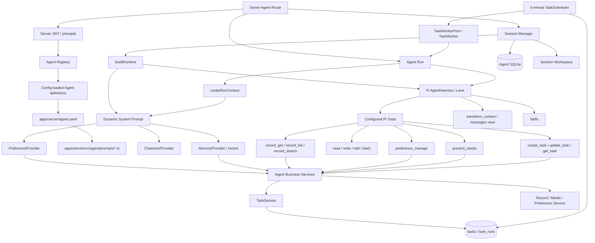

# Agent Runtime

当前 Agent Runtime 位于 `apps/server/src/agent/`，由 Business Server 同一 Hono 进程提供 `/api/agent/*`。

## 组成


```mermaid
flowchart TD
  HTTP[Server Agent Route] --> AUTH[Server JWT / principal]
  AUTH --> REG[Agent Registry]
  HTTP --> SM[Session Manager]
  HTTP --> RUN[Agent Run]
  TOOLS --> TASKS[create_task / update_task / get_task]
  TS[TaskService] --> TDB[(tasks / task_runs)]
  SCH[5-minute TaskScheduler] --> TDB
  SCH --> WORKER[TaskWorkerPool / TaskWorker]
  WORKER --> RUN
  REG --> DEF[Config-loaded Agent definitions]
  DEF --> YAML[apps/server/agent.yaml]
  YAML --> PROMPTS[apps/server/src/agent/prompts/*.ts]

  SM --> HARNESS[buildRuntime]
  HARNESS --> PI[Pi AgentHarness / Lane]
  SM --> DB[(Agent SQLite)]
  SM --> WS[Session Workspace]

  RUN --> RC[createRunContext]
  HARNESS --> SP[Dynamic System Prompt]
  RC --> SP
  SP --> CHAR[CharacterProvider]
  SP --> PREF[PreferenceProvider]
  SP --> MEM[MemoryProvider / recent]
  PREF --> B[Agent Business Services]
  MEM --> B
  RUN --> PI
  PI --> TC[transform_context / messages view]

  PI --> TOOLS[Configured Pi Tools]
  TOOLS --> BUILTIN[read / write / edit / bash]
  TOOLS --> RECORD[record_get / record_list / record_search]
  TOOLS --> PM[preference_manage]
  TOOLS --> PRESENT[present_media]
  RECORD --> B
  PM --> B
  PRESENT --> B
  TASKS --> B
  B --> SERVICE[Record / Media / Preference Service]
  B --> TS
  PI --> SKILLS[Skills]
```

## Agent Definition

`apps/server/agent.yaml` 是当前 Server Agent 定义入口。它引用受限的 TypeScript Prompt 模块名；`apps/server/src/agent/harness/definition.ts` 在 Server 启动时加载模块、校验模型、Tool、Skill 与 revision。定义包含：

- model_id；
- systemPrompt，或受限的 TypeScript Prompt 模块引用；
- tools；
- skills；
- compaction 配置；
- 可选 `task` 配置（是否允许后台 Task 调度、默认/最大超时）。

`main` 是必需的默认 Agent；配置缺少它时服务启动失败。创建 Session 与 stream 请求可省略 `agentId`，此时固定使用 `main`；`create_task.agentId` 必填，并且只能指向 `task.enabled=true` 的非 main Agent。

当前 Tool schema 接受：

```text
read
write
edit
bash
record_get
record_list
record_search
present_media
preference_manage
create_task
update_task
get_task
deliver_task_result
```

当前 `main` 是 Fanto 面向用户的长期对话 Agent，开启三个只读 Record Tool、`present_media`、`preference_manage` 与 `create_task / update_task / get_task`。唯一的后台 `task-worker` 配置 `task.enabled=true` 与 `deliver_task_result`，统一处理资料整理、HTML 页面和卡片、文本 / Markdown 文档、代码及工作区文件修改；默认 Task 超时 900 秒、最大 3600 秒。其交付协议位于 `apps/server/src/agent/prompts/task-worker.ts`。Fanto 的认识与关系 Core 位于 `apps/server/src/agent/prompts/core.ts`，操作规则与动态插槽位于 `apps/server/src/agent/prompts/operational.ts`；`apps/server/agent.yaml` 分别通过 `corePromptModule` 与 `systemPromptModule` 在启动期拼成最终 Prompt。操作模板包含 `{{character}}`、`{{current_time}}`、`{{user_preferences}}`、`{{current_tasks}}`、`{{recent_memory}}` 五个运行时插槽。Tool 权限仍由 Agent definition 显式声明。

Core 与 operational Prompt 在启动期按固定顺序合并为最终 `systemPrompt`，并参与 Agent revision 计算；修改 Prompt 后需要重启 Server。

Skill 通过 ID 映射到与 `apps/server/agent.yaml` 同级的 `apps/server/skills/<id>/SKILL.md`。密钥不写入 YAML。

## Context

`context/index.ts` 对 Harness 暴露 `createRunContext`、`createSystemPrompt`、`createTransformContext` 与 `createContextProviders`；各 Provider 的具体组合和构造依赖收敛在 `context/providers/index.ts`。`harness/run.ts` 是唯一执行入口：它在调用 Runtime `prompt()` 前创建包含 runId、用户、query、Session、时区、最近消息和 slot store 的 Chord Context，并作为 Pi prompt 的第三参传入。

`harness/build-runtime.ts` 在创建 Harness 时注册 System Prompt 回调。首次回调从 Run Context 解析模板引用的 `{{slot}}`，只选择被引用的自声明 Provider 并行执行，得到 `{ slot, content }` 后填充模板。缺少 Provider、空内容或普通 Provider 失败填 `（无）`；取消会中止 Run。结果按 run 缓存，所以该 Run 后续 turn 不再解析模板或运行 IO。

当前只有包含 Context 插槽的 Prompt 才会触发 Provider；因此 `task-worker` 不会执行用户 Preference / Memory 查询。

- CharacterProvider 返回当前默认 `natural` 表达风格，不使用数据库。
- CurrentTimeProvider 以请求的 `X-Time-Zone` 生成当前日期、时间和星期；缺失或无效时使用 UTC。
- PreferenceProvider 读取当前用户最多 20 条已保存 Preference；热路径命中 Preference 读缓存。
- TaskProvider 读取当前用户 Task 摘要，使 Main Agent 在同一 Session 内可引用既有 `taskId`；完整 TaskRun 状态仍需调用 `get_task`。
- MemoryProvider 当前使用代码内固定的 `recent` 模式，调用 `listRecords(limit=10)` 且不传 cursor，因此可直接命中 Record 首页前 10 条缓存；Run 前不再调用额外模型或向量搜索。
- Recent Memory 只包含真实 `recordId`、时间、截断正文，以及媒体的真实 `mediaId` 和截断图片描述 / 音频转写。已给出的 `mediaId` 可直接用于 `present_media`；需要完整内容时使用 `record_get`，需要主题相关历史时由主模型主动使用 `record_search`。
- `PiQueryRewriter` 与 MemoryProvider 的 `relevant` 模式仍保留在代码中，但 main Agent 当前不使用，也不通过 Agent 配置切换。

`transform_context` 已在 Harness Hook 中接入，当前默认 pass。它只允许返回 messages 请求视图，可用于裁剪、重排、注入或脱敏；不会写回 transcript，也不能修改 System Prompt。后续 Tool / Model turn 不重新执行 Provider，也不会因为 `preference_manage` 成功而刷新本轮 Context。

## Session

调用方必须先通过 `POST /api/agent/sessions` 创建 Session，再用同一 `sessionId` 发起 stream。

每个 Session 绑定：

- `userId`；
- 当前 `agentId`；
- Agent definition revision；
- 独立 workspace。

绑定信息保存在 Pi Session 的 `fanto.session_owner` custom entry。旧 Session 在下一次执行时可以应用当前 Agent revision；如果调用方指定另一个 Agent，空闲 Session 可以切换 Agent，同时保留历史和工作区。

同一 Session 同时只允许一个运行。Session Manager 不负责执行 Prompt；`harness/run.ts` 是唯一执行入口。

## 执行方式

### Stream

`POST /api/agent/stream` 使用 POST 响应体 SSE。除 `start`、`delta`、`done` / `error` 外，还会发送 Pi 运行阶段的 `turn_start`、`tool_start` 和 `tool_end`。普通工具事件只公开 `toolCallId`、`toolName` 与成功/失败状态；当前只对白名单的成功 `present_media` 和 `create_task` 返回产品化结果：前者提供稳定媒体 metadata，后者提供 Task Card 所需的任务摘要。Record Tool 参数、Goal 细节、sources、用户身份、Worker 信息、内部错误与 reasoning 仍不对客户端公开。断连会取消执行，单次请求有超时限制。

## 后台 Task

`main` 通过 `create_task` 提交 Goal（objective、必要 context、constraints、successCriteria）与 Agent / trigger / timeout 等 Task 元数据；使用 `get_task` 查询，再用 `update_task` 更新任务详情或状态。Task 若依赖已读取的资料，Main 必须把真实 ID 写入 `sources.recordIds / sources.mediaIds`，Worker 会在 Goal 中接收该列表并通过 Record Tool 回查；不以复制聊天摘要替代来源引用。Tool schema 不接受用户身份，也不把 Main Chat 历史直接传给子 Agent。`AgentRegistry.taskAgents()` 会从 `agent.yaml` 自动筛选 `task.enabled=true` 且非 `main` 的 Agent，并把 `{ id, description }` 作为只读 catalog 注入 Harness。`create_task` 据此动态生成 `agentId` literal union，同时把每个可用 Agent 的 description 写进 Tool description，因此新增、删除或修改后台 Agent 只需要更新 `agent.yaml` 并重启 Server，不维护第二份 Agent 名单。Server 在真正创建 Task 时仍再次通过 Registry 校验 `agentId`。同一 Main Session 可以创建多个 Task；系统不做 Task 去重、版本、替代或并行关系建模，Main Agent 自行编排。Task 创建时只记录 `next_run_at`，不创建队列 Run。`TaskScheduler` 每 5 分钟执行一次 single-flight Tick，只扫描到期 Task 并按 `TaskWorkerPool.available` 提交；Worker 创建独立 Session 后，在同一数据库事务中创建携带该 Session 的 `running` TaskRun 并推进 `next_run_at`。没有容量时 Task 保持到期并等待下一次 Tick。

每个 TaskRun 创建独立 Pi Session 与 Workspace，Worker 将 Goal 渲染为稳定的 Task Goal 消息后复用 `runAgent()`。Worker 先将主结果写为 `result.md` / `result.txt` / `result.html`，再调用 `deliver_task_result` 显式声明主文件和最多 9 个附属文件；工具只接受工作区根目录下的相对文件名，校验内容并上传 OSS。HTML / Markdown 中的 Fanto 图片和音频必须使用真实 `fanto-media://<mediaId>`，本地相对媒体路径不属于当前交付模型并会被拒绝。上传成功后才把 `summary + artifacts[]` 写入 `task_runs.result` 并将 Run 完成，同时终止该 Worker 回合；Worker 普通文本、未交付文件或交付失败都不能完成 Run。每一个 Worker Session 可以有多个交付文件，产物对象键使用 `users/<userId>/task/<YYYY-MM>/<workerSessionId>/<filename>`，因此失败重试的新 Run / Worker Session 不会覆盖旧产物。当前 TaskRun 只暴露 `running/completed/failed/cancelled` 状态和最终结果，不向客户端投影 Worker Tool Progress 或内部 Session History。

## 历史

Session History 直接读取 Pi Session entry，以 `seq` 倒序分页。内部 `fanto.*` 条目和 compaction 记录不作为普通可见历史返回，敏感字段在对外响应前脱敏。

## Workspace 与安全

文件工具固定工作在 `AGENT_WORKSPACE_ROOT/<userId>/<sessionId>`；`userId` 和 `sessionId` 都来自受信运行上下文。bash 使用该目录作为 cwd、最小环境、超时和危险命令限制。

这些措施不等于宿主机隔离。生产环境如果启用 bash，需要使用无特权容器或微虚拟机，将 Session 工作区作为受控挂载，并限制 CPU、内存、进程与磁盘。

## 与 Fanto 业务数据的当前关系

Agent Runtime 不连接业务数据库，也不调用 Server HTTP API。`business-services.ts` 将 Tool / Provider 所需的最小能力适配到领域 Service：

```text
record_list / record_get / record_search → RecordService
preference_manage                       → PreferenceService
present_media                            → MediaService
create_task / update_task / get_task     → TaskService
deliver_task_result                      → TaskService + MediaService
```

每次 prompt 已把 Server JWT 验证后的 Session owner `userId` 与可选 `traceId` 写入 Pi Run Context。Record Tool、`present_media`、`preference_manage` 与 Task Tool 都从当前 Tool execution Context 读取这些值；LLM Tool schema 不包含 `userId`。Task Worker 还会获得可信的 `taskId / taskRunId / sessionId / workspace`，`deliver_task_result` 仅据此读取和交付文件。Preference Tool 的 `sessionId` / `sourceMessageId` 同样来自当前 Run Context，模型只提供动作、业务 ID/version、偏好内容与当前用户消息中的逐字 `sourceQuote`。其中 `present_media` 的 Tool Call 只接受 `mediaIds`，真实 `mediaType / mimeType / capture` 被写入原生 Tool Result `details`，不会保存短期 OSS signed URL。

客户端 Access Token 由 Server 的统一鉴权中间件验证，不进入 Run Context。Runtime 不使用内部 HTTP Client、`FANTO_SERVER_BASE_URL`、`FANTO_SERVER_API_TOKEN`、`X-API-Token` 或 `X-User-Id`。

接口和运行示例见 [HTTP API](../api/http-api.md#agent-runtime)。
