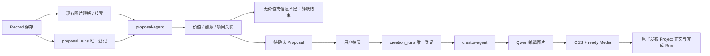

# 创作运行

运行入口在 `src/creative-runtime/`，与现有 Task 独立。`CREATIVE_ENABLED=true` 开启；关闭时不登记新 Record 分析，不运行后台 Agent。启动配置见 [Configuration](../engineering/configuration.md)。

Record 创建 / 更新与对应 `(userId, recordId, version)` 分析登记同事务提交。后台等待当前版本 processed，复用已写回的图片 description / 音频 transcription；没有 image_inspect 或第二套视觉处理。处理事件丢失时通过 Record Service 重新投递；同版本 processing 超过十分钟时按原 runId 释放后重新投递。该恢复只覆盖已登记的创作分析记录，现有 Record 队列仍是进程内机制。

proposal-agent 完整读取触发 Record，先判断创作价值，再找具体创意，最后构造包含真实经历、主体与创作主题的 query，通过 project_read(search) 检索同用户 active 项目候选，再用 project_read(get) 核对 summary、正文预览与参考记录，判断 create / extend。当前可执行角色扮演写真与配文；无价值、主体不明确、素材不可用或必要信息不足时返回 no_proposal 并静默结束；不向用户提问，不生成补充信息表单。成功 proposal_create 将当前可信 sessionId 写入 proposals.session_id，与分析完成同事务，模型文字不是成功凭据。

接受 create 先将 proposedSummary 向量化，建立空 active Project；extend 增加参考记录，不覆盖成果。后台按 resolvedAt / proposalId 分页扫描含 creation.objective 的 accepted Proposal，幂等登记一条 CreationRun。同一项目按接受顺序串行，旧运行未结束时后续运行等待。拒绝提议不创作。

creator-agent 只读取已接受提议的参考 Record 与授权目标 Project。Proposal creation 使用 objective / context / constraints / successCriteria 描述确认目标。creator-agent 读取素材后调用 creation_prepare，核验原图、主体、图片数量（1–3），同事务保存不可变 execution_plan；不准备计划不能生图或发布，重试必须复用计划。原图必须仍为该用户的 ready Image、仍在参考记录中且主体有非空 description。每张图片按 execution_plan 固定 imageIndex（1–3），至少包含原 subject 图片；请求指纹限制同一槽位改变输入，不能换槽位绕过失败。服务端适配原图为模型参考尺寸、使用临时签名地址调用 Qwen，返回 Agent 的只有已保存的 mediaId 和尺寸。

`creation_image_steps` 在请求前登记 requested，收到结果后保存加密的短期恢复地址（有效期最多 24 小时），OSS / Media 登记成功后置 saved 并清除密文。结果 URL 不进入 Tool、Session、HTTP 或日志。结果地址仅允许指定的 DashScope OSS HTTPS 主机，禁止重定向；下载最多 20 MiB，完整解码并存为 PNG。临时参考对象在调用后清理。

请求已发出而结果不确定、遗留 requested 或 unknown 槽位，运行失败并停止自动付费重试。response 槽位优先认领同运行、同槽位已经注册的 ready Media，否则只恢复下载与保存；saved 槽位直接复用。可恢复的执行 / 保存失败最多三次，每次使用独立内部 Session；密钥轮换会使原恢复密文失效。不会将失败创作的部分正文发布到 Project，已保存图片保留为 ready Media。

所有后台运行使用数据库租约（90 秒，每 20 秒续约）与 sessionId / leaseToken 验证。过期运行可重新领取，旧执行者不能继续写提议或发布成果。creator-agent 发布时必须提交整个项目的准确 summary；正文、summary、对应向量更新与 Run 完成同事务；create 只能写空成果，append 由服务器拼接增量，expectedVersion 冲突须重新读取项目并复用图片。

内部 Agent 不允许公共 Session 创建、stream、历史读取或通过普通 Session 切换进入。工具权限仅由 server RunContext 提供，LLM 参数不能指定 userId、Run、Session 或 Project 权限。iOS 使用公开进度接口显示排队 / 生图 / 整理 / 失败状态并刷新完成成果；不展示内部 Session 或供应商地址。

后台 Agent 每次实际执行在 `logs/agent.log`（可由 `LOG_DIR` 覆盖目录）记录 `creative-runner` 的 `Agent started` / `Agent ended`：包含 Agent、runId、sessionId、attempt；分析包含 recordId / recordVersion，创作包含 proposalId / projectId / recordIds。结束记录耗时、持久化状态、提议 decision 和错误码；queued 表示等待重试。日志不包含正文、图片地址或凭据。

`project_read` 仅支持 `search`（query，固定最多 3 个候选，不接受 limit）与 `get`（projectId）。不再暴露 list / detail / records action。get 返回最近最多 5 条参考记录与截断正文，creator-agent 只能 get 授权目标，并仅返回已接受提议授权的参考记录。summary / query 使用同一 768 维 Embedding 模型；失败不作为“无相关项目”，而以 EMBEDDING_UNAVAILABLE 中止该次执行。

Proposal title 使用作品标题语言；reason 仅保留内部判断依据；tags 生成 2–4 个作品化短标签；idea 最多两句话描述最终创作效果；plan 固定 3 项并使用 `短标题｜一句结果说明`，不写 Agent 技术步骤。shared creative Skill 统一 Tag 语言，各 reference 只提供精简 Tag Guidance，不做固定枚举。事实准确优先于创意和吸引力，不将未知地点、人物关系或情绪写成事实；不足时静默 no_proposal。用户 accept 时可附带创作补充，服务端原子写入 creation constraints，随后 creator-agent 从已接受 Proposal 读取该最终目标。旧 creation brief 通过增量迁移转为目标描述，并保留已有 CreationRun 的素材计划和付费槽位；不会重置失败状态或未知生图结果。
