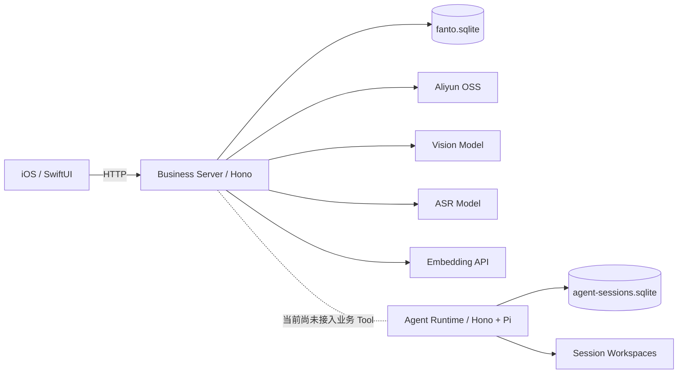

# 系统架构总览

## 当前运行组件

Fanto 当前有两个独立服务：

1. **Business Server**：Record、Media、Creation / Proposal 与 Record 向量索引的业务运行时。
2. **Agent Runtime**：Agent 定义、Session、流式执行、异步任务、工作区与 Pi 内置工具的独立运行时。

两者当前没有共享数据库。Agent Runtime 也还没有通过业务 Tool 调用 Business Server。

## 业务数据边界

Business Server 使用一个 SQLite 数据库保存：

- users；
- records；
- media_assets；
- vector_items + sqlite-vec `record_vectors`；
- creation_kinds；
- creations；
- creation_proposals；
- entity_relations。

其中 Record、Media、Creation / Proposal 等业务表是业务事实；Record 向量索引是可重建的派生数据。

Agent Runtime 使用独立 SQLite 保存 Pi Session 与 Agent Task，并在 `AGENT_WORKSPACE_ROOT/<sessionId>` 为每个 Session 创建独立工作区。

## 用户边界

Business Server 除 `GET /health` 外要求 `x-user-id`，当前它只承担开发阶段的用户隔离，不是正式认证。

Agent Runtime 除健康检查外使用 Bearer Token，并要求 `X-User-Id`；Session 归属会持久化在 Pi Session custom entry 中。

## 当前可靠性边界

- Business Server 的 Record 后置任务通过进程内 EventEmitter 触发，不持久化、不自动重试。
- Agent 异步任务有 SQLite 状态，但 Runner 当前按单实例设计；服务重启时遗留的 running task 会失败而不是自动重放。
- iOS 当前访问固定 HTTP ECS 地址，尚未具备正式认证和生产级服务发现。
