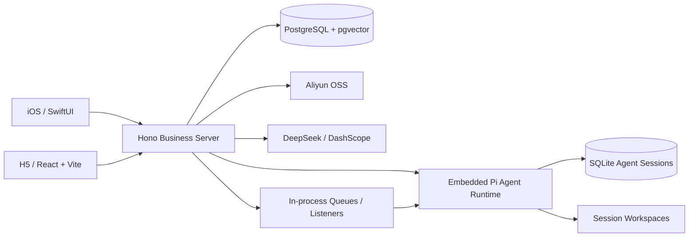

# 系统架构总览

## 运行拓扑

```mermaid
flowchart LR
  IOS[iOS / SwiftUI] --> API[Hono Business Server]
  H5[H5 / React + Vite] --> API
  API --> PG[(PostgreSQL + pgvector)]
  API --> OSS[Aliyun OSS]
  API --> AI[DeepSeek / DashScope]
  API --> AGENT[Embedded Pi Agent Runtime]
  AGENT --> SQ[(SQLite Agent Sessions)]
  AGENT --> WS[Session Workspaces]
  API --> Q[In-process Queues / Listeners]
  Q --> AGENT
```

部署时 Server 与 Agent Runtime 在同一 Node.js 进程，H5 由 Nginx 提供静态文件，`/api/*` 转发至 Server。没有独立 Agent HTTP 服务或 Gateway。工具和 Context Provider 通过 `agent/business-services.ts` 访问 Domain Service，不经本机 HTTP 或 Route。

## 事实与派生数据

- PostgreSQL：用户、身份、Records、Media 元数据、Memory、Proposal、Project、Record 关联、Task 与 TaskRun。
- pgvector：`records.embedding`（可重建的派生字段）、`memories.embedding`、`projects.embedding`。
- OSS：Record 上传媒体、生成的 Project 媒体、Task 交付文件；客户端读取短期签名 URL。
- SQLite：Pi Session transcript / session owner；工作区位于 `AGENT_WORKSPACE_ROOT/<userId>/<sessionId>`。
- Session transcript 记录 Agent 过程；Project 只存最新 `goal/content/status`，TaskRun 存任务计划与交付结果，不从 UI 消息反推业务事实。

## 异步与会话

- Record 保存后向非持久化 `RecordPostprocessQueue` 发布消息；图片理解/音频转写成功标记 processed，之后分别向 `RecordEmbeddingQueue` 和 `AgentExecutionQueue` 投递。
- `AgentExecutionQueue` 统一分发 Proposal、Creator 和 Task，监听器在内存中限制并发；TaskScheduler 按间隔扫描到期 Task，并在创建 queued TaskRun 后投递。
- Creator 首次创作由后台 Handler 执行，用户随后可通过统一 `POST /api/agent/stream` 继续同一 Session；通用 Session History 和只读 Events SSE 用于查看过程。
- 所有内存队列和 Session 事件 **不持久化、不重放、不跨进程恢复**；重启可能丢失待执行消息。Task/Project 持久状态可能仍为 queued/running，不能声称自动补偿。

详见 [业务 Server](server.md)、[Agent Runtime](agent-runtime.md) 和 [创作执行](creative-runtime.md)。

## 鉴权与运维

受保护路由使用服务端校验的 Fanto JWT `sub` 作为唯一用户边界；iOS 通过 Google / Apple 认证，H5 当前通过受控测试 refresh token 建立会话。Session 历史按用户归属查询，Creator 执行还要校验关联 Project、业务状态和 Session 绑定。

`/health` 实际检查 PostgreSQL，失败返回 503；Server 每 10 秒检查数据库，连续 3 次失败退出交给 PM2 重启。没有独立的 `/ready`。部署、配置和当前客户端范围见 [本地开发](../engineering/local-development.md)、[配置](../engineering/configuration.md)、[当前能力](../product/current-scope.md)。
