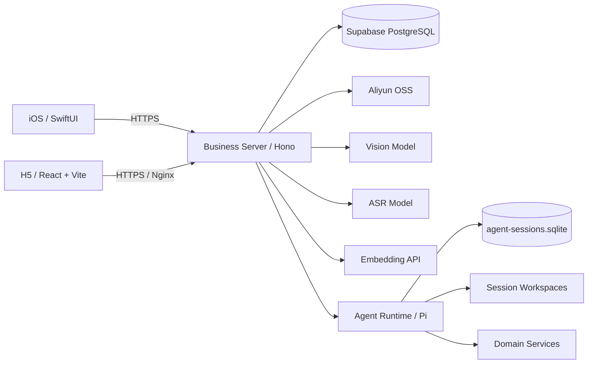

# 系统架构总览

## 当前运行组件

```mermaid
flowchart LR
  IOS[iOS / SwiftUI] -->|HTTPS| S[Business Server / Hono]
  H5[H5 / React + Vite] -->|HTTPS / Nginx| S
  S --> DB[(Supabase PostgreSQL)]
  S --> OSS[Aliyun OSS]
  S --> VL[Vision Model]
  S --> ASR[ASR Model]
  S --> EMB[Embedding API]

  S --> AR[Agent Runtime / Pi]
  AR --> ADB[(agent-sessions.sqlite)]
  AR --> WS[Session Workspaces]
  AR --> DS[Domain Services]
```

Fanto 当前有一个后端服务，并有 iOS 与 H5 两类客户端入口：

1. **Business Server**：Record、Media、Memory / Retrieval、User Preference、Project、Agent Task，以及内嵌的 Agent Runtime。

Agent Runtime 的 Session 与工作区仍独立于业务数据；其 Tool 和 Context Provider 通过 `business-services.ts` 调用领域 Service，不经过 Server Route 或内部 HTTP。H5 生产构建由 Nginx 提供静态文件，所有 `/api/*` 请求均转发到 Business Server。

## 业务数据边界

Business Server 使用 Supabase PostgreSQL 保存：

- users；
- records；
- media_assets；
- vector_items + pgvector embedding；
- user_preferences；
- projects、project_records；
- tasks；
- task_runs。

其中 Record、Media、Project 等业务表是业务事实；Record 向量索引是可重建的派生数据。

Agent Runtime 只使用独立 SQLite 保存 Pi Session；Task / TaskRun 属于业务运行状态，保存在 PostgreSQL。每个 Agent Session 的工作区固定为 `AGENT_WORKSPACE_ROOT/<userId>/<sessionId>`。

## 用户边界

Business Server 的公开入口只有健康检查与 Google 注册 / 登录 / Refresh。其余业务 API 统一验证 EdDSA Access JWT，并只从经过验证的 `sub` 生成 `principal.userId`；客户端提交的用户 ID 不参与授权。

Agent Runtime 使用同一 Server 鉴权中间件验证 Access JWT，并以验证后的 `sub` 绑定 Session 归属。Access Token 有效期 30 分钟，Refresh Token 为 30 天滑动有效期。

## 当前可靠性边界

- Business Server 的 Record 后置任务通过进程内 EventEmitter 触发，不持久化、不自动重试。
- Agent Task 使用 PostgreSQL 持久化并由单实例 5 分钟 Scheduler 调度；Scheduler 只扫描到期 Task，TaskRun 仅在取得 Worker 与独立 Session 后以 running 状态创建。服务重启时遗留的 running Run 会收敛为 failed；到期但未启动的 Task 保持到期并等待后续 Tick，不自动重试失败 Run。
- iOS 当前访问固定 HTTPS 公网域名，已通过 Google / Apple 原生认证换取 Fanto Access / Refresh JWT；服务地址仍是代码内固定值，尚未配置 staging / production 环境切换。
- H5 仍是受控测试客户端，通过构建时 refresh token 调用现有刷新接口建立 Access JWT 会话，不提供正式登录 UI。
- `/health` 表示整体服务可用性并实际检查 PostgreSQL；数据库不可用时返回 503。Server 每 10 秒执行一次数据库健康检查，连续 3 次失败后主动退出，由 PM2 重启；当前不提供独立 `/ready`。
