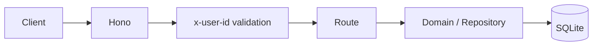
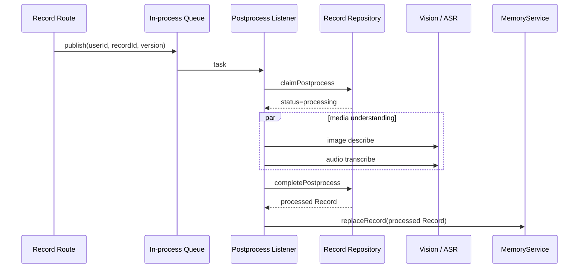

# Business Server

目录：`apps/server/`。入口为 `src/bootstrap/main.ts`。

## 模块边界

```text
apps/server/src/
├── bootstrap/       # 启动、配置、Hono 装配、迁移命令
├── routes/          # HTTP 输入、用户边界、响应映射
├── domain/          # records / media / memory / preferences / creations
├── infrastructure/ # SQLite、Memory adapter、外部 client、queue、logging、time
├── listeners/       # 进程内事件处理
├── migrations/      # 当前空库 schema 基线
└── scripts/         # 演示数据等运维脚本
```

普通 CRUD Route 直接调用相应 Repository。Memory 通过 Domain 内的 `MemoryService + MemoryIndex / EmbeddingProvider` 边界编排，当前 sqlite-vec 实现位于 `infrastructure/memory/`。外部 OSS、图片理解、音频转写与 Embedding 通过 infrastructure adapter 适配。

## HTTP 请求路径



当前注册模块：

| 路由 | 领域 |
| --- | --- |
| `/api/uploads`、`/api/media/:id`、`/api/media/:id/url` | Media |
| `/api/records` | Record / Memory Search |
| `/api/preferences` | User Preference |
| `/api/creation-kinds`、`/api/creations` | Creation |
| `/api/creation-proposals` | Proposal |

具体契约见 [HTTP API](../api/http-api.md)。

## Record 后置处理

Record 创建或更新成功后，Route 发布 postprocess task。Listener 对指定 Record 版本进行 claim：



图片与音频任务可以部分失败；成功结果写回对应 Record block，音频 ASR 状态同时写入 Media `ext_data`。只有完成当前 Record 版本的 postprocess 后才会把最终 Record 交给 Memory。

Record 已成功变成 `processed` 后，Memory / Embedding 失败只记录错误，不会重新 release Record；索引属于可重建派生数据。该队列仍是进程内机制，服务进程退出时未完成任务不会恢复，也没有持久 retry。

## 数据库与 migration

启动时创建 SQLite 连接、加载 sqlite-vec，并执行 `create_current_schema.ts`。

当前 migration 策略是：**只维护一个面向空数据库的当前 schema 基线**。它不是历史数据库升级系统。已有旧 schema 文件不能假设可以直接原地升级。

SQLite 开启 WAL，并设置 busy timeout。向量索引存储在同一业务数据库，但属于派生数据；`record_vectors.user_id` 是 sqlite-vec partition key，Record KNN 从 candidate generation 阶段就限定当前用户。
