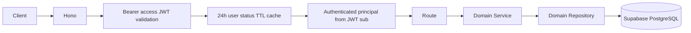
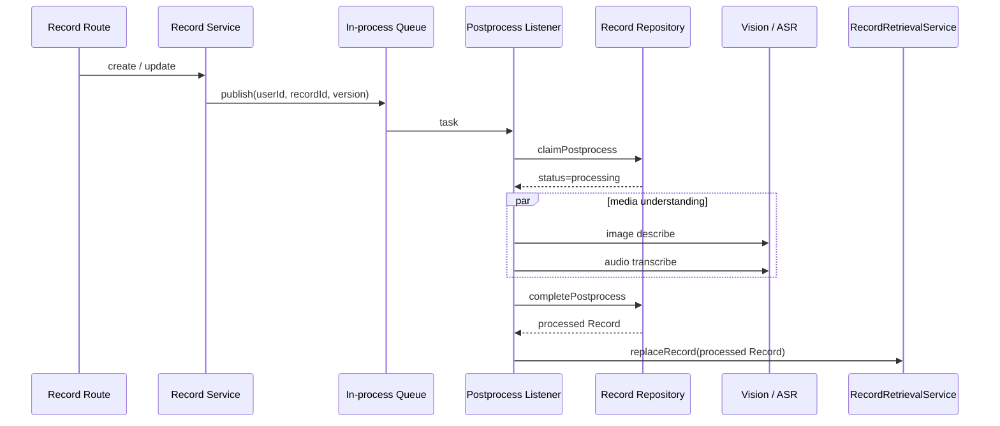

# Business Server

目录：`apps/server/`。入口为 `src/bootstrap/main.ts`。

## 模块边界

```text
apps/server/src/
├── bootstrap/       # 启动、配置、Hono 装配、迁移命令
├── routes/          # HTTP 输入、用户边界、响应映射
├── domain/          # records（含 retrieval）/ memory / media / projects / tasks
├── task-runtime/    # 5 分钟 Scheduler、WorkerPool、TaskWorker、结果发布
├── infrastructure/ # PostgreSQL、TTL cache、外部 client、queue、logging、time
├── listeners/       # 进程内事件处理
├── migrations/      # 空库 schema 基线与 PostgreSQL 增量迁移
└── scripts/         # 演示数据等运维脚本
```

每个 Domain 以 `index.ts` 作为模块外入口，采用 `model.ts`、`repository.ts`、`postgres-repository.ts`（需要持久化时）和 `*-service.ts` 的统一组织方式。Route 只能调用相应 Service，Repository 不对模块外暴露。Record Retrieval 通过 Record domain 内的 `RecordRetrievalService + EmbeddingProvider` 编排，并直接读写 `records.embedding`；Memory 以独立 `memories` 业务表保存用户明确指定的长期文本记忆。外部 OSS、图片理解、音频转写与 Embedding 通过 infrastructure adapter 适配。

## HTTP 请求路径


```mermaid
flowchart LR
  C[Client] --> H[Hono]
  H --> U[Bearer access JWT validation]
  U --> A[24h user status TTL cache]
  A --> P[Authenticated principal from JWT sub]
  P --> R[Route]
  R --> S[Domain Service]
  S --> D[Domain Repository]
  D --> DB[(Supabase PostgreSQL)]
```

当前注册模块：

| 路由 | 领域 |
| --- | --- |
| `/api/uploads`、`/api/media/:id`、`/api/media/:id/url` | Media |
| `/api/records` | Record / Record Retrieval Search |
| `/api/projects` | Project 查询、更新与归档 |
| `/api/proposals` | Proposal 查询、参考记录与决策 |
| `/api/tasks` | Agent Task |

具体契约见 [HTTP API](../api/http-api.md)。

当前进程内读缓存统一使用 `infrastructure/cache/TtlCache`：

- 用户 active 状态：24 小时 TTL；
- Record 首页：按 userId 缓存前 10 条，24 小时 TTL；只有无 cursor 且 limit ≤ 10 命中；
- Record 写入与后置处理的状态、内容写入会立即删除对应用户首页缓存。

这些缓存是单进程缓存；未来 Business Server 多实例部署时，如需跨实例即时失效，应切换到共享缓存或增加失效广播。

## Agent Task 调度

Task 定义和 TaskRun 都持久化在 PostgreSQL。Task 创建时仅设置 `next_run_at`；immediate Task 的值为创建时刻。`TaskScheduler` 每 5 分钟执行一次 single-flight Tick，只扫描 `status=active AND next_run_at <= now` 的 Task，并以 `TaskWorkerPool.available` 限制数量。Worker 先创建独立 Session，随后以事务原子写入已绑定 Session 的 `running` TaskRun 并推进该 Task 的 `next_run_at`；WorkerPool 不维护内存或数据库等待队列，没有容量时 Task 保持到期并等待下一次 Tick。

每个 TaskRun 使用独立 Agent Session 与 `AGENT_WORKSPACE_ROOT/<userId>/<sessionId>` Workspace。Task 可携带结构化的 Record / Media 来源 ID，Worker 在执行 Goal 时通过 Record Tool 回查其中的真实资料。TaskWorker 根据 Task `agent_id` 加载 `agent.yaml` 中 `task.enabled=true` 的子 Agent，并通过现有 `runAgent()` 执行 Goal。Worker 必须调用 `deliver_task_result` 交付工作区内的相对路径文件；该工具上传 OSS、注册 `media_type=file`，并把摘要、主文件和附属文件 metadata 写入 `task_runs.result`。成功交付后 Harness 终止该回合，避免工作区随后变更与已上传产物分叉。产物对象键为 `users/<userId>/task/<YYYY-MM>/<workerSessionId>/<filename>`。

## Record 后置处理

Record 创建或更新成功后，Record Service 发布 postprocess task。Listener 对指定 Record 版本进行 claim：


```mermaid
sequenceDiagram
  participant HTTP as Record Route
  participant S as Record Service
  participant Q as In-process Queue
  participant L as Postprocess Listener
  participant R as Record Repository
  participant AI as Vision / ASR
  participant I as RecordRetrievalService

  HTTP->>S: create / update
  S->>Q: publish(userId, recordId, version)
  Q->>L: task
  L->>R: claimPostprocess
  R-->>L: status=processing
  par media understanding
    L->>AI: image describe
    L->>AI: audio transcribe
  end
  L->>R: completePostprocess
  R-->>L: processed Record
  L->>I: replaceRecord(processed Record)
```

图片与音频任务可以部分失败；图片 description、音频 transcription 与 ASR metadata 都写回对应 Record block，不再把 ASR 结果复制到 Media `ext_data`。只有完成当前 Record 版本的 postprocess 后才会把最终 Record 交给 Record Retrieval。

Record 已成功变成 `processed` 后，Embedding 失败只记录错误，不会重新 release Record；`records.embedding` 是派生字段。该队列仍是进程内机制，服务进程退出时未完成任务不会恢复，也没有持久 retry、补偿或批量重建入口。

## 数据库与 migration

启动时创建 PostgreSQL Pool，执行 migration 后先用 `SELECT 1` 预热连接，再开放 HTTP 服务。Pool 开启 TCP keepalive，当前 `max=10`、`min=1`、连接超时 5 秒、空闲超时 5 分钟。

`create_current_schema.ts` 仍是面向空数据库的当前 schema 基线。对已经执行过基线的现有数据库，必须新增按文件名顺序执行的前向 migration；当前 Task System 使用 `z_task_system_schema.ts` 幂等创建 `tasks / task_runs`。不要修改已经执行过的 migration 来假装完成线上升级。

向量数据存储在同一业务数据库。`records.embedding` 是整条 Record 的 768 维 pgvector 派生字段；`memories.embedding` 是用户明确保存的 Memory 业务数据。两类查询都从 SQL 层按 `user_id` 限定当前用户。

Creative Runtime 由同一进程装配，启用时登记 Record 版本分析、扫描接受提议并执行两类内部 Agent。公开分析 / 进度路由只调用 CreativeService，Tool / Provider 仍只走 Business Services。持久化执行状态与租约独立于业务 Domain 和进程内 Record 后置队列，见 [创作运行](creative-runtime.md)。
