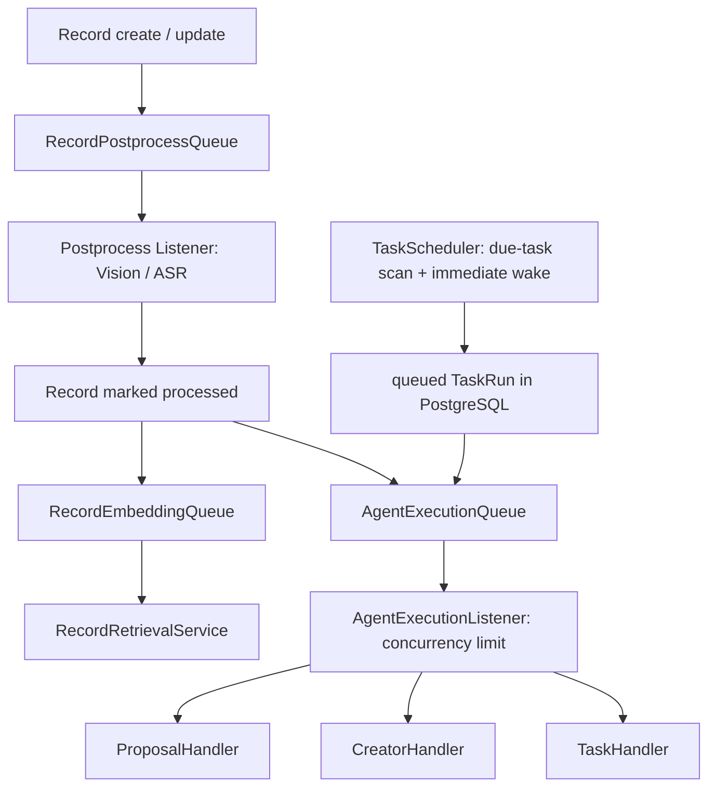

# Business Server

代码入口：`apps/server/src/bootstrap/main.ts`。Hono、Domain、Agent Runtime、异步队列和 Listener 在一个进程中装配。

## 模块边界

```text
apps/server/src/
├── bootstrap/         # 启动、配置、Hono 装配
├── routes/            # HTTP 校验、鉴权上下文、响应
│   └── agent/         # Session History / Events / Stream
├── domain/            # records / media / memory / projects / tasks 等领域
│   ├── projects/      # Proposal、Project、CreativeService
│   └── tasks/         # TaskService、TaskScheduler、ResultPublisher
├── agent/             # Pi Harness、Session、Tool、Prompt、Skills
├── event/             # Record / Embedding / Agent Execution 队列与 SessionEventBus
├── execution/         # AgentWorker、AgentExecutionListener、各业务 Handler
├── listeners/         # Record postprocess、Record embedding
├── infrastructure/    # DB、OSS、AI Client、缓存、日志
└── migrations/        # schema 基线与前向增量
```

路由只处理输入与响应边界；领域操作交给 Service，Agent Tool 只能通过 `agent/business-services.ts` 访问领域能力。受保护请求均从验证后的 Access JWT `sub` 获取 userId。用户状态与 Record 首页缓存是单进程 TTL 缓存，不具备多实例失效广播。

## 事件链路


```mermaid
flowchart TD
  R[Record create / update] --> Q[RecordPostprocessQueue]
  Q --> V[Postprocess Listener: Vision / ASR]
  V --> P[Record marked processed]
  P --> E[RecordEmbeddingQueue]
  P --> A[AgentExecutionQueue]
  E --> I[RecordRetrievalService]
  A --> L[AgentExecutionListener: concurrency limit]
  L --> PA[ProposalHandler]
  L --> CR[CreatorHandler]
  L --> TH[TaskHandler]
  S[TaskScheduler: due-task scan + immediate wake] --> T[queued TaskRun in PostgreSQL]
  T --> A
```

postprocess 按 `userId/recordId/version/runId` 认领与写回；单个图片或音频理解失败不会阻塞其他 block。Record 一旦写入 processed，Embedding 失败仅记录日志，不回滚 Record 或自动重试。Proposal 仅在创作能力启用时由 Listener 投递；无价值记录允许不产生提议。

`AgentExecutionQueue` 的 Listener 持有内存 pending 列表和 active Set，`AGENT_EXECUTION_CONCURRENCY` 控制 Proposal / Creator / Task 的共享并发。无需持久化消息；不是可靠 MQ。队列消息、运行事件、进程中断时尚未完成的工作都没有自动恢复/补投保证。

## Task 执行

`TaskScheduler` 每 `TASK_SCHEDULER_INTERVAL_MS` 扫描到期 Task，创建 PostgreSQL `queued` TaskRun 并投递消息；即时 Task 创建时主动唤醒扫描。TaskHandler 认领 `queued→running`，创建/绑定独立 Pi Session，使用 `AgentWorker → runAgent` 执行 Goal。Task Worker 使用 `task_plan_manage` 保存计划，用 `deliver_task_result` 上传交付到 OSS，完成 TaskRun。未交付、执行失败或超时会失败收敛，不自动重试。Task / TaskRun 状态不等于进程内事件状态。

## Project / Agent 执行

Proposal accept 在事务中确定所选 Idea，创建或更新 Project 为 `queued`，提交后向 AgentExecutionQueue 发布 Creator 消息。CreatorHandler 认领 `queued→running`，创建/复用绑定 Session，执行并将 Project 状态设置为 `completed` 或 `failed`。后续用户消息直接走通用 `/api/agent/stream`，按 userId + sessionId 解析 Project，再校验状态和权限并注入可信 projectId；不再有 Project 专属 POST 消息路由。更多语义见 [创作执行](creative-runtime.md)。

## 数据库与可靠性

启动先执行 Kysely migrations、健康预热再监听端口。最新空库基线是 `create_current_schema.ts`，异步 V3 的前向变更是 `zzzzzz_async_v3.ts`。已经完整应用旧迁移的数据库按 Kysely 元数据归并规则保留业务表，再执行新前向 migration；不要删除 `kysely_migration` 以强制重建。生产连接、健康与部署见 [本地开发](../engineering/local-development.md)。

目前不提供队列消息持久化、自动失败重试、重启执行恢复或跨实例调度协调；任何规模评估应考虑这些真实限制。
