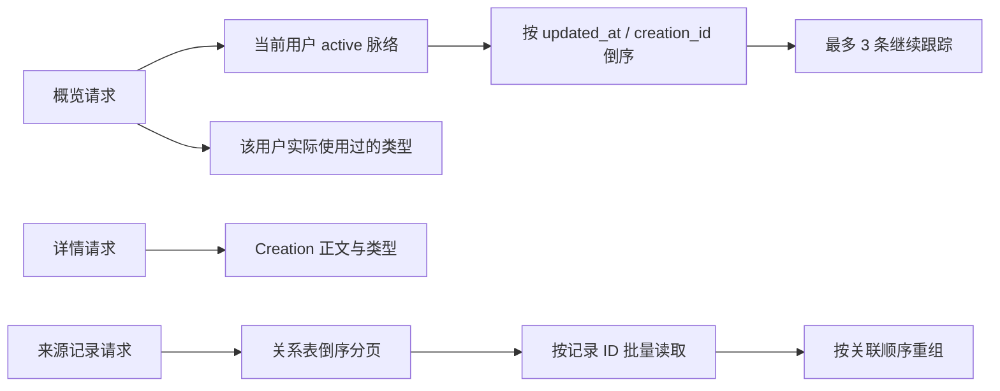

# 脉络

## 概念与数据模型

脉络（Creation）是由多个 Record 形成的长期线索。当前服务仅提供读取能力；Creation 的生成、Proposal 的确认/拒绝均未挂载。

| 实体 | 作用 |
| --- | --- |
| `creation_kinds` | 全局或用户自定义的脉络类型。当前演示数据使用全局类型。 |
| `creations` | 脉络正文、摘要、状态、类型、版本。 |
| `entity_relations` | Record 与 Creation 的关联。当前读取使用 `record_creation` 关系。 |
| `creation_proposals` | 数据表与旧代码保留，但当前 API 不提供 Proposal 读取或写入。 |

Creation 状态限定为 `active`、`resting`、`archived`。概览仅返回 `active`；详情按用户和业务 ID 查询，可返回已归档脉络。

摘要字段是 JSON 字符串，当前约定至少含：

```json
{ "schemaVersion": 1, "overview": "摘要文本", "summaryVersion": 1 }
```

正文 `content` 当前以 Markdown 字符串保存和返回。

## 读取逻辑



来源记录分页先读取关系，再按 ID 批量获取记录并恢复关系顺序；这避免 JOIN 放大分页结果。游标编码来源记录的创建时间和业务 ID。

## 演示数据

执行 `pnpm --filter @fanto/server seed:creation-demo` 会为用户 `creation-demo-user` 重置并写入：3 个系统类型、5 条 active 脉络、50 条纯文本记录、25 个 Creation-Record 关联，以及 3 条待确认 Proposal 数据。概览接口仍只展示最近 3 条 active 脉络。

注意：演示 Proposal 虽会写入数据库，但当前运行服务没有对外 Proposal 路由，客户端不能使用它们完成长期跟踪或暂不保留。
