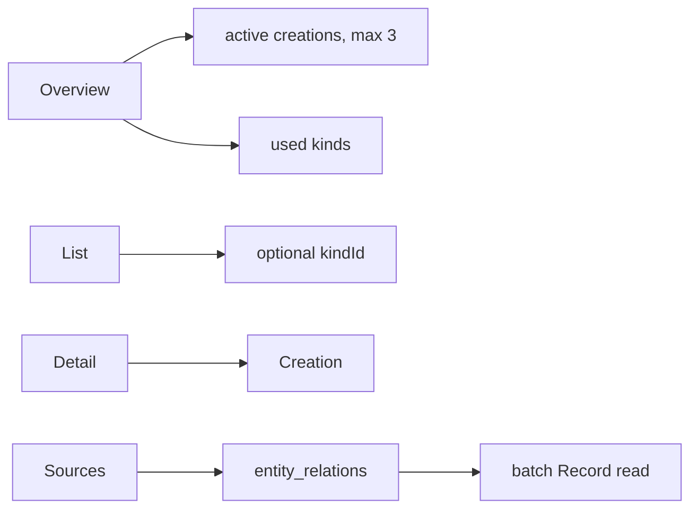

# Creation / Proposal

Creation 是值得长期跟踪的脉络；Proposal 是等待用户确认的候选发现。当前运行时已经具备读取 Proposal、用户决策和 Creation 展示，但**没有自动生成 Proposal 的运行链路**。

## 核心实体

| 实体 | 当前职责 |
| --- | --- |
| `creation_kinds` | 脉络类型目录；支持系统类型，schema 也预留用户 owner |
| `creations` | 脉络标题、类型、summary、Markdown content、状态与版本 |
| `creation_proposals` | 待确认候选，可指向新建或更新 Creation |
| `entity_relations` | Record 与 Proposal / Creation 等实体的来源关系 |

Creation 状态：

```text
active
resting
archived
```

概览只展示最近的 active Creation；详情可以读取当前用户的归档 Creation。

## 读取路径



来源记录分页先读取 relation，再按 ID 批量读取 Record 并按 relation 顺序重组，避免 JOIN 影响分页稳定性。

## Proposal 决策

待确认 Proposal 当前支持：

- 列表；
- 详情与来源；
- confirm；
- reject。

confirm 在事务中创建或更新 Creation，并把 Proposal 来源迁移成 Creation 的 Record 关系；更新已有 Creation 时会检查目标版本，避免覆盖并发变化。

reject 将 Proposal 标记为不再保留。

## 当前缺失

当前没有挂载“从 Record 自动分析并产生 Proposal”的 workflow，也没有自动持续更新 Creation 的后台链路。数据库里有 Proposal 不代表系统具备自动发现能力。

演示数据可以通过：

```bash
pnpm --filter @fanto/server seed:creation-showcase
```

生成，用于验证现有读取和决策界面。
