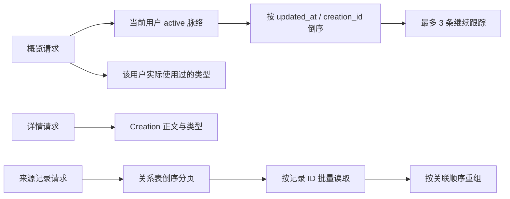

# 脉络

## 概念与数据模型

脉络（Creation）是由多个 Record 形成的长期线索。待确认 Proposal 可被用户转为长期跟踪，或标记为暂不保留；自动生成 Proposal 的工作流仍未挂载。

| 实体 | 作用 |
| --- | --- |
| `creation_kinds` | 全局或用户自定义的脉络类型。当前演示数据使用全局类型。 |
| `creations` | 脉络正文、摘要、状态、类型、版本。 |
| `entity_relations` | Record 与 Creation 的关联。当前读取使用 `record_creation` 关系。 |
| `creation_proposals` | 待确认提案；支持读取、详情、确认与暂不保留。 |

Creation 状态限定为 `active`、`resting`、`archived`。概览仅返回 `active`；详情按用户和业务 ID 查询，可返回已归档脉络。

摘要字段 `summary` 是纯文本，可为空（Proposal 在待确认阶段也可能尚未具备完整内容）。旧数据库中 JSON 摘要会在迁移时提取其中的 `overview` 文本。正文 `content` 当前以 Markdown 字符串保存和返回。

## 读取逻辑

来源记录分页先读取关系，再按 ID 批量获取记录并恢复关系顺序；这避免 JOIN 放大分页结果。游标编码来源记录的创建时间和业务 ID。

## 演示数据

执行 `pnpm --filter @fanto/server seed:creation-demo` 会为用户 `creation-demo-user` 重置并写入：3 个系统类型、5 条 active 脉络、50 条纯文本记录、25 个 Creation-Record 关联，以及 3 条待确认 Proposal 数据。概览接口仍只展示最近 3 条 active 脉络。

每条演示 Proposal 同时关联三条来源 Record，便于验证「为什么会出现」详情。确认时会在同一事务内创建或更新 Creation，并将关联迁移为 `record_creation`。Creation 的完整列表可按可选 `kindId` 从 `GET /api/creations` 读取；概览的三条限制不影响该列表。
