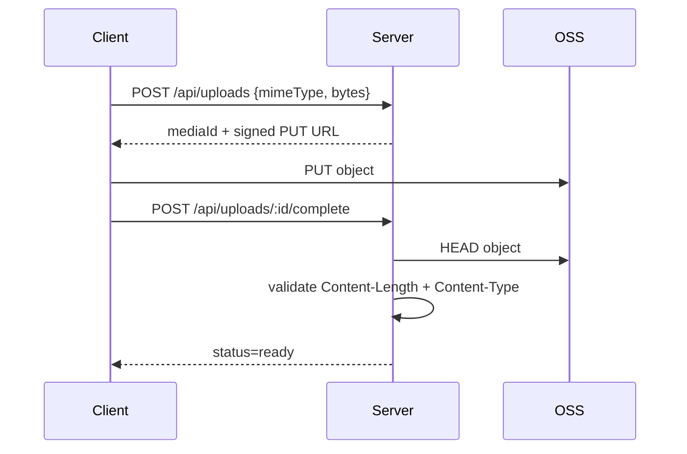

# Media

Media 负责 Record 使用的图片与音频资产。二进制内容存储在阿里云 OSS，业务元数据保存在 `media_assets`。

## 支持格式

| 类型 | MIME |
| --- | --- |
| Image | `image/jpeg`、`image/png`、`image/webp` |
| Audio | `audio/mp4`、`audio/mpeg`、`audio/wav` |

单个媒体请求声明大小上限为 50,000,000 bytes。

## 上传链路



Server 根据 MIME 决定 media type 和对象后缀。complete 时会验证 OSS 实际对象大小和 MIME；不一致返回 `UPLOAD_MISMATCH`。

ready Media 才能关联到 Record。关联后 `ext_data.recordId` 记录归属，避免同一媒体被不同 Record 重复使用。

## 图片理解

Record postprocess 发现 image block 尚无 description 时，会通过 Vision Client 使用 OSS 读取地址生成描述。成功结果写回该 Record block：

```json
{ "type": "image", "mediaId": "...", "description": "..." }
```

图片理解失败只记录日志，不阻断其他媒体处理。

## 音频转写

Audio block 在 Record postprocess 中调用 ASR。成功后：

- transcription 写入 Record audio block；
- ASR 状态、模型、语言、情绪、完成时间写入对应 Media `ext_data.asr`。

失败时 Media 记录失败状态和错误码，Record block 不产生 transcription。

当前没有独立的“上传后立即转写” SSE API；音频理解属于 Record 后置处理的一部分。

## 读取

三个读取接口都先校验当前用户和 ready 状态，不存在、未完成或不属于当前用户的媒体统一返回 `404 NOT_FOUND`：

- `GET /api/media/:id`：302 到短期 OSS 读取地址；
- `GET /api/media/:id/url`：返回 `{ url, expiresAt }`，供浏览器 `` / `<audio>` 这类无法附加 `x-user-id` Header 的元素使用；
- `GET /api/media/:id/meta`：返回稳定的 `mediaId / mediaType / mimeType` 与可用的 `width / height / durationMs`，不返回 OSS 地址。

`present_media` Agent Tool 使用 `/meta` 对模型给出的 mediaId 做用户归属与 ready 校验，并把稳定 metadata 写入原生 Tool Result `details`。短期 signed URL 不写入 Agent Session，真正展示或播放时再由客户端调用 `/url` 获取。业务 API 不直接暴露永久 OSS URL。
