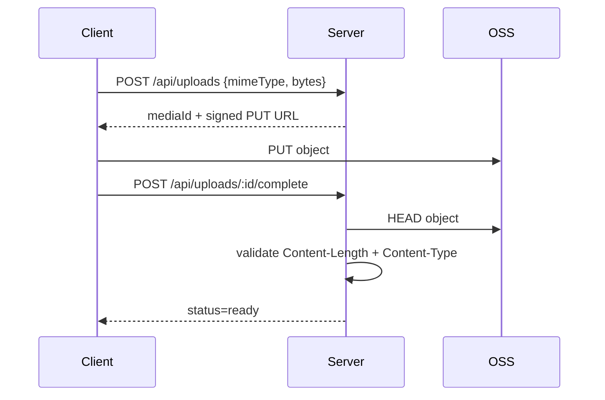

# Media

Media 负责 Record 使用的图片与音频资产。二进制内容存储在阿里云 OSS，业务元数据保存在 `media_assets`。

## 支持格式

| 类型 | MIME |
| --- | --- |
| Image | `image/jpeg`、`image/png`、`image/webp` |
| Audio | `audio/mp4`、`audio/mpeg`、`audio/wav` |

单个媒体请求声明大小上限为 50,000,000 bytes。

## 上传链路


```mermaid
sequenceDiagram
  participant C as Client
  participant S as Server
  participant O as OSS

  C->>S: POST /api/uploads {mimeType, bytes}
  S-->>C: mediaId + signed PUT URL
  C->>O: PUT object
  C->>S: POST /api/uploads/:id/complete
  S->>O: HEAD object
  S->>S: validate Content-Length + Content-Type
  S-->>C: status=ready
```

Server 根据 MIME 决定 media type 和对象后缀。complete 时会验证 OSS 实际对象大小和 MIME；不一致返回 `UPLOAD_MISMATCH`。

用户主动上传的媒体对象键为 `users/<userId>/media/<YYYY-MM>/<mediaId>.<extension>`。后台 Task 的交付文件由 `deliver_task_result` 上传，使用独立对象键 `users/<userId>/task/<YYYY-MM>/<workerSessionId>/<filename>`；Task 产物仍作为 ready Media 保存。普通下载继续通过现有 Media URL 接口取得短期 OSS signed URL；HTML / Markdown / Text Task Artifact 的域内预览由 `/api/tasks/artifacts/:mediaId/preview` 读取受控文本内容。Artifact 实现内部引用 Fanto 图片或音频统一使用 `fanto-media://<mediaId>`，客户端在渲染前再将其解析成短期 signed URL，不把 signed URL 持久化进 Artifact、TaskRun 或 Agent Session。该 URI 是 Fanto 内部媒体协议：Worker 可以在 HTML / Markdown 资源属性中使用，但不得把它写成用户可见的使用说明、图片替换指南或交付摘要。

ready Media 才能关联到 Record。关联后 `ext_data.recordId` 记录归属，避免同一媒体被不同 Record 重复使用。

## 图片理解

Record postprocess 发现 image block 尚无 description 时，会通过 Vision Client 使用 OSS 读取地址生成描述。成功结果写回该 Record block：

```json
{ "type": "image", "mediaId": "...", "description": "..." }
```

图片理解失败只记录日志，不阻断其他媒体处理。

## 音频转写

Audio block 在 Record postprocess 中调用 ASR。成功后，transcription 与 ASR 状态、模型、语言、情绪、完成时间都写入 Record audio block。失败时 audio block 写入 `asr.status=failed` 与错误码，不产生 transcription。

`media_assets.ext_data` 继续保存上传阶段 capture metadata（包括可用的 `durationMs`）与 Record 占用关系；ASR 结果不再写入 Media。Record 创建 / 更新时会把 capture 中的音频时长复制进 audio block。

当前没有独立的“上传后立即转写” SSE API；音频理解属于 Record 后置处理的一部分。

## 读取

三个读取接口都先校验当前用户和 ready 状态，不存在、未完成或不属于当前用户的媒体统一返回 `404 NOT_FOUND`：

- `GET /api/media/:id`：302 到原始媒体的短期 OSS 读取地址；
- `GET /api/media/:id/url?variant=original|thumbnail`：返回 `{ url, expiresAt }`；不传 variant 时默认为 `original`。图片 `thumbnail` 使用 OSS 实时处理生成宽 600、质量 80、WebP 变体；音频始终返回原始媒体；
- `GET /api/media/:id/meta`：返回稳定的 `mediaId / mediaType / mimeType` 与可用的 `width / height / durationMs`，不返回 OSS 地址。

`present_media` Agent Tool 使用 `/meta` 对模型给出的 mediaId 做用户归属与 ready 校验，并把稳定 metadata 写入原生 Tool Result `details`。短期 signed URL 不写入 Agent Session，真正展示或播放时再由客户端调用 `/url` 获取。缩略图 URL 与原图 URL 必须按 variant 独立缓存；业务 API 不直接暴露永久 OSS URL。
