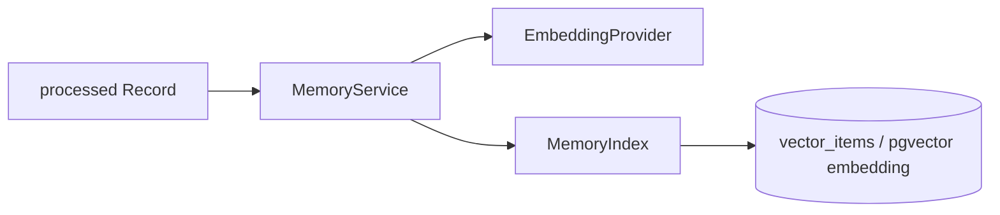

# Memory / Retrieval

Memory 在产品上表示 Fanto 对长期上下文的理解与可重新找到的能力；当前仍没有独立的“Memory 实体”或用户可见 Memory 表。业务事实来自 Record 等领域数据，Memory 索引属于可重建派生数据。

## 当前模块结构

Memory 现在分为三层职责：

```text
domain/memory/
├── model.ts
├── embedding-provider.ts
├── memory-index.ts
├── record-memory.ts
└── memory-service.ts

infrastructure/memory/
├── postgres-memory-index.ts
└── rebuild-memory-index.ts
```

- `MemoryService`：编排 Record 索引、删除与搜索，不直接访问 SQLite。
- `EmbeddingProvider`：Embedding 能力契约；当前由 `EmbeddingsClient` 实现。
- `MemoryIndex`：派生索引契约；当前由 `PostgresMemoryIndex` 实现。
- `record-memory.ts`：把 processed Record 拆成稳定的原子索引文档并生成 `contentHash`。

因此 pgvector 是当前 Memory 的基础设施实现，不是 Domain API。

## Record 接入

Record 创建或更新后仍走现有 postprocess queue。图片理解与音频转写完成并成功写回当前版本后，Repository 返回最终的 `processed` Record，Listener 再调用：

```text
MemoryService.replaceRecord(processedRecord)
```

Memory 不再自行反查 `records` 表。

如果图片或音频单项失败，其余结果仍可写回；如果后续 Embedding 或 Memory Index 写入失败，Record 已完成的 `processed` 状态不会回滚。当前队列没有持久重试，缺失索引依靠后续 rebuild 恢复。

## 原子索引单元

Memory 不再把整条 Record 的文本、图片描述和音频转写拼成一个 embedding。一个 processed Record 会按可独立检索的语义单元拆分：

```text
record_text: 用户记录：<text>
image:       图片描述：<image description>
audio:       音频转写：<audio transcription>
```

每个非空单元独立生成 embedding 与 SHA-256 `content_hash`。文本单元直接以 `recordId` 标识；图片和音频单元使用内部可逆 source ID 关联 `recordId + mediaId`，因此搜索命中媒体内容后仍可回到所属 Record。Record 更新时只重建发生变化的原子单元，并移除已不存在的旧媒体单元。

## 存储



- `records`：业务事实。
- `vector_items`：保存 user、原子 source type（`record_text` / `image` / `audio`）、source ID、原始 Record 的 `event_at`、索引文本、hash 与索引状态。
- `vector_items.embedding`：与元数据同表保存的 768 维 pgvector 向量。

向量索引可以 reset / rebuild，不替代 Record。

## 用户隔离与检索

Supabase 中不再使用 SQLite 的 `record_vectors` 虚拟表；向量直接保存在 `vector_items.embedding`：

```sql
CREATE TABLE vector_items (
  -- 其他索引元数据
  embedding vector(768) NOT NULL
);
```

Record Search 先把 query 转成 embedding，再以当前用户为查询边界执行 pgvector KNN：

```sql
SELECT type, outer_id, content, embedding <-> $1::vector AS distance
FROM vector_items
WHERE user_id = $2
  AND status = 'indexed'
ORDER BY embedding <-> $1::vector
LIMIT $3
```

因此 candidate generation 本身就是 user-scoped。

读取 `vector_items` 时仍再次校验：

- `user_id`；
- `type ∈ { record_text, image, audio }`；
- `status = indexed`。

前者是检索边界，后者是业务归属的二次防御。

## MemoryService 当前能力

`MemoryService` 当前提供：

- `replaceRecord(record)`；
- `removeRecord({ userId, recordId })`；
- `searchRecords({ userId, query, limit })`。

当前 Memory 的业务来源只接入 Record；一个 Record 内部再拆成 `record_text` / `image` / `audio` 三类原子检索单元。接口结构允许以后增加 Creation 或 Conversation summary，但这些能力尚未存在。

## HTTP Search

Business Server 已注册：

```http
POST /api/records/search
```

它调用 `MemoryService.searchRecords`，并从请求 Header 获取当前用户，不接受客户端在请求体传 `userId`。

HTTP 返回 `recordId`、原子 `sourceType`、可选 `mediaId`、`snippet`、原始 Record 的 `eventAt` 与 pgvector `distance`。`distance` 用于 Agent 判断结果相关性，不代表已经校准后的产品置信度。

## Agent Context Retrieval

Fanto main Agent 在每次 Agent Run 开始前执行一次 MemoryProvider。它不新增 Memory HTTP API，而是复用现有 Record Search：

```text
current message + recent conversation
          |
          v
Query Rewrite (deepseek-v4-flash)
          |
          v
0-2 semantic queries
          |
          v
POST /api/records/search
          |
          v
dedupe by real recordId
          |
          v
top 2 Relevant Memory
```

Query Rewrite 只负责把指代和自然对话改写成检索查询；纯知识问答、简单寒暄或不需要过去信息时可以返回空查询。每条查询最多取 4 个原子命中，MemoryProvider 跨查询按真实 Record ID 去重、保留距离更近的命中，最终只向 System Prompt 注入 2 条。

注入内容包含真实 `recordId`、`snippet` 和 `eventAt`，不包含 `mediaId` 或向量 `distance`。主模型需要恢复完整 Record 时可以直接调用 `record_get(recordId)`。

该 Context Build 只在 Run 前执行一次；Agent Loop 中不会再次自动重写或搜索。主模型仍可按需要主动调用 Record Tools。

## Rebuild

根命令：

```bash
pnpm memory:rebuild
```

`pnpm vector:rebuild` 当前保留为兼容别名。

Rebuild 会：

1. reset `vector_items` 派生索引；
2. 按批次扫描所有用户的 `processed` Records；
3. 对每条 Record 复用 `MemoryService.replaceRecord`；
4. 输出累计 Record 数与用户数。

它不会删除 Record、Media、Creation 或 Proposal 等业务数据。
