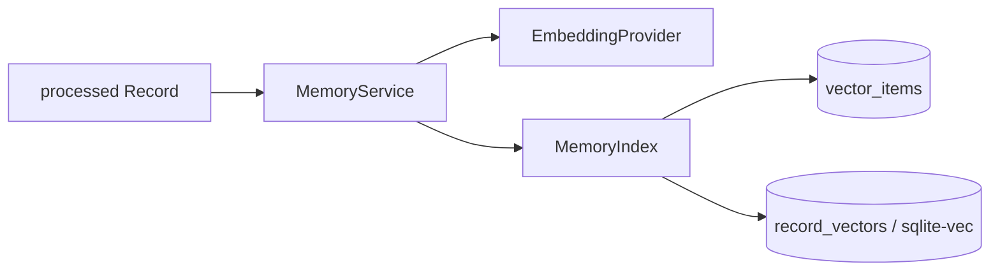

# Memory / Retrieval

Memory 在产品上表示 Fanto 对长期上下文的理解与可重新找到的能力；当前仍没有独立的“Memory 实体”或用户可见 Memory 表。业务事实来自 Record 等领域数据，Memory 索引属于可重建派生数据。

## 当前模块结构

Memory 现在分为三层职责：

```text
domain/memory/
├── model.ts
├── embedding-provider.ts
├── memory-index.ts
├── record-memory.ts
└── memory-service.ts

infrastructure/memory/
├── sqlite-vec-memory-index.ts
└── rebuild-memory-index.ts
```

- `MemoryService`：编排 Record 索引、删除与搜索，不直接访问 SQLite。
- `EmbeddingProvider`：Embedding 能力契约；当前由 `EmbeddingsClient` 实现。
- `MemoryIndex`：派生索引契约；当前由 `SqliteVecMemoryIndex` 实现。
- `record-memory.ts`：把 processed Record 拆成稳定的原子索引文档并生成 `contentHash`。

因此 sqlite-vec 是当前 Memory 的基础设施实现，不是 Domain API。

## Record 接入

Record 创建或更新后仍走现有 postprocess queue。图片理解与音频转写完成并成功写回当前版本后，Repository 返回最终的 `processed` Record，Listener 再调用：

```text
MemoryService.replaceRecord(processedRecord)
```

Memory 不再自行反查 `records` 表。

如果图片或音频单项失败，其余结果仍可写回；如果后续 Embedding 或 Memory Index 写入失败，Record 已完成的 `processed` 状态不会回滚。当前队列没有持久重试，缺失索引依靠后续 rebuild 恢复。

## 原子索引单元

Memory 不再把整条 Record 的文本、图片描述和音频转写拼成一个 embedding。一个 processed Record 会按可独立检索的语义单元拆分：

```text
record_text: 用户记录：<text>
image:       图片描述：<image description>
audio:       音频转写：<audio transcription>
```

每个非空单元独立生成 embedding 与 SHA-256 `content_hash`。文本单元直接以 `recordId` 标识；图片和音频单元使用内部可逆 source ID 关联 `recordId + mediaId`，因此搜索命中媒体内容后仍可回到所属 Record。Record 更新时只重建发生变化的原子单元，并移除已不存在的旧媒体单元。

## 存储



- `records`：业务事实。
- `vector_items`：保存 user、原子 source type（`record_text` / `image` / `audio`）、source ID、索引文本、hash 与索引状态。
- `record_vectors`：1536 维 sqlite-vec 向量索引。
- `record_vectors.rowid = vector_items.id` 用于关联。

向量索引可以 reset / rebuild，不替代 Record。

## 用户隔离与检索

`record_vectors` 当前 schema：

```sql
CREATE VIRTUAL TABLE record_vectors USING vec0(
  user_id text partition key,
  embedding float[1536]
);
```

Record Search 先把 query 转成 embedding，然后直接在当前用户 partition 中执行 KNN：

```sql
SELECT rowid AS id, distance
FROM record_vectors
WHERE embedding MATCH ?
  AND user_id = ?
  AND k = ?
ORDER BY distance
```

因此 candidate generation 本身就是 user-scoped，不再使用“全局 KNN + limit * N + 用户过滤”的补偿逻辑。

读取 `vector_items` 时仍再次校验：

- `user_id`；
- `type ∈ { record_text, image, audio }`；
- `status = indexed`。

前者是检索边界，后者是业务归属的二次防御。

## MemoryService 当前能力

`MemoryService` 当前提供：

- `replaceRecord(record)`；
- `removeRecord({ userId, recordId })`；
- `searchRecords({ userId, query, limit })`。

当前只接入 `record` source type；接口结构允许以后增加 Creation 或 Conversation summary，但这些能力尚未存在。

## HTTP Search

Business Server 已注册：

```http
POST /api/records/search
```

它调用 `MemoryService.searchRecords`，并从请求 Header 获取当前用户，不接受客户端在请求体传 `userId`。

HTTP 返回 `recordId`、原子 `sourceType`、可选 `mediaId`、`snippet` 与 sqlite-vec `distance`。`distance` 用于 Agent 判断结果相关性，不代表已经校准后的产品置信度。

## Rebuild

根命令：

```bash
pnpm memory:rebuild
```

`pnpm vector:rebuild` 当前保留为兼容别名。

Rebuild 会：

1. reset `vector_items` 与 `record_vectors` 派生索引；
2. 按批次扫描所有用户的 `processed` Records；
3. 对每条 Record 复用 `MemoryService.replaceRecord`；
4. 输出累计 Record 数与用户数。

它不会删除 Record、Media、Creation 或 Proposal 等业务数据。
