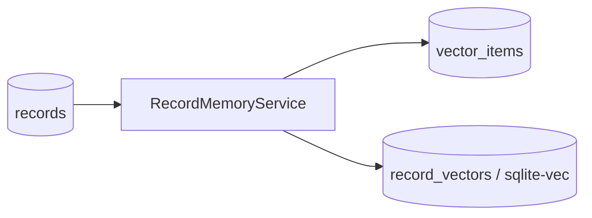
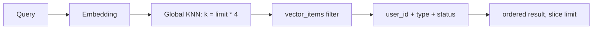

# Memory / Record Retrieval

当前 Fanto 没有独立的“Memory 实体”。Memory 在产品上表示 Fanto 对长期上下文的理解；代码中已经存在的基础能力是 **Record 向量索引与语义检索**。

实现位于 `apps/server/src/domain/memory/record-index.ts`。

## 索引文本

Record postprocess 完成后调用 `RecordMemoryService.index(..., operation="replace")`。

索引文本按已有内容组合：

```text
用户记录：<text>
图片描述：<image description>
音频转写：<audio transcription>
```

空内容会跳过索引。组合文本使用 SHA-256 生成 `content_hash`，避免同一 Record 同内容重复创建 indexed item。

## 存储



- `records`：业务事实。
- `vector_items`：向量对应的 user、Record ID、索引文本、hash 与状态。
- `record_vectors`：1536 维 sqlite-vec 向量表。
- `record_vectors.rowid = vector_items.id` 用于关联。

向量数据是派生数据，不是 Record 的替代存储。

## 当前检索实现

`search(userId, query, limit)` 当前流程：



也就是说，当前先在全局 `record_vectors` 取候选，再通过 `vector_items.user_id` 做用户过滤。

这能阻止直接返回其他用户 metadata，但它不是理想的 user-scoped candidate generation：其他用户的高相似向量仍可能占用 Top-K 候选，导致当前用户召回不足。任何调用方都不应把 `limit * 4` 当成可靠的数据隔离或召回保证。

当前 `RecordMemoryService.search` 还没有注册成 Business Server HTTP API。

## Search 返回

内部搜索结果包含：

- `recordId`；
- 索引内容 snippet；
- sqlite-vec distance（当前字段名为 `score`）。

这个 distance 是向量距离，不是“置信度”或“相关概率”，不应直接赋予产品语义。

## Rebuild

根脚本 `scripts/rebuild-vector-index.ts` 可以对 Record 做 replace index，但当前脚本只读取 `default-user` 且最多 10,000 条，因此它目前不是完整的多用户全量 rebuild 工具。
