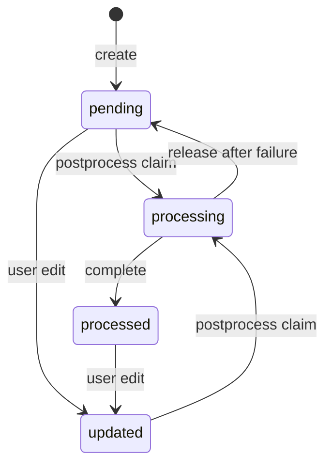

# Record

Record 是用户原始记录，是 Fanto 个人数据的基础事实之一。它属于单一用户，并保留用户的原始文字与媒体顺序。

## 内容模型

`records.content` 保存 JSON：

```json
{
  "text": "准备周末徒步",
  "blocks": [
    { "type": "image", "mediaId": "...", "description": "异步生成，可选" },
    { "type": "audio", "mediaId": "...", "transcription": "异步生成，可选" }
  ]
}
```

创建 / 更新时客户端只提交文字与 `mediaId`，不提交 AI 生成的 `description` 或 `transcription`。

保存约束：

- text 最长 20,000 字；
- 最多 4 个媒体；
- 同一 Record 中 mediaId 不可重复；
- 媒体必须 ready、属于当前用户，且不能被其他 Record 占用；
- 文字为空时，至少需要包含一条音频；仅图片且无文字的 Record 当前不允许保存。

## 时间语义

- `eventAt`：业务发生时间，由客户端在创建时提交带时区 ISO 8601，Server 规范化后保存；Timeline / 日历应以它为准。
- `createdAt`：服务端首次保存时间。
- `updatedAt`：服务端最后变更时间。

列表按 `eventAt DESC, recordId DESC` 分页，cursor 同时编码这两个值，避免相同时间戳导致漏项。

## 版本与状态

Record 使用整数 `version` 做乐观并发。更新必须提交 `expectedVersion`。



当状态为 `processing` 时，不接受内容更新；版本冲突或 processing 更新会返回 `409 VERSION_CONFLICT`。

## 后置理解

Record 创建 / 更新后会触发 [Media](media.md) 理解与 [Memory](memory.md) 索引。图片描述和音频转写都回写到当前 Record 版本的 block；旧 task 不能覆盖已经变化的版本。

Record 的完整 HTTP 投影还会把 block 关联到 Media URL、音频时长和 ASR 元数据，见 [HTTP API](../api/http-api.md)。
