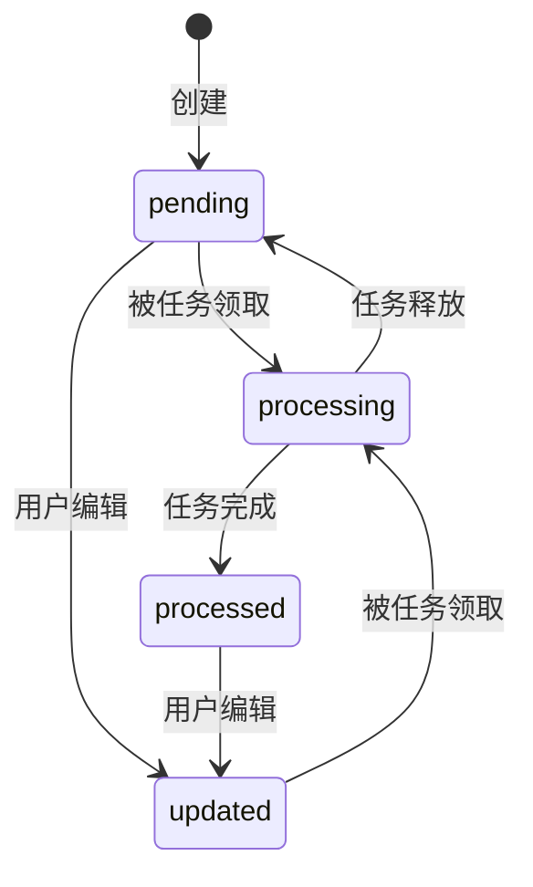

# 记录与媒体

## Record

Record 是用户原始记录，归属于单一用户。主要字段为：业务 ID、来源、文本与媒体块、版本、状态、创建/更新时间。内容存于 `records.content` JSON：

```json
{
  "text": "随手写下的文字",
  "blocks": [
    { "type": "image", "mediaId": "...", "description": "可选，异步补写" },
    { "type": "audio", "mediaId": "..." }
  ]
}
```

保存规则：文本最长 20,000 字；最多 4 个媒体；媒体 ID 不可重复；文字与媒体不可同时为空；若没有文字，至少要包含音频。所有关联媒体必须已就绪、属于当前用户，且未关联到其他记录。

### 生命周期



当前 HTTP 写入只会创建 `pending` 或更新为 `updated`；领取、完成、释放方法已在仓储中实现，但当前运行入口没有挂载使用它们的整理任务。

编辑为乐观并发：客户端必须提交 `expectedVersion`。版本不匹配返回 `409 VERSION_CONFLICT`，并带回当前记录视图。列表采用 `(createdAt, recordId)` 复合游标倒序分页，避免同一时间戳漏项。

## 媒体

媒体先创建上传凭据，再由客户端直传 OSS，随后调用 complete 确认。支持：

| 类型 | MIME |
| --- | --- |
| 图片 | JPEG、PNG、WebP |
| 音频 | MP4、MPEG、WAV |

最大文件大小为 50 MB。确认时服务会检查 OSS 对象的 Content-Length 和 Content-Type 是否与申请值一致，成功后状态从 `uploading` 变为 `ready`。

### 图片理解

创建或更新记录后，对没有描述的图片异步调用视觉模型。任务会重新校验记录版本、用户、媒体关联和图片类型，避免旧任务覆盖新内容。描述写入 Record 内容块。

### 音频转写

`POST /api/uploads/:id/transcription` 返回 SSE：`delta` 事件逐段输出文本，最终为 `completed`，失败为 `failed`。同一媒体只允许一个进行中的转写；成功结果会缓存，重复请求直接返回 completed。转写失败记录状态但不自动重试。

## 向量记忆

每次记录创建/更新后触发向量写入或替换。索引内容为用户文本加已就绪的音频转写，使用 SHA-256 去重。向量表为 `record_vectors`，元数据在 `vector_items`，键为 `(userId, type=record, outerId=recordId)`。图片不向量化。
