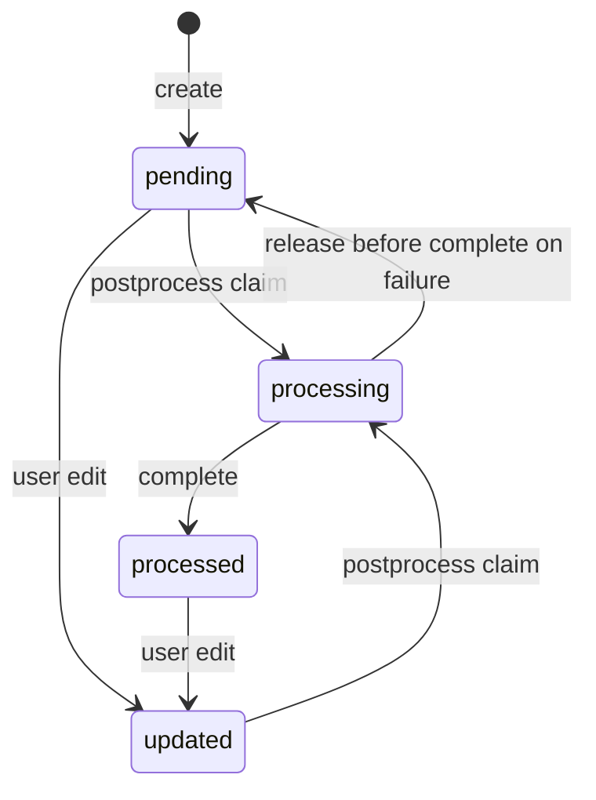

# Record

Record 是用户原始记录，是 Fanto 个人数据的基础事实之一。它属于单一用户，并保留用户的原始文字、媒体顺序与可选地点。

## 内容模型

`records.content` 保存 JSON：

```json
{
  "text": "准备周末徒步",
  "blocks": [
    { "type": "image", "mediaId": "...", "description": "异步生成，可选" },
    {
      "type": "audio",
      "mediaId": "...",
      "durationMs": 12000,
      "transcription": "异步生成，可选",
      "asr": {
        "status": "succeeded",
        "model": "qwen3-asr-flash",
        "emotion": "neutral",
        "language": "zh",
        "completedAt": "2026-09-29T00:00:00.000Z"
      }
    },
    { "type": "location", "name": "万科·金草公寓", "countryCode": "CN", "country": "中国", "province": "浙江省", "city": "杭州市", "district": "上城区", "latitude": 30.311147, "longitude": 120.214973 }
  ]
}
```

创建 / 更新时客户端提交文字、`mediaId` 与可选 `location`；地点输入为 `{ name, countryCode?, country?, province?, city?, district?, latitude, longitude }`，服务端写入 location block。`name` 是地点本体，行政区按国家、省/州、城市、区独立保存，不重复拼入 name。`countryCode` 使用 ISO 3166-1 alpha-2；海外地点的 `province` 可承载 state、province 或 region，`district` 可承载 borough、arrondissement 等较细 locality。坐标固定为 WGS-84、规范化到小数点后六位，每条 Record 最多一个地点。客户端不提交 AI 生成的 `description`、`transcription` 或 `asr`。保存音频 block 时，Server 会把上传完成阶段记录的 `durationMs` 一并写入 Record。

保存约束：

- text 最长 20,000 字；
- 最多 4 个媒体；
- 同一 Record 中 mediaId 不可重复；
- 媒体必须 ready、属于当前用户，且不能被其他 Record 占用；
- 地点名称为 1–200 字；行政区展示字段为可选的 1–100 字，`countryCode` 为可选的两个字母 ISO 国家代码；纬度范围为 -90 至 90，经度范围为 -180 至 180；
- 文字为空时，至少需要包含一条媒体；仅图片、仅音频的 Record 均可保存。

## 时间语义

- `eventAt`：业务发生时间，由客户端在创建时提交带时区 ISO 8601，Server 规范化后保存；Timeline / 日历应以它为准。
- `createdAt`：服务端首次保存时间。
- `updatedAt`：服务端最后变更时间。

列表按 `eventAt DESC, recordId DESC` 分页，cursor 同时编码这两个值，避免相同时间戳导致漏项。无 cursor 且 `limit <= 10` 时，Server 使用按用户隔离的 24 小时内存缓存：固定读取 11 条、只缓存前 10 条及 `hasMore`，因此 1–10 条的首页请求可共享同一缓存窗口；带 cursor 或 `limit > 10` 时直接查询 PostgreSQL。Record create / update / delete，以及 postprocess 的 claim / complete / release，都会立即使该用户的首页缓存失效。

`records.location_latitude` 与 `records.location_longitude` 是由 location block 同事务维护的地图查询投影；两者始终同时存在或为空，并不替代 `content.blocks` 里的业务事实。当前未提供世界地图读取接口或聚类能力。

## 版本与状态

Record 使用整数 `version` 做乐观并发。更新必须提交 `expectedVersion`。


```mermaid
stateDiagram-v2
  [*] --> pending: create
  pending --> processing: postprocess claim
  updated --> processing: postprocess claim
  processing --> processed: complete
  processing --> pending: release before complete on failure
  pending --> updated: user edit
  processed --> updated: user edit
```

当状态为 `processing` 时，不接受内容更新；版本冲突或 processing 更新会返回 `409 VERSION_CONFLICT`。

`completePostprocess` 只有在 `recordId + userId + version + runId` 都匹配当前 processing 任务时才完成，并返回最终的 processed Record；过期任务返回 `null`。

## 后置理解

Record 创建 / 更新后会触发 [Media](media.md) 理解与 [Memory](memory.md) 索引：

```text
Record save
→ postprocess claim
→ Vision / ASR
→ completePostprocess
→ processed Record
→ MemoryService.replaceRecord
```

图片描述写回 image block；音频转写正文与 ASR 状态 / 模型 / 语言 / 情绪 / 完成时间写回 audio block。Record 的读取数据因此由 `records.content.blocks` 自包含；旧 task 不能覆盖已经变化的版本。

Memory 是派生能力。Record 已经成功变成 `processed` 后，如果 Embedding 或 Memory Index 写入失败，不会把 Record 回滚到 pending；当前没有持久重试，索引可通过 Memory rebuild 恢复。

## 删除

删除使用当前 `version` 进行乐观并发校验，并从主表硬删除 Record。删除会解除关联媒体的 `recordId` 占用标记、移除该 Record 的向量记忆，以及清除其作为来源的创作关联；媒体资产及其 OSS 对象保留，后续可由专门的媒体清理能力处理。已入队或执行中的后置任务只会匹配仍存在的 Record，因此不会写回已删除内容。

Record HTTP 返回不再生成额外 `media[]` 投影，也不会在读取路径查询 `media_assets`。媒体二进制访问按 block 的 `mediaId` 单独通过 [Media](media.md) 读取接口获取。
