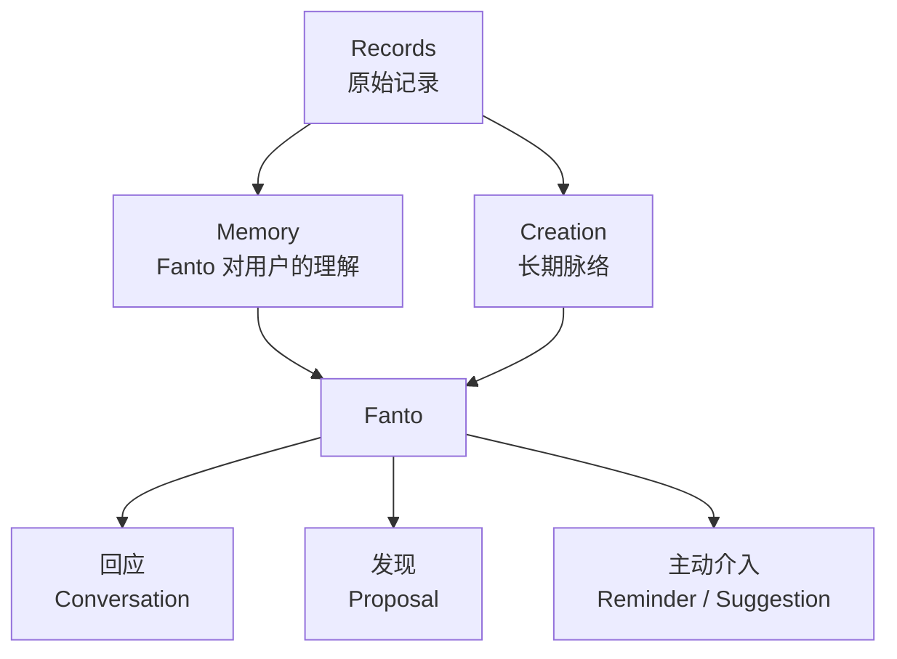
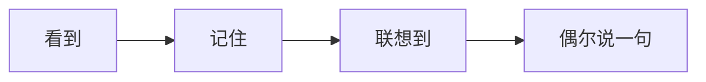

# Fanto 产品方向：认识你的陪伴型个人智能

> 本文描述 Fanto 的中长期产品方向与 MVP 验证重点，不代表仓库当前已经具备这些运行时能力。当前实现边界以 `docs/README.md`、领域文档和 API 文档为准。

## 1. 产品定位

Fanto 不是“带 AI 的笔记 App”，也不是一个无所不在、主动替用户管理人生的 Agent。

Fanto 是一个长期生活在用户个人记录之上的陪伴型个人智能：

> 因为它长期知道用户记录过什么，所以能在合适的时候，给出只有“认识用户很久”才能给出的回应。

它的核心价值不是一次回答有多聪明，也不是能自动执行多少任务，而是三个逐渐建立的感受：

1. **它记得我**：能准确、自然地想起过去的重要记录。
2. **它理解我**：能发现跨时间的联系、变化和长期脉络。
3. **它尊重我**：知道什么时候出现，也知道什么时候闭嘴。

产品原则可以浓缩为一句话：

> **默认安静，长期记得，偶尔有用。**

## 2. 用户记录为什么有长期价值

用户记录通常不是完整知识文档，而是发生在真实生活中的碎片：

| 记录类型 | 示例 | 长期价值 |
| --- | --- | --- |
| 知识与工具 | “Archify 可以生成项目架构图” | 在未来相关项目中重新浮现 |
| 人物与关系 | “老婆喜欢榴莲千层”“小朋友最近喜欢恐龙” | 在合适的日期或场景中提供帮助 |
| 生活经历 | 杭州三日游的文字、照片和地点 | 形成可回看的个人经历与生活记忆 |
| 思考与判断 | “AI 眼镜可能是下一代交互入口” | 发现观点如何持续、变化和形成 |
| 项目与愿望 | “这个 GitHub 项目以后可以试试” | 在重新遇到相似问题时恢复上下文 |
| 状态与感受 | “最近工作没有价值感”“又睡得太晚” | 在用户主动交流时提供连续而非模板化的回应 |

单条碎片的价值通常有限。Fanto 的价值来自跨时间、跨记录的连接：它不要求用户在记录时完成分类和整理，而是在未来真正需要时，让曾经的记录重新产生价值。

## 3. 产品模型

其中：

- **Record** 是用户原始、真实、低负担的表达，不要求先分类、先整理。
- **Memory** 是产品概念，表示 Fanto 对人物、偏好、经历、判断和上下文的理解；它不预设必须对应一个独立数据库实体。
- **Proposal** 是 Fanto 发现的候选联系，需要让用户理解“为什么会出现”，并允许继续、忽略或降低同类内容。
- **Creation** 是已经值得长期跟踪的脉络，例如持续思考、研究方向、生活主题或可能性分支。
- **Chat** 只是 Fanto 的一个出口，而不是产品本身。Fanto 还通过发现和克制的主动行为体现价值。

## 4. Fanto 的四层介入深度

AI 能力不应先按“搜索、总结、提醒、推荐”等功能菜单划分，而应先按对用户生活的介入深度划分。

| 层级 | 名称 | 行为 | 默认策略 |
| --- | --- | --- | --- |
| Level 0 | 记住 | 在后台理解并保存与未来相关的上下文，不打扰用户 | 默认开启 |
| Level 1 | 回应 | 用户主动找 Fanto 时，基于长期记录进行有连续性的回应 | 默认开启 |
| Level 2 | 发现 | 发现旧记录与新问题的联系，或正在形成的长期观点 | 克制出现 |
| Level 3 | 主动介入 | 主动提醒日期、建议行动或发起讨论 | 明确授权后开启 |

### 4.1 记住

这一层负责让记录在未来可被理解和重新使用。用户记录“家人不喜欢甜食”时，Fanto 不需要立即弹出任何内容，只需要正确记住，并保留来源。

这一层应该尽量无感，但必须可追溯、可纠正、可删除。

### 4.2 回应

用户主动发起对话时，Fanto 应优先理解当前表达，再谨慎引用相关历史，而不是机械展示检索结果。

例如用户说“最近工作有点烦”，Fanto 可以结合过去多次关于“价值感”的记录，判断困扰可能不只是忙碌。但它需要把判断表达为可讨论的观察，而不是替用户下结论。

### 4.3 发现

这是最可能形成产品差异的一层。Fanto 可以发现：

- 过去收藏的工具与当前项目重新相关；
- 多条分散记录正在形成一个持续观点；
- 用户对同一问题的判断发生了变化；
- 某个搁置想法重新具备推进条件；
- 一段生活经历值得形成可回看的脉络。

发现应优先进入 Proposal 或 Fanto 内部的信息流，而不是直接通过系统通知打扰用户。

### 4.4 主动介入

这一层包括生日提醒、礼物建议、行程关联、状态提醒和主动发起讨论。它可能很有价值，也最容易越界。

主动介入必须满足：

- 用户已明确允许相应能力和主动程度；
- 建议有足够强的时间或情境相关性；
- 能清楚解释依据；
- 可以一键拒绝，并让同类内容减少；
- 没有足够把握时宁可不出现。

## 5. IP 角色：让算法行为成为可理解的角色行为

Fanto 不应只是聊天页头像。它是“住在用户记录世界里的小生命”，基本行为是：

角色表达应强化克制和可信赖，而不是制造无处不在的拟人感。推荐使用：

- “Fanto 想起了一件可能有用的事”
- “Fanto 找到了一条旧线索”
- “Fanto 最近注意到……”
- “这让我想到你以前记录过的……”

不建议使用：

- “AI 分析结果”
- “系统智能推荐”
- “你应该……”
- 过度卖萌、频繁打断或以角色人格掩盖不确定性

IP 的真正价值是帮助用户理解 Fanto 为什么出现、正在做什么，以及如何与它建立长期边界。

## 6. 用户控制：主动程度与能力范围分离

不能只提供一个“开启 AI / 关闭 AI”的总开关。用户控制至少包含两个独立维度。

### 6.1 Fanto 主动程度

| 模式 | 用户可感知行为 |
| --- | --- |
| 安静 | 只有用户主动找 Fanto 时才回应；发现保留在应用内部 |
| 自然 | 偶尔展示高相关、高价值的发现；默认推荐 |
| 积极 | 可主动提醒、建议和发起讨论；需要用户明确选择 |

主动程度控制“Fanto 多主动”，但不决定它可以理解哪些内容。

### 6.2 用户语义层的能力范围

设置页不应暴露几十个底层模型开关，而应提供 5～6 个用户能理解的能力类别：

| 能力 | Fanto 可以做什么 |
| --- | --- |
| 回忆 | 在合适的时候想起以前记录的事情 |
| 思考 | 发现长期观点、想法之间的联系与变化 |
| 关系 | 记住家人朋友的重要信息与偏好 |
| 生活 | 理解旅行、照片、地点和生活经历 |
| 提醒 | 主动告诉用户可能忘记的重要事情 |
| 陪伴 | 基于记录聊天、谈心和提供建议 |

底层可以有更细的 capability，但它们应映射到稳定、可理解的用户语义。高敏感能力，如情绪推断、关系信息和主动提醒，应允许单独关闭。

## 7. 反馈机制比开关更重要

静态设置只能表达用户当前的预期，真正的边界需要在每次 Fanto 出现时持续学习。

每条主动发现或建议至少应该支持：

- 继续看看；
- 这次忽略；
- 少出现这类内容；
- 不再使用某类信息；
- 查看“为什么会出现”。

反馈需要同时影响：

1. **当前内容状态**：是否保留、转为 Creation 或忽略；
2. **同类能力偏好**：降低或提高类似内容出现概率；
3. **主动程度校准**：连续拒绝时自动降低打扰；
4. **人格表现**：Fanto 承认边界并调整，而不是反复询问。

Fanto 的个性最终不应只来自固定人设，还应来自它对用户边界的长期学习。

## 8. 核心用户场景

### 8.1 旧知识重新浮现

当前记录提到要重构 Agent Harness，Fanto 想起用户两个月前记录过 Archify，并说明二者可能相关。

价值不是替用户直接执行，而是让过去的信息在正确时机恢复价值。

### 8.2 长期观点形成

用户数月内多次记录 AI 眼镜、视觉 Agent、MR 和语音交互。Fanto 发现这些碎片正在形成“AI 硬件可能成为下一代个人计算入口”的持续判断，并生成 Proposal，用户确认后转为 Creation。

### 8.3 观点变化

用户过去认为 Agent 价值集中在模型厂商，近期记录逐渐转向“模型厂商提供基础设施，行业公司沉淀经验”。Fanto 展示这种变化及来源，而不是宣称用户已经改变立场。

### 8.4 人物与关系

在家人生日临近时，Fanto 基于明确记录过的偏好，询问是否需要整理礼物想法。默认不应从零推断亲密关系，也不应在未授权时主动触达。

### 8.5 生活回忆

在周年、地点重访或用户主动询问时，Fanto 将过去旅行中的照片、文字和地点组合成一段可回看的经历。

### 8.6 有连续性的陪伴

当用户表达焦虑或迷茫时，Fanto 可以引用长期记录中反复出现的关注点，但应以“我注意到”“会不会是”表达观察，避免诊断式结论和权威口吻。

## 9. 关键产品界面

| 界面 | 核心职责 |
| --- | --- |
| 记录页 | 极低成本捕获；不要求先理解 AI 会怎么处理 |
| Fanto 入口 | 承接对话、发现和少量状态表达，不做功能大全 |
| 对话 | 基于长期上下文回应，并提供来源但不打断阅读 |
| Proposal | 呈现一个待确认的发现，解释来源和出现原因 |
| Creation | 长期承载持续思考、生活主题或可能性分支 |
| 设置 | 控制主动程度、能力类别、敏感信息范围与通知 |
| 反馈动作 | 让用户随时纠正内容、来源、推断和打扰频率 |

每一次引用历史、形成推断或主动出现，都应该能回答三个问题：

1. Fanto 为什么现在提起这件事？
2. 它依据了哪些记录？
3. 用户如何纠正或阻止类似行为？

## 10. MVP 范围

MVP 不应追求大量 AI 功能，而应验证三个核心体验。

### P0：它真的记得我

- 对话能检索并自然引用真正相关的 Record；
- 引用可查看来源；
- 用户可纠正错误记忆或排除某条记录；
- 不为了显示“记得”而强行引用历史。

### P0：它能发现有价值的联系

- 优先验证“旧知识与新问题关联”和“长期观点形成”；
- 发现先生成 Proposal，不直接替用户做长期结论；
- 用户确认后再进入 Creation；
- 每条发现必须说明来源和理由。

### P0：它知道什么时候闭嘴

- 默认采用“自然”或更克制的主动策略；
- 主动内容优先留在 App 内，不默认推送；
- 支持“少出现这类内容”和“不再提醒”；
- 连续负反馈应降低同类能力的主动性。

MVP 暂不优先：

- 自动替用户执行外部操作；
- 大量时间管理、日程和待办能力；
- 基于弱信号的情绪诊断；
- 对人物关系进行激进推断；
- 每日总结、周报等同质化 AI 功能；
- 以高频通知制造活跃度。

## 11. 产品验证指标

指标应围绕价值、信任和克制，而不只是聊天次数或通知点击率。

| 目标 | 建议观察指标 |
| --- | --- |
| 记得准确 | 历史引用被展开、采纳、纠正或标记无关的比例 |
| 发现有用 | Proposal 查看率、确认率、转为 Creation 后的持续访问 |
| 不打扰 | 主动内容忽略率、负反馈率、关闭能力或降低主动程度的比例 |
| 建立信任 | 用户是否愿意持续记录更真实、更长期的信息 |
| 形成连续性 | 用户是否在后续对话或记录中继续同一个脉络 |
| 控制感 | 用户能否理解来源，并成功纠正或关闭相关行为 |

需要特别避免用高点击率证明主动打扰合理。更重要的是长期留存、负反馈后的恢复，以及用户是否愿意继续把真实记录交给 Fanto。

## 12. 信任与边界原则

1. **来源可追溯**：历史引用、Proposal 和推断都应能回到原始 Record。
2. **事实与推断分离**：明确区分“用户记录过”与“Fanto 猜测”。
3. **敏感能力显式授权**：关系、情绪、健康和主动提醒采用更高授权门槛。
4. **删除真实生效**：用户删除或排除的信息不应继续通过派生记忆出现。
5. **不以人格掩盖错误**：Fanto 可以有温度，但必须承认不确定和错误。
6. **不制造依赖**：陪伴不应通过焦虑、愧疚、连续签到或情感绑架提高活跃。
7. **最小必要主动**：同样能在用户主动进入 App 后完成的事情，不默认使用通知。
8. **先建议，后行动**：涉及外部世界或他人的操作，必须由用户确认。

## 13. 与当前领域模型的关系

当前已有的 `Record → Proposal → Creation` 模型与该方向基本一致：

- Record 保持原始记录的真实性；
- Proposal 承载“Fanto 发现了什么”的待确认状态；
- Creation 承载经过确认、值得长期跟踪的脉络；
- Agent Session 可以成为对话和具体执行过程的技术载体。

后续设计中应避免把所有 Fanto 理解都强行写入 Creation。Creation 是用户可见、值得长期跟踪的产物；Memory 是支撑理解和回应的产品概念；Proposal 是二者之间可解释、可确认的发现机制。

## 14. 阶段路线

### 阶段一：可信记忆

打通 Record 检索、来源引用、纠正和排除机制，验证 Fanto 是否能在对话中真正表现出“记得我”。

### 阶段二：克制发现

围绕知识关联和长期观点实现 Proposal 生成、解释、确认与负反馈，验证“偶尔有用”。

### 阶段三：长期脉络

让 Creation 可持续更新、对话和回看，验证 Fanto 是否能陪伴一个思考或生活主题长期生长。

### 阶段四：授权后的主动服务

在用户明确开启的前提下，小范围验证重要日期、情境提醒和建议，并用反馈动态校准主动程度。

## 15. 当前需要持续回答的问题

- 什么信息值得成为 Memory，什么只应保留为原始 Record？
- 如何判断一个发现值得打扰用户，而不只是语义上相关？
- Fanto 的“自然”主动模式应有怎样的频率上限和冷却机制？
- 用户纠正一次后，影响单条内容、同类能力，还是全局人格？
- Creation 的形成应由用户确认到什么程度，哪些场景可以自动更新？
- 情绪与关系信息的默认边界在哪里？
- Fanto 的角色表达如何保持温度，同时不削弱准确性和可信度？

这些问题不需要一次性通过复杂设置解决。产品应先通过少量高价值场景、透明来源和真实反馈逐步学习边界。

---

Fanto 最终要建立的不是“AI 什么都能做”的印象，而是一种更难获得的长期信任：

> 它认识我，能想起真正重要的事；它偶尔给出有价值的发现，也始终把决定权留给我。
