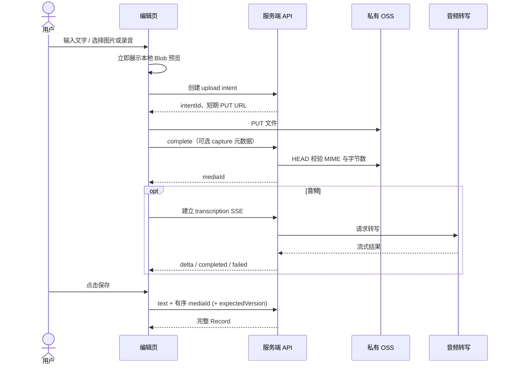

# Record 编辑页流程

本文描述一次 Record 编辑会话从输入内容到保存完成的产品行为。媒体处理仅发生在编辑态；保存后的 Record 不触发转写或其他媒体回写。

## 角色与状态

- 编辑草稿：文字、媒体展示顺序及本地 Blob 预览均由客户端持有。
- 上传 intent：服务端为一个待上传文件创建的短期授权。它可处于 `pending` 或 `completed` 状态。
- Media asset：完成校验后的稳定媒体索引，以 `mediaId` 标识；对象 key 仅服务端保存。
- Record：用户明确保存后的内容快照。创建时 `version = 1`，每次更新递增。

## 主流程

## 图片流程

1. 选择图片后，编辑页立即以本地 Blob URL 预览，不等待网络上传。
2. 创建图片 intent 后，将文件直接 PUT 到私有 OSS。
3. `complete` 通过服务端 HEAD 校验后返回 `mediaId`，该 ID 才能进入保存请求。
4. 删除尚未保存的图片时，编辑页移除本地预览并调用 intent 或 media 删除接口。

## 音频流程

1. 录音结束后按与图片相同的上传和 complete 流程取得 `mediaId`。
2. 编辑页连接音频转写 SSE。`delta` 用于更新界面中的临时文稿，`completed` 表示完整结果已写入媒体资产，`failed` 表示本次不可保存为音频 Record。
3. 保存时服务端要求音频已有非空完整 transcript；否则返回 `AUDIO_TRANSCRIPTION_PENDING`。
4. 用户可在保存请求中提交编辑后的 transcript；它只覆盖本次 Record block 快照，不修改媒体资产的转写原文。

## 保存、更新与冲突

- 创建只接受文字和按展示顺序排列的 `mediaId`，不接受对象 key、客户端 MIME/字节校验值或图片描述。
- 更新必须带 `expectedVersion`。版本不一致返回当前 Record，客户端应提示用户刷新或合并，而非静默覆盖。
- 同一媒体只能关联一个 Record。更新时被移除的媒体解除关联，可由编辑页继续删除。

## 恢复与取消

- 编辑页可通过读取 intent 状态恢复尚未完成的上传或转写提示。
- 用户删除 intent 时，服务端会取消活跃的转写连接，并删除 OSS 对象及未关联的媒体资产。
- 所有媒体读取均使用内部 `/api/media/:mediaId` 地址；服务端鉴权成功后才重定向到短期私有下载地址。
