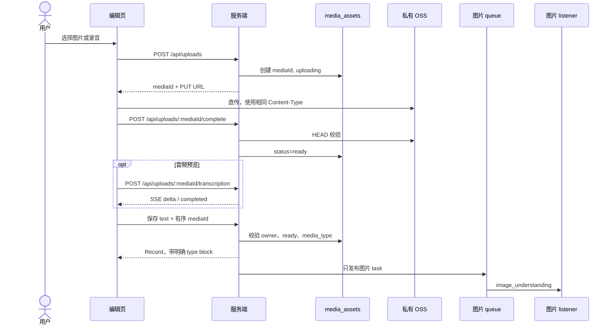

# Record 编辑页流程

Record 的正文是文本和音频至少其一；图片仅为可选附件。允许文本、音频、文本+音频，以及上述任意组合附带图片；不允许纯图片。转写是音频预览，不可编辑且不保存。

同一 `mediaId` 贯穿创建上传、确认上传与音频转写。保存时服务端不接受客户端声称的媒体类型，而是从 `media_assets.media_type` 写入 block。图片理解失败仅写入 `logs/service.log`，不改变 Record，不重试或补偿。
