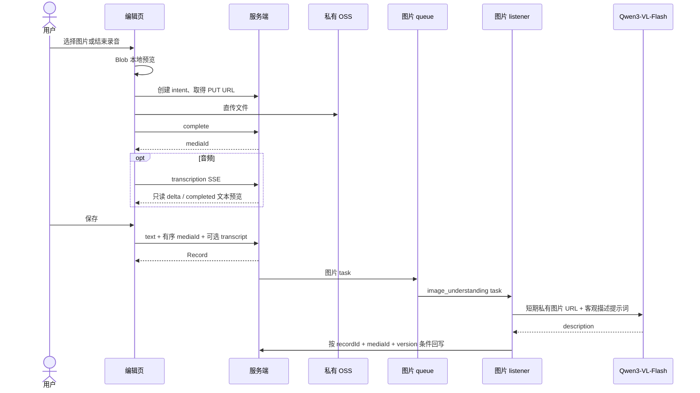

# Record 编辑页流程

编辑页支持纯文本、图文、纯音频、图音。选择文件后立即使用 Blob URL 本地预览；前端取得短期 PUT URL 后直接上传私有 OSS，complete 成功才得到 `mediaId`。

音频转写不写入媒体资产；没有文本仍可保存。保存后的图片描述可能稍后才在详情或列表中出现。图片 listener 只描述画面直接可见的主体、场景、动作和文字，不推断身份、关系、情绪或背景。

Record 每次用户保存会递增版本。若图片任务执行期间用户修改或移除了该图片，旧 task 因版本或媒体不匹配而直接丢弃，绝不覆盖新内容。queue 为进程内队列：保存成功不受图片模型失败影响；进程重启前尚未消费的图片 task 不会自动恢复。编辑态取消和未保存媒体清理不在当前模块范围。
