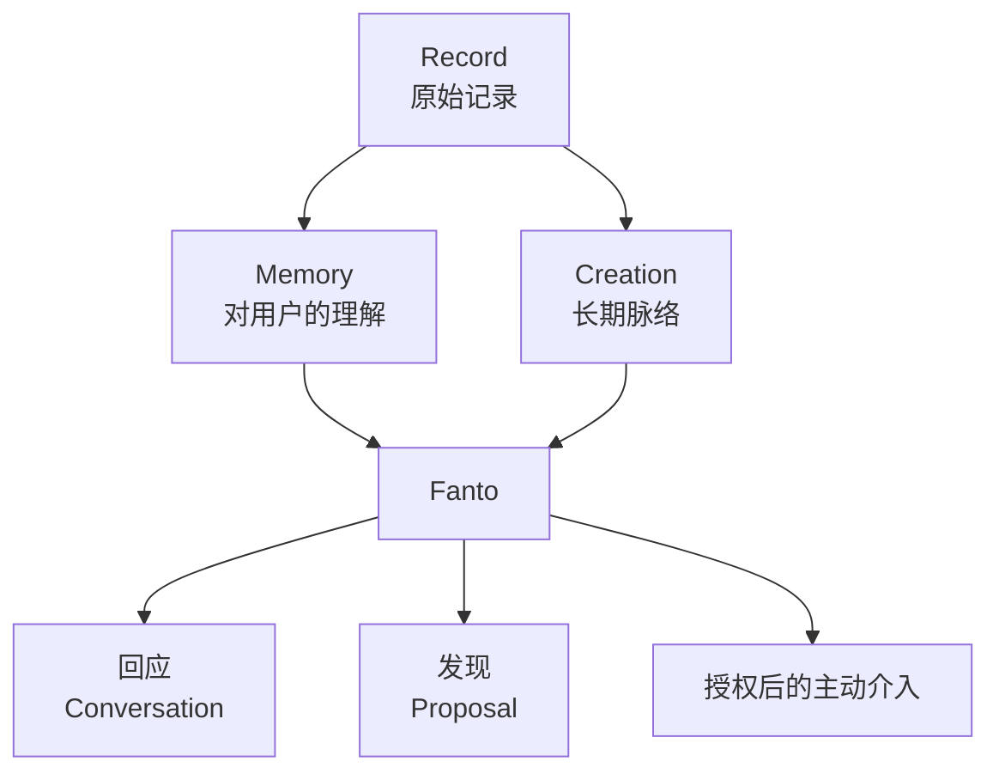

# Fanto 产品愿景

## 定位

Fanto 不是“带 AI 的笔记 App”，也不是一个无所不在、主动替用户管理人生的 Agent。

Fanto 是一个和用户保持长期连续关系、能够逐渐形成长期记忆的陪伴型个人智能：

> 因为它会把用户长期告诉它的事情逐渐沉淀成记忆，所以能在合适的时候，给出只有“认识用户很久”才能给出的回应。

Record、Memory Index 与检索机制属于实现层；在产品关系上，这些过去的信息应表现为 Fanto 与用户长期相处形成的记忆，而不是一份需要反复向用户说明或“翻查”的外部资料库。

它希望逐渐建立三种感受：

1. **它记得我**：能准确、自然地想起过去的重要记录。
2. **它理解我**：能发现跨时间的联系、变化和长期脉络。
3. **它尊重我**：知道什么时候出现，也知道什么时候闭嘴。

产品方向可以浓缩为一句话：

> **默认安静，长期记得，偶尔有用。**

## 为什么长期记录有价值

用户留下的通常不是完整知识文档，而是生活中自然产生的碎片：一句判断、一段情绪、一张照片、一段语音、一次经历、一个项目想法。

单条记录价值有限，真正的价值来自跨时间重新关联：

- 过去收藏的工具在当前项目里重新变得有用；
- 多条零散观点逐渐形成长期判断；
- 用户对同一问题的看法发生变化；
- 人物偏好、生活经历在合适的场景被重新想起；
- 一个搁置的想法重新具备推进条件。

因此 Fanto 不要求用户在记录时先分类、先整理，而是尽量把整理成本留给后台，把价值放到未来真正需要上下文的时候。

## 长期产品模型

- **Record**：用户原始、真实、低负担的表达。
- **Memory**：Fanto 对人物、偏好、经历、判断和上下文的理解；它是产品概念，不预设必须对应独立数据库实体。
- **Proposal**：Fanto 发现的候选联系，让用户理解来源并决定是否继续。
- **Creation**：值得长期跟踪的脉络，例如持续思考、研究方向、生活主题或可能性分支。
- **Conversation**：Fanto 的一个出口，而不是产品本身。

这张图描述长期方向，不代表所有链路已经在当前仓库中实现；当前能力以 [current-scope.md](current-scope.md) 为准。

## AI 介入层级

Fanto 的能力不先按“搜索、总结、提醒、推荐”拆成功能菜单，而按介入用户生活的深度理解：

| 层级 | 行为 | 默认策略 |
| --- | --- | --- |
| Level 0：记住 | 理解并保存未来可能有用的上下文 | 默认、安静 |
| Level 1：回应 | 用户主动交流时结合长期记录 | 默认开启 |
| Level 2：发现 | 发现跨记录联系、观点变化或长期脉络 | 克制出现 |
| Level 3：主动介入 | 提醒、建议或主动发起讨论 | 需要更明确授权 |

越往后，Fanto 对“为什么现在出现”“依据是什么”“用户如何拒绝”的要求越高。

## 典型价值场景

长期方向优先围绕这些场景验证，而不是堆叠通用 AI 功能：

- **旧知识重新浮现**：过去记录的工具、资料在当前问题里重新相关。
- **长期观点形成**：分散数月的 Record 逐渐形成一个值得跟踪的判断。
- **观点变化**：展示用户对同一问题的判断如何变化，并保留来源。
- **人物与关系**：只基于明确记录过的信息，在合适场景帮助回忆偏好与事件。
- **生活回忆**：把文字、图片和时间重新组织成可回看的经历。
- **连续性的回应**：用户主动交流时，能结合过去反复出现的关注点，而不是每次从零开始。

## 近期产品验证重点

Fanto 的 MVP 价值最终需要回答三个问题：

1. **它真的记得我吗？** 历史 Record 能否被准确、自然地重新使用。
2. **它能发现有价值的联系吗？** Proposal / Creation 是否比单纯搜索更有长期价值。
3. **它知道什么时候闭嘴吗？** AI 的主动性是否足够克制，并让用户持续保持控制感。

具体“当前已经做到哪里”始终以 [current-scope.md](current-scope.md) 为准。
