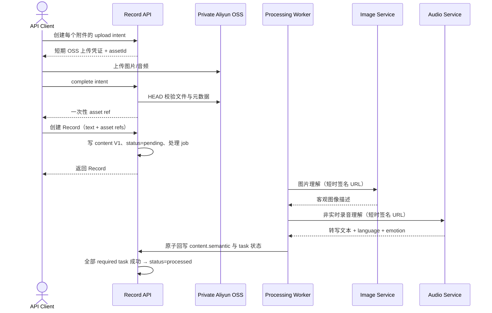
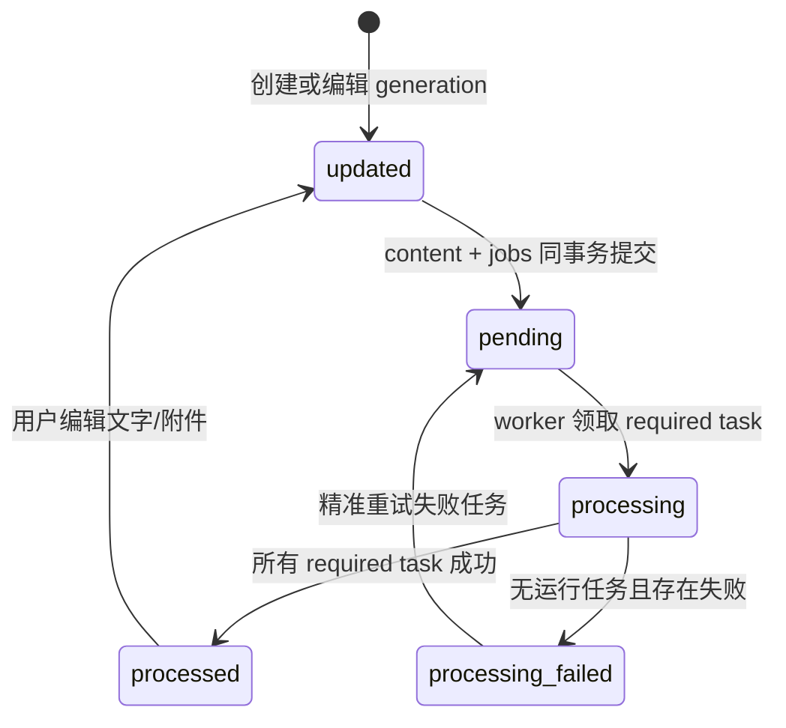

# Fanto Server 重构：多模态 Record

> 版本：4.0
> 范围：仅 server，支持文字、图片、音频、私有 OSS、图像理解与非实时语音理解。
> 非范围：H5、视频、链接、Suggestion、真实 Topic 自动逻辑、Artifact。

## 1. 一条完整操作链路



模型调用本身不在 HTTP 创建请求中执行。`qwen3-asr-flash` 在后台 processing job 内以 OpenAI 兼容 SSE 消费增量转写，Record 创建不等待模型。模型请求/响应的厂商差异只存在于 AI service adapter 内部；流中的半成品绝不写入 `records.content`。

## 2. 静态完整对象

下面是 `records.content` 的完整静态 JSON；SQLite 以 TEXT 保存该 JSON。原始素材、处理状态、模型结果和可检索语义均放在一个 versioned 内容对象中。永久 OSS URL、AccessKey 不保存其中。

```json
{
  "version": 1,
  "text": "傍晚在江边散步，孩子第一次自己骑完这一段。",
  "blocks": [
    {
      "id": "b5e3fc33-81c6-4c92-bad8-d69409ba43f1",
      "type": "image",
      "objectKey": "u_123/records/r_456/b5e3fc33-81c6-4c92-bad8-d69409ba43f1/river.jpg",
      "mimeType": "image/jpeg",
      "bytes": 1834021,
      "sha256": "8eb9f22f7c48f8d0e4bb85237e3a2b4a0e74e6da2b7270fc6b65b3906ce8c32c",
      "width": 3024,
      "height": 4032,
      "processing": { "tasks": [{
        "kind": "image_understanding", "required": true, "status": "succeeded", "attempt": 1,
        "inputHash": "c4bcde2b5f1d4d4b2c4af09d0ebd8d10c63f17c54dbb893f3b9a7e93159978d3",
        "updatedAt": "2026-09-08T16:20:00.000+08:00"
      }] },
      "understanding": {
        "description": "一名儿童骑着自行车沿江边步道前行，远处有江面、树木和傍晚的天空。",
        "model": "qwen3-vl-flash", "generatedAt": "2026-09-08T16:20:00.000+08:00", "version": 1
      }
    },
    {
      "id": "7dd76c9d-1f75-4924-bca4-f4f5d8c25b09",
      "type": "audio",
      "objectKey": "u_123/records/r_456/7dd76c9d-1f75-4924-bca4-f4f5d8c25b09/wind.m4a",
      "mimeType": "audio/mp4",
      "bytes": 426331,
      "sha256": "0b9b7aacac2f3a083b35fa6660bdb8d2e9eaa0cc977d24f93f8d6701e1af4f8e",
      "durationMs": 12500,
      "processing": { "tasks": [{
        "kind": "audio_understanding", "required": true, "status": "succeeded", "attempt": 1,
        "inputHash": "ae631c3f3709f55bc5e1b0a7e2ff2baf8b25c942b5d2d8a664ddbd91791b4d8f",
        "updatedAt": "2026-09-08T16:20:10.000+08:00"
      }] },
      "understanding": {
        "transcript": "风有点大，但是他坚持骑到了桥边。",
        "language": "zh", "emotion": "excited", "model": "qwen3-asr-flash",
        "generatedAt": "2026-09-08T16:20:10.000+08:00", "version": 1
      }
    }
  ],
  "semantic": {
    "version": 1,
    "imageDescriptions": [{ "blockId": "b5e3fc33-81c6-4c92-bad8-d69409ba43f1", "description": "一名儿童骑着自行车沿江边步道前行，远处有江面、树木和傍晚的天空。" }],
    "audioTranscripts": [{ "blockId": "7dd76c9d-1f75-4924-bca4-f4f5d8c25b09", "text": "风有点大，但是他坚持骑到了桥边。", "language": "zh", "emotion": "excited" }],
    "searchableText": "傍晚在江边散步，孩子第一次自己骑完这一段。\n图片：一名儿童骑着自行车沿江边步道前行，远处有江面、树木和傍晚的天空。\n音频：风有点大，但是他坚持骑到了桥边。",
    "updatedAt": "2026-09-08T16:20:10.000+08:00"
  },
  "processing": { "generation": 1, "requiredTaskCount": 2, "completedTaskCount": 2, "failedTaskCount": 0, "lastUpdatedAt": "2026-09-08T16:20:10.000+08:00" }
}
```

`emotion` 是模型返回的音频信息，允许值以厂商实际输出为准；它是对语音表现的模型标注，不是对用户人格、情绪状态或心理状况的推断。缺失时存 `null`，不补写猜测。

## 3. 完整 Schema 与状态生命周期

### 3.1 顶层 Record

新增 `records.content_version INTEGER NOT NULL DEFAULT 0`，`content` 保存 V1 JSON。`Record.status` 改为当前 generation 的整体处理状态：

```ts
type RecordStatus =
  | 'pending'             // required task 已排队
  | 'processing'          // 至少一个 required task 正在运行
  | 'processed'           // 所有 required task 均 succeeded
  | 'processing_failed'   // 无运行任务且至少一项 required task 最终失败
  | 'updated';            // 写入新 generation 与 job 前的短暂可恢复状态
```

旧的 `organized`、`skipped` 在迁移时统一映射为 `processed`，旧的组织说明存入 `ext_data.legacyOrganization`，后续不得再写入。

### 3.2 Schema（伪 TypeScript，等价 JSON Schema 的领域约束）

```ts
type RecordContentV1 = {
  version: 1;
  text: string; // max 20,000，text 与 blocks 不能同时为空
  blocks: Array<ImageBlock | AudioBlock>; // image <=3，audio <=1，总数 <=4
  semantic: {
    version: number;
    imageDescriptions: Array<{ blockId: UUID; description: string }>;
    audioTranscripts: Array<{ blockId: UUID; text: string; language: string | null; emotion: string | null }>;
    searchableText: string; // text + 当前 generation 全部成功的理解结果，可重建
    updatedAt?: ISODate;
  };
  processing: { generation: number; requiredTaskCount: number; completedTaskCount: number; failedTaskCount: number; lastUpdatedAt: ISODate };
};
type ImageBlock = AssetBase & { type: 'image'; mimeType: 'image/jpeg' | 'image/png' | 'image/webp'; width?: number; height?: number; understanding?: ImageUnderstanding };
type AudioBlock = AssetBase & { type: 'audio'; mimeType: 'audio/mp4' | 'audio/mpeg' | 'audio/wav'; durationMs: number; understanding?: AudioUnderstanding };
type AssetBase = { id: UUID; objectKey: ObjectKey; bytes: number; sha256: Sha256; processing: { tasks: ProcessingTask[] } };
type ProcessingTask = { kind: 'image_understanding' | 'audio_understanding'; required: true; status: 'pending' | 'processing' | 'succeeded' | 'failed'; attempt: 0 | 1 | 2 | 3; inputHash: Sha256; updatedAt: ISODate; errorCode?: string };
type ImageUnderstanding = { description: string; model: 'qwen3-vl-flash'; generatedAt: ISODate; version: number };
type AudioUnderstanding = { transcript: string; language: string | null; emotion: string | null; model: 'qwen3-asr-flash'; generatedAt: ISODate; version: number };
```

V1 禁止 `video` block。未来扩展只能新增 V2 block 类型和 processing task，不能向 V1 传入未知 type；版本字段与判别联合保证旧客户端安全拒绝新媒体。



每次 generation 变更清空旧 `semantic` 和受影响 understanding。worker 回写以 `recordId:blockId:generation:inputHash` 为幂等键，并在写入前核对 generation；不匹配的旧结果直接丢弃。状态计数从 tasks 重算，不能由调用方传入。

## 4. Server 目录与模块设计

```text
apps/server/src/
├── application/
│   ├── records/
│   │   ├── create-record.service.ts
│   │   ├── update-record.service.ts
│   │   ├── get-record.service.ts
│   │   └── retry-record-processing.service.ts
│   ├── uploads/
│   │   ├── create-upload-intent.service.ts
│   │   ├── complete-upload-intent.service.ts
│   │   └── cancel-upload-intent.service.ts
│   └── processing/
│       └── process-record-task.service.ts
├── domain/
│   ├── records/
│   │   ├── record.ts                # Record/status/content 领域对象
│   │   ├── record-content.schema.ts # V1 runtime schema + codec
│   │   ├── processing-state.ts       # generation/counter/status 纯函数
│   │   └── record.repository.ts      # repository contract
│   ├── uploads/
│   │   ├── upload-intent.ts
│   │   └── upload.repository.ts
│   └── media/
│       ├── image-understanding.ts    # 归一化图像理解结果
│       └── audio-understanding.ts    # transcript/language/emotion 结果
├── interfaces/
│   ├── media-storage.ts
│   ├── image-understanding.ts
│   └── audio-understanding.ts
├── workers/record-processing/
│   ├── worker.ts
│   ├── processing-job.repository.ts
│   ├── image-understanding.job.ts
│   └── audio-understanding.job.ts
├── infrastructure/
│   ├── ai/qwen-vl-image-understanding.ts
│   ├── ai/qwen-asr-audio-understanding.ts
│   ├── storage/aliyun-oss.storage.ts
│   ├── repositories/sqlite-record.repository.ts
│   ├── repositories/sqlite-upload.repository.ts
│   ├── repositories/sqlite-processing-job.repository.ts
│   └── migrations/
├── routes/records.ts
├── routes/uploads.ts
├── server.ts
└── main.ts
packages/shared/src/
└── record-content.ts                 # API DTO/公共 schema 类型
```

| 模块 | 职责 |
| --- | --- |
| routes | HTTP 校验、用户上下文、调用 application service；不调 OSS/模型 |
| application | 编排 Record、上传、处理三个用例；不包含 SQL/HTTP/SDK 细节 |
| domain | Record、上传 intent、媒体结果的业务规则、schema、状态机；无 SDK 依赖 |
| interfaces | 对 OSS、图像理解、音频理解声明外部能力契约 |
| infrastructure/ai | 将 Qwen 两种外部协议转换为 interface 结果 |
| workers | job lease、退避、调用 processing application service、原子提交结果 |
| infrastructure/storage | OSS 私有对象、HEAD、短时签名 URL |

依赖只能向内：`routes → application → domain/interfaces`，`workers → application → domain/interfaces`，`infrastructure` 实现 interfaces。domain 不依赖 Hono、Kysely、OSS 或模型 SDK。

## 5. AI 服务模块

### ImageUnderstandingService

`QwenVlImageUnderstandingService` 调用可配置的 OpenAI 兼容端点 `/compatible-mode/v1/chat/completions`，模型固定 `qwen3-vl-flash`。输入是一张 OSS 短时签名 URL 和固定事实描述 prompt；输出解析 `choices[0].message.content` 后，必须通过内部 schema：`{ description: string }`。服务只返回 `ImageUnderstanding`，不能更新数据库。

内部请求形态：

```json
{
  "model": "qwen3-vl-flash",
  "messages": [{
    "role": "user",
    "content": [
      { "type": "image_url", "image_url": { "url": "<short-lived-oss-url>" } },
      { "type": "text", "text": "请只用客观中文描述可见主体、场景、文字和活动；不要推断身份、关系、地点、心理状态或意图。" }
    ]
  }]
}
```

### AudioUnderstandingService

`QwenAsrAudioUnderstandingService` 调用可配置的 OpenAI 兼容端点 `/compatible-mode/v1/chat/completions`，模型固定 `qwen3-asr-flash`，输入是短时 OSS 音频 URL。该服务使用 SSE 流式返回，worker 在后台完整消费后才返回 `AudioUnderstanding`。

内部请求形态：

```json
{
  "model": "qwen3-asr-flash",
  "messages": [{
    "role": "user",
    "content": [{ "type": "input_audio", "input_audio": { "data": "<short-lived-oss-url>" } }]
  }],
  "stream": true,
  "asr_options": { "enable_itn": false }
}
```

adapter 按行解析 SSE：忽略初始空 `delta.content`；对每个 `data: {JSON}` 读取 `choices[0].delta.content` 字符串并顺序拼接 transcript；从 `choices[0].delta.annotations[]` 中读取 `type=audio_info` 的 `language` 与 `emotion`。示例响应会在多个 chunk 重复该 annotation，因此以最后一个非空值为最终值；如果同一流出现互相冲突的非空值，记录诊断并以最后值为准。

只有同时收到 `finish_reason: "stop"` 与 `data: [DONE]`，且拼接后的 transcript 非空时，adapter 才返回成功。断流、无 DONE、无 stop、无 transcript 或任何 chunk JSON 格式错误都是可诊断失败；此前的增量文本只留在 worker 内存中，不写数据库。情感标注缺失时 `language/emotion=null`，不会使成功转写失败。情感标注不参与 Record status 判断。

两个 service 共用：三次退避（网络/429/5xx）、请求超时、requestId 日志、响应 schema 校验。日志只记录 record/block id、模型、耗时、HTTP 类别和 requestId，不能记录音频 URL、正文、图像或转写全文。

## 6. OSS、迁移与验收

```dotenv
OSS_ENDPOINT=oss-rg-china-mainland.aliyuncs.com
OSS_BUCKET=fanto
OSS_ACCESS_KEY_ID=...       # 仅部署密钥管理注入
OSS_ACCESS_KEY_SECRET=...   # 仅部署密钥管理注入
DASHSCOPE_API_KEY=...       # 仅部署密钥管理注入
DASHSCOPE_ASR_BASE_URL=https://<workspace>.cn-beijing.maas.aliyuncs.com/compatible-mode/v1
DASHSCOPE_VL_BASE_URL=https://<workspace>.cn-beijing.maas.aliyuncs.com/compatible-mode/v1
```

Bucket 必须 private。服务端生成对象 key：`userId/records/recordId/blockId/filename`；客户端不能指定 key。模型访问 OSS 使用短时签名 URL，TTL 覆盖一次调用超时但尽量短。真实密钥不得进入仓库、配置样例、日志或 HTTP 响应。

迁移前停用 contemplate/digest/organizer 写路径。追加 `content_version`，旧文本转 V1：`blocks=[]`、`semantic.searchableText=原文`、counter 均为 0、status 映射 `processed`；`organized/skipped` 的旧含义保存为 legacy 元数据。一个发布周期双读 V0/V1，新写只 V1。

完成标准：图片和音频的 required task 都成功才 `processed`；音频失败可单独重试；语义可精确回链 block；私有对象不可跨用户读；旧任务不能覆盖新 generation；没有视频、H5、Topic 自动写入或 Artifact 实现。
