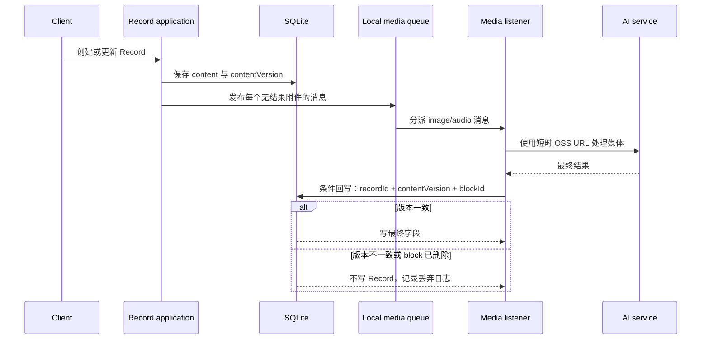

# Fanto Server 重构：简化多模态 Record

> 范围：仅 server；支持文字、图片、音频、私有 OSS、图片理解与非实时音频转写。
> 非范围：H5、视频、链接、向量化、Suggestion、Artifact、真实 Topic 自动整理。

## 1. 设计结论

1. `records.content` 只保存用户原文、附件元数据和最终媒体结果；不保存哈希、处理进度、任务计数、模型名、向量或可检索文本副本。
2. 图片和音频处理不创建 task，也不维护媒体处理状态；创建或更新后仅向本地消息队列投递一条消息。
3. 每次修改 Record 内容时递增 `content_version`。消息携带创建时的版本；消费完成时版本不一致即丢弃结果，绝不覆盖新内容。
4. 图片与音频的结果直接扁平地回写到对应 block；没有 block 级处理状态。
5. 当前不做媒体向量化。未来若需要，另建独立的索引任务类型与索引存储，不能把向量状态塞回 Record。

## 2. Record 内容

SQLite 的 `records.content` 仍为 JSON TEXT，`records.content_version` 为 `INTEGER NOT NULL DEFAULT 1`。

```ts
type RecordContentV1 = {
  version: 1;
  text: string; // 最长 20,000；text 与 blocks 不可同时为空
  blocks: Array<ImageBlock | AudioBlock>; // image <= 3，audio <= 1，总数 <= 4
};

type MediaBase = {
  id: string;          // UUID，仅用于定位附件和任务回写目标
  objectKey: string;   // 私有 OSS object key，不保存永久 URL 或凭证
  mimeType: string;
  bytes: number;
};

type ImageBlock = MediaBase & {
  type: "image";
  mimeType: "image/jpeg" | "image/png" | "image/webp";
  width?: number;
  height?: number;
  description?: string; // 图片理解完成后写入
};

type AudioBlock = MediaBase & {
  type: "audio";
  mimeType: "audio/mp4" | "audio/mpeg" | "audio/wav";
  bytes: number;
  durationMs: number;
  transcript?: string; // 转写完成后写入
  language?: string | null;
  emotion?: string | null;
};
```

示例：

```json
{
  "version": 1,
  "text": "傍晚在江边散步，孩子第一次自己骑完这一段。",
  "blocks": [
    { "id": "b5e3fc33-81c6-4c92-bad8-d69409ba43f1", "type": "image", "objectKey": "u_123/records/r_456/b5e3fc33-81c6-4c92-bad8-d69409ba43f1/river.jpg", "mimeType": "image/jpeg", "bytes": 1834021, "width": 3024, "height": 4032, "description": "一名儿童骑着自行车沿江边步道前行，远处有江面、树木和傍晚的天空。" },
    { "id": "7dd76c9d-1f75-4924-bca4-f4f5d8c25b09", "type": "audio", "objectKey": "u_123/records/r_456/7dd76c9d-1f75-4924-bca4-f4f5d8c25b09/wind.m4a", "mimeType": "audio/mp4", "bytes": 426331, "durationMs": 12500, "transcript": "风有点大，但是他坚持骑到了桥边。", "language": "zh", "emotion": "excited" }
  ]
}
```

`emotion` 只是模型对语音表现的标签；缺失时为 `null`，不进行推断。

## 3. 本地媒体消息队列

媒体处理不使用 `tasks` 表；现有 `tasks` 表维持 Contemplate 等既有用途，不为图片或音频增加 type、状态、租约或结果。定义进程内队列契约：

```ts
type MediaMessage = {
  recordId: string;
  blockId: string;
  contentVersion: number;
};

interface LocalMediaQueue {
  publish(type: "image_understanding" | "audio_understanding", message: MediaMessage): void;
  on(type: "image_understanding" | "audio_understanding", listener: (message: MediaMessage) => Promise<void>): void;
}
```

`LocalMediaQueue` 的实现仅在本地进程内分发消息；图片与音频分别由独立 listener 消费。它不提供持久化、租约、重试或任务审计：进程重启时，尚未消费的消息会丢失；模型调用失败只记录日志，不自动重试。这是以简单性换取可靠性的明确边界。如以后需要跨进程投递或至少一次消费，再替换该 interface 的实现，不改变 Record 回写规则。

## 4. 创建、更新与异步回写



创建或编辑时写入 Record、递增 `content_version`（新建为 1），然后为尚无最终结果的图片/音频发布消息。编辑时清除被替换附件的结果；未变化的附件保留最终结果，不重复投递。

listener 回写时在同一事务中验证：`record.id`、用户归属、`content_version === message.contentVersion`、目标 block 存在且类型匹配。任一条件不满足即不写入并记录丢弃日志；满足时仅更新图片 `description` 或音频 `transcript/language/emotion`。SSE 中间文本始终仅存在 listener 内存，不能写入 Record。

媒体处理不改变 `Record.status`，也不引入 `pending`、`processing`、`processed` 或 `processing_failed` 等媒体状态。状态不进入 block；既有 status 字段仅按其原有非媒体语义维护。

## 5. 模块边界

```text
apps/server/src/
├── application/
│   ├── records/       # 创建、修改、读取、根据当前 content 发布媒体消息
│   ├── uploads/       # upload intent、complete、取消
│   └── media/         # 发布媒体消息、版本校验与结果回写
├── domain/
│   ├── records/       # RecordContentV1 codec、校验、附件结果写回纯函数
│   └── uploads/       # upload intent 规则
├── interfaces/        # MediaStorage、ImageUnderstanding、AudioUnderstanding 契约
├── listeners/
│   ├── image-understanding.listener.ts
│   └── audio-understanding.listener.ts
└── infrastructure/
    ├── ai/            # Qwen HTTP/SSE 适配
    ├── queue/         # 本地消息队列实现
    ├── storage/       # Aliyun OSS
    └── repositories/  # SQLite Record、Task、Upload 实现
```

不再设 `domain/media/`：图片描述和音频转写只属于 Record block，没有独立业务生命周期。其结果类型由 `interfaces/` 声明，写回与校验由 `domain/records/` 的纯函数完成。

边界为：application 发布消息并编排结果回写；listener 调用对应模型服务；domain 决定结果是否可写入及如何写入；infrastructure 负责本地队列、Qwen、OSS、SQLite 的实现。

## 6. 外部服务与迁移

`ImageUnderstandingService` 输入短时签名 URL，返回 `{ description }`。`AudioUnderstandingService` 在内存完整消费 SSE，只有同时收到 `finish_reason=stop`、`[DONE]` 且 transcript 非空时，才返回 `{ transcript, language, emotion }`；否则 listener 记录失败日志。二者均不直接写数据库。

前滚迁移新增 `content_version`；旧的纯文本 content 转为 `{ version: 1, text: oldContent, blocks: [] }`。保留既有 tasks 表，不新增媒体任务字段。旧 `organized/skipped` 的兼容策略沿用现有状态语义；历史组织信息放入 `ext_data.legacyOrganization`。迁移须支持 dry-run、备份与重复安全检查。
