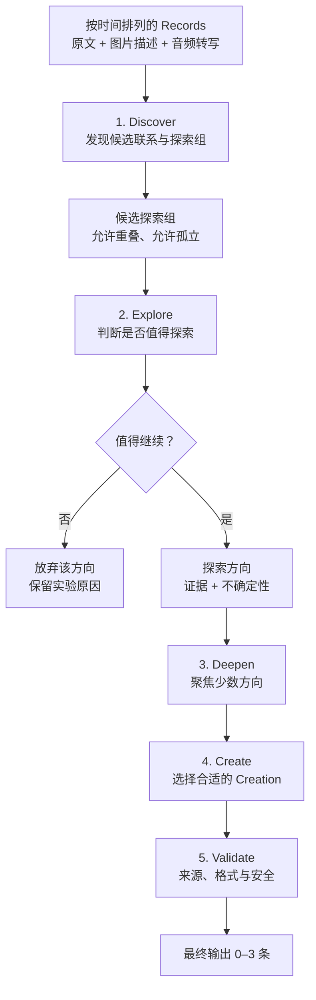

# Creation Workflow v0.2 验证方案

## 1. 目标与边界

本轮只验证一个工作流：它是否能从生活碎片中**发现联系、判断哪些联系值得探索、对少数方向深入思考，并在最后形成少量有依据的 Creation**。

它不是把 Record 总结成主题的流程。分组只是发现潜在联系的暂时手段：允许重叠，允许孤立，也允许深入后放弃；任何 Record 都不需要被强行归类。

验证使用一个隔离的合成用户测试集。实验脚本只读取固定夹具，输出写入实验目录；不调用现有 Contemplate、不写生产数据库、不处理真实用户数据。本轮使用一个 Agent Runtime 和按阶段调用的 Prompt，不引入多 Agent 系统、任务编排框架或新的业务表。

## 2. 一个测试集

建立一个独立 `user_id` 的合成测试集，包含至少 24 条按时间排列的 Record。它模拟一个真实但不复杂的用户：一边感到工作消耗，一边多次记录做小东西时的投入感，也有散步、朋友聊天、植物和无关的生活片段。

测试集应同时包含：

- 文本、图片、图文、音频、图音频五种输入形态；图片使用确定性的文字描述，音频使用固定转写。
- 一个逐渐显现的线索，例如“独立创作时更有能量”。
- 一个矛盾或未定论线索，例如“想改变，但担心不稳定”。
- 能支持低成本尝试的线索，例如“连续一周留出短时间做自己的小项目”。
- 足够多无关内容，例如饮食、采购、临时琐事，避免模型把任何记录都强行拼成意义。

每条 Record 只需保存稳定 ID、`userId`、时间、文本（可空）、媒体类型和媒体描述/转写。可另写隐藏设计说明，标记预期线索、无关项和高风险误判；该说明绝不输入模型。

## 3. 固定的 Creation 类型与 content

type 不是 Agent 的思考起点。Agent 先完成探索，再选择最适合表达最终结果的 type；可以输出空数组。

本轮只允许以下三种类型：

| type | 适用条件 |
|---|---|
| `insight` | 至少两条 Record 支持一个跨时间或跨场景的模式、张力或变化。 |
| `question` | 存在矛盾、空白或证据不足，但有一个值得温和提出的开放问题。 |
| `experiment` | 已有明确方向，可提出一个低成本、可逆、具体的小尝试。 |

`content` 暂统一使用受限 Markdown；所有 `source_record_ids` 只能引用输入中同一用户的 Record ID。

### `insight`

```md
## 你可能正在看到
<一句克制的观察>

## 线索
- <recordId>: <事实或原话摘要>
- <recordId>: <事实或原话摘要>

## 值得留意的是
<可能意味着什么；保留不确定性>
```

最少两个来源；不得作诊断或写出无来源结论。

### `question`

```md
## 值得慢一点想的问题
<一个开放问题>

## 它从哪里来
- <recordId>: <线索>

## 可以从这里开始
<一个可选的观察角度>
```

问题不能伪装成结论。只有一个来源时，必须明确证据有限。

### `experiment`

```md
## 可以试一次
<低成本、可逆的行动>

## 想验证什么
<仍是假设的判断>

## 怎么做
<一个具体步骤>

## 留意什么
<完成后可观察的信号>

## 来源
- <recordId>: <支持该尝试的线索>
```

最少两个来源；不得产生医疗、法律、投资等高风险建议，也不得要求购买、公开发布或联系第三方。

## 4. 待验证工作流：Discover → Explore → Deepen → Create → Validate



### 阶段 1：Discover — 发现联系和候选探索组

输入是该用户完整、按时间排列的 Record。Agent 寻找可能的联系：对象反复出现、相似体验、前后变化、明确矛盾、共同愿望，或不同领域之间可能相关的线索。

输出最多 6 个候选探索组：

```json
{
  "groups": [
    {
      "id": "group_01",
      "recordIds": ["rec_001", "rec_004", "rec_010"],
      "connection": "多次提到工作消耗、成就感不足，以及对改变环境的犹豫",
      "basis": "shared_theme | recurring_experience | change | tension | possible_connection"
    }
  ]
}
```

规则：

1. `connection` 仅描述候选联系，不得解释动机、人格或人生结论。
2. 一条 Record 可属于多个组，也可不属于任何组；不要求覆盖所有输入。
3. 每组至少两条 Record；只有表面词汇重合时不成组。
4. 图片只基于提供的描述，音频只基于提供的转写。

### 阶段 2：Explore — 判断什么值得继续探索

输入为候选探索组及其原始 Record。Agent 不生成最终内容，而是检查每个组是否只有事实重复，是否存在未被直接表达的连接、值得追问的矛盾或可能的可行动方向；也可以比较两个组，发现跨组方向。

输出最多 5 个探索方向：

```json
{
  "explorations": [
    {
      "id": "explore_01",
      "sourceGroupIds": ["group_01", "group_02"],
      "recordIds": ["rec_001", "rec_004", "rec_006", "rec_009"],
      "direction": "探索工作消耗与独立创作投入感之间的差异",
      "whyWorthExploring": "跨时间反复出现的体验差异，可能帮助用户理解什么更能带来投入感",
      "uncertainties": ["差异可能来自自主性、任务内容或工作时长，现有记录无法确定"],
      "decision": "deepen | skip"
    }
  ]
}
```

规则：

1. `direction` 是待验证的探索方向，不是结论。
2. 必须写出至少一个不确定性或反例需求；不能从“喜欢创作”直接推到“应该离职”。
3. 允许跨组组合，但所有 Record 必须与方向存在可说明的联系。
4. 对价值有限、证据薄弱或只是总结事实的方向标记 `skip`。

### 阶段 3：Deepen — 深入少数方向

只对最多 2 个 `deepen` 方向回看原始 Record，进行一次聚焦检查：时间顺序是否支持该方向、是否有反例、其他解释是否更合理、是否已有足以支撑一个低成本可逆尝试的线索。

输出每个方向的深入结论：

```json
{
  "deepened": [
    {
      "explorationId": "explore_01",
      "supportedFindings": ["工作消耗与独立创作的投入感均跨多个时间点出现"],
      "counterEvidence": ["独立创作也曾出现拖延，不能简单等同于持续满足"],
      "remainingUncertainties": ["无法判断差异主要来自自主性还是任务类型"],
      "bestNextExpression": "question | insight | experiment | none",
      "reason": "先提出区分性问题，比直接建议职业转变更符合现有证据"
    }
  ]
}
```

规则：

1. Deepen 必须主动寻找反例或替代解释；若没有找到，也要说明检查范围。
2. 发现表面联系、不足以支撑表达时，`bestNextExpression` 为 `none`，不生成 Creation。
3. 本轮不调用外部搜索或工具，只在个人 Record 范围内深入。
4. 每个方向只深入一次，避免无限推理；是否需要多轮研究由未来验证决定。

### 阶段 4：Create — 最后决定产出什么

输入为 Deepen 结果。Agent 先全局去重，再选择最适合的 type 和对应 Markdown 模板，最终输出 0–3 条 Creation。

```json
{
  "creations": [
    {
      "type": "question",
      "title": "你想改变的究竟是什么？",
      "content": "符合 question Markdown 模板的内容",
      "source_record_ids": ["rec_001", "rec_004", "rec_006", "rec_009"]
    }
  ]
}
```

规则：

1. 不为每个组或每种 type 强行生成一条；若 experiment 已承载 insight/question，则只保留更有行动价值的一条。
2. `insight` 和 `experiment` 最少两个来源；`question` 最少一个来源，单一来源时必须表达不确定性。
3. 不输出高风险建议、心理诊断或确定性人生判断。

### 阶段 5：Validate — 程序化校验

实验脚本只做确定性校验：JSON 可解析、阶段输出不超预算、所有 ID 都存在且属于该用户、来源不重复、type 在允许集合、标题/content 非空、Creation 满足来源数量规则。校验失败时保存原始结果和失败原因，不自动修复或重跑。

## 5. 探索预算

这些上限只是实验控制，不是产品规则：

| 阶段 | 上限 |
|---|---|
| Discover | 最多 6 个候选组 |
| Explore | 最多 5 个探索方向 |
| Deepen | 最多深入 2 个方向 |
| Create | 最多输出 3 条，允许 0 条 |

预算的目的，是将计算资源集中在少数有潜力的方向，并验证“深入探索”是否真正提高结果质量。

## 6. 最小执行与复盘

```text
experiments/creation/
├── fixtures/user-001.json
├── prompts/discover.md
├── prompts/explore.md
├── prompts/deepen.md
├── prompts/create.md
├── src/run.ts
├── src/validate.ts
└── output/<run-id>/
    ├── discover.json
    ├── explore.json
    ├── deepen.json
    ├── creations.json
    └── trace.json
```

1. 用固定 JSON/JSONL 文件构造测试 Record、媒体描述/转写和隐藏设计说明。
2. 实验脚本依次调用 Discover、Explore、Deepen、Create，并为每步保存输入、Prompt 版本、原始输出、解析结果、校验结果、耗时和错误。
3. 人工直接阅读每个阶段结果及来源 Record，重点检查三个问题：Discover 是否找到真实联系；Explore 是否筛出了值得深入的方向；Deepen 是否通过反例或替代解释让最终 Creation 更具体、更克制，或正确地放弃了方向。
4. 根据失败案例调整某一阶段 Prompt，再运行同一测试集；不改变测试 Record，才能观察流程改动是否真的带来增量。

如果 Deepen 没有明显提高最终结果的质量，应删去或进一步简化它，而不是因其看起来更像 Agent 而保留。只有该流程稳定产出少量、有来源依据且值得继续探索的 Creation，才进入真实持久化和产品链路讨论。
