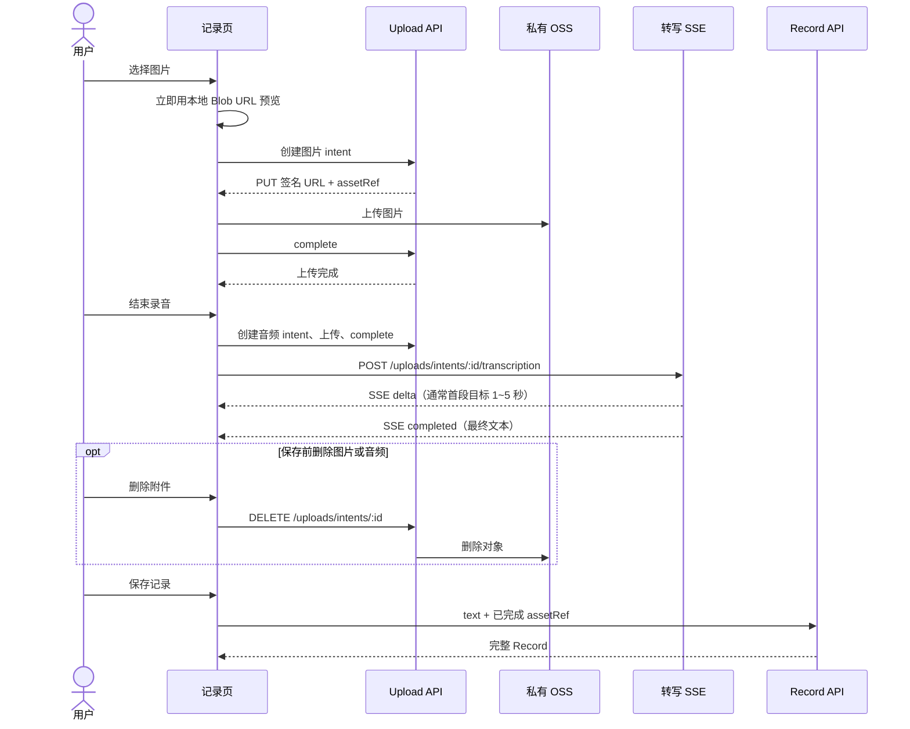

# Record 编辑态媒体处理方案

## 1. 结论

Record 只能在用户点击“保存”时创建或修改一次。图片理解、音频转写和用户删除附件均发生在保存前的记录编辑态；保存后的 Record 不再触发媒体处理。

此前“先保存 Record、再由 listener 转写”的设计不满足录音页体验：前端无法在保存前展示文本，也无法让用户检查或编辑转写结果。本方案以 `upload_intent` 作为短生命周期的编辑态媒体载体，避免创建半成品 Record 或把处理状态放入 Record block。

## 2. 前端体验与时序



“1~5 秒可见内容”是首个 SSE `delta` 的体验目标，而非可由服务端绝对保证的 SLA。前端在完成上传后立即显示“正在转写”，收到第一个 `delta` 后替换为文本；音频很短或模型只返回最终片段时，可以先收到 `completed`。

## 3. 临时媒体资源：upload_intents

`upload_intents` 既是安全上传凭证，也是记录页未保存附件的唯一服务端状态。它不属于 Record，不是任务表。

```ts
type UploadIntent = {
  id: string;
  userId: string;
  objectKey: string;
  mediaType: "image" | "audio";
  mimeType: string;
  bytes: number;
  uploadStatus: "pending" | "completed" | "consumed" | "cancelled" | "expired";
  analysisStatus: "idle" | "processing" | "completed" | "failed" | "cancelled";
  result: ImageResult | AudioResult | null;
  expiresAt: string;
};

type ImageResult = { description: string };
type AudioResult = { transcript: string; language: string | null; emotion: string | null };
```

这两个状态只服务临时上传/转写 UI：Record content 永远没有 processing、upload 或 analysis 状态。intent 被消费或过期后，其临时结果不再是业务真相。

## 4. 接口

### 上传

| 接口 | 用途 |
| --- | --- |
| `POST /api/uploads/intents` | 校验媒体类型/大小，生成私有 OSS PUT 签名 URL 与 `assetRef` |
| `POST /api/uploads/intents/:id/complete` | HEAD 复核上传对象，设为 completed |
| `GET /api/uploads/intents/:id` | 页面恢复、轮询图片理解结果或读取最终音频结果 |
| `DELETE /api/uploads/intents/:id` | 保存前删除附件、取消转写、删除 OSS 对象 |

客户端只可提交 `assetRef`，不可提交 object key、文件大小或模型结果。

### 音频转写 SSE

`POST /api/uploads/intents/:id/transcription`

前置条件：intent 属于当前用户、`uploadStatus=completed`、`mediaType=audio`、未取消。服务端首先将 `analysisStatus` 设为 `processing`，再调用 Qwen 流式 ASR，并把 SSE 原样转发为受控事件：

```text
event: delta
data: {"text":"今天"}

event: delta
data: {"text":"天气很好"}

event: completed
data: {"transcript":"今天天气很好","language":"zh","emotion":null}
```

只有收到模型 `stop`、`[DONE]` 且全文非空，才将最终 `AudioResult` 写入 intent，设为 `completed`。流式半成品只转发给当前前端连接，不持久化。失败时发送 `failed`，intent 标记失败，可由用户重新录音或手动删除。

同一个 audio intent 同时只允许一个转写连接；重复请求在完成后直接返回最终结果，处理中返回 409。

### 图片

图片上传完成后即可预览，不阻塞保存。若需要图片描述，`POST /api/uploads/intents/:id/image-description` 由前端在 complete 后触发，或由服务端完成上传后发布本地消息给图片 listener。结果写入 intent 的 `ImageResult`，不回写已保存 Record。

## 5. 保存与删除

`POST /api/records` 和 `PATCH /api/records/:id` 接收：

```json
{
  "text": "今天记录一下",
  "assets": [
    { "assetRef": "image-intent-id", "width": 1536, "height": 1024 },
    { "assetRef": "audio-intent-id", "durationMs": 12500 }
  ]
}
```

同一事务完成：校验当前用户、`uploadStatus=completed`、未过期、未被消费；音频必须 `analysisStatus=completed`，否则返回 `409 AUDIO_TRANSCRIPTION_PENDING`；从 intent 生成最终 block，复制图片 description 和音频最终 transcript/language/emotion；将 intent 标为 `consumed`；写入/更新 Record；更新时 `records.version + 1`。

前端可以在转写文字框内编辑，但编辑内容不能直接伪造模型字段：保存请求允许显式传入 `transcript` 覆盖最终 block 的 transcript，并以用户输入为准；`language`、`emotion` 仍只从 intent 复制。若不允许编辑，保存请求不接受 transcript。

删除附件只在 intent 未 consumed 时允许。删除时原子标记 `cancelled`，中止活跃 SSE（若有），并异步删除 OSS 对象；已经产生但尚未保存的转写结果随 intent 失效。

## 6. 模块边界

```text
application/
  uploads/       # intent 创建、complete、删除、转写结果提交
  records/       # 消费已完成 intent、一次性保存 Record
domain/
  uploads/       # intent 状态转移与保存前置条件
  records/       # content/block 构建、version 规则
interfaces/
  media-storage.ts
  audio-transcription.ts
  image-understanding.ts
routes/
  uploads.ts     # HTTP/SSE 输出
  records.ts
listeners/
  image-understanding.listener.ts # 可选，仅图片描述
```

音频转写不能放到“保存后 listener”：它需要将 SSE 直接转给记录页。图片理解可保留本地 listener，因为前端预览不依赖图片描述；但其最终结果只能写入未消费的 intent。

## 7. 失败、超时与清理

- 上传失败：前端保留本地文件预览和重试入口，intent 可取消。
- 转写 SSE 断开：服务端中止模型请求，intent 标记 `failed`；前端展示“转写失败，重试或重新录音”。
- 用户离开页面：未消费 intent 在 24 小时后过期清理对象与记录。
- 用户点击保存时仍在转写：返回 409；前端禁用保存并显示“正在转写”。
- 用户删除正在转写的音频：取消 intent，任何后续模型结果均因状态不符被丢弃。
- Record 保存后：不再处理媒体；因此不存在保存后异步覆盖版本的问题。

## 8. 媒体身份与顺序修订

`blocks` 是有序数组，数组下标就是媒体展示顺序；block 不再使用自身 id。每个 block 使用 `mediaId` 引用稳定媒体资产：

```ts
type RecordContent = {
  text: string;
  blocks: Array<
    | { mediaId: string; description?: string }
    | { mediaId: string; transcript?: string; language?: string | null; emotion?: string | null }
  >;
};
```

新增 `media_assets` 表，字段包括 `id`（mediaId）、`user_id`、`object_key`、`media_type`、`mime_type`、`bytes`、`ext_data`、`created_at` 与 `updated_at`。upload intent complete 后创建 media asset 并返回 mediaId；保存 Record 时按请求数组顺序关联媒体。媒体不维护独立状态列。

`ext_data` 是 JSON 扩展数据，使用命名空间保存不参与查询或状态转换的内容：`recordId`、`capture.width`、`capture.height`、`capture.durationMs` 与 `audio.{transcript,language,emotion}`。图片描述属于 Record block；音频转写属于音频文件，可存入 media asset 的 `audio`。更新一个命名空间不得覆盖其他键。宽高、时长和音频结果均不作为独立列或索引。

统一读取接口为 `GET /api/media/:mediaId`。服务端按 mediaId 校验用户，读取 MIME 和 object key，生成短期 OSS GET 签名 URL 并 302 跳转。路径不区分图片或音频；列表 DTO 返回 `type`，前端据此选择 `` 或 `<audio>`。列表页解析当前页 Record JSON 后批量查询全部 mediaId，再按 blocks 数组顺序组装结果，避免逐媒体查询。

## 9. 完整能力检查

在加入 media_assets 后，方案已覆盖：编辑态图片预览、录音后 SSE 预览、保存前删除、统一保存、列表预览/播放、详情读取、私有媒体鉴权、版本更新、过期清理和保存后不再异步回写。

实施时还必须明确以下规则，才可认为 Record 模块完整：请求幂等键（create intent、complete、保存）、PATCH 的 `expectedVersion` 并发冲突 409、已保存 Record 编辑时的附件移除与对象回收、音频 Range 播放、正式 Cookie/Session 鉴权、media URL 的私有缓存策略、删除/过期时的 OSS 删除失败补偿，以及列表批量 hydration 的最大页大小。它们不需要改变当前数据模型，但必须成为 API 与测试验收条件。
