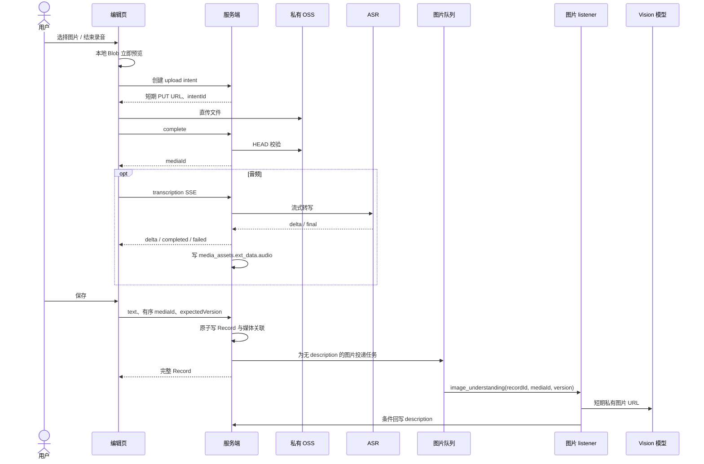

# Record 模块完整方案：编辑态音频与保存后图片理解

## 1. 目标与范围

本阶段交付可靠的文字、图片、音频 Record：前端直传私有 OSS；音频在编辑页通过 SSE 转写并允许用户确认后保存；图片在 Record 保存成功后由队列异步理解，并安全回写图片描述。Record、媒体读取、列表、详情、编辑、删除和清理均在本阶段闭环。

不在本阶段实现 Topic、Agent、Task、向量、视频、链接、实体图谱、持久化消息队列或模型自动重试。它们不得因本模块改造被删除、重构或引入依赖。

## 2. 从旧方案继承与修正

| 既有结论 | 新方案处理 |
| --- | --- |
| 私有 OSS + 短期签名 URL | 保留。浏览器直传 PUT，服务端 HEAD 复核；读取经鉴权接口 302。 |
| `upload_intents` 与 `media_assets` 分离 | 保留。前者是短期上传授权，后者是完成校验后的稳定媒体索引。 |
| 音频保存前 SSE 转写 | 保留。转写结果写入媒体资产，保存时复制到 Record 快照。 |
| “保存后不再处理媒体” | 修正。仅音频不在保存后处理；图片保存后必须进入队列并由 listener 回写描述。 |
| 图片理解写入 upload intent | 不采用。图片描述是 Record 语境中的快照，写回对应 Record block。 |
| 旧 agent/topic/task 模块移除 | 不采用。本阶段只新增或修改 Record 与媒体相关文件。 |

## 3. 数据模型

### 3.1 Record

```ts
type RecordContent = {
  text: string;
  blocks: Array<
    | { mediaId: string; description?: string }
    | { mediaId: string; transcript: string; language: string | null; emotion: string | null }
  >;
};
```

- `blocks` 的数组顺序即展示顺序。
- 同一个 Record 的 `mediaId` 不重复，因此 `mediaId` 可作为图片 listener 的稳定回写定位符，不额外引入 block ID。
- `records.version` 是唯一的内容版本：创建为 1，每个成功 PATCH 加 1；图片异步回写不增加 version。
- 内容中不保存对象 key、上传状态、队列状态、模型名称或中间流式结果。

### 3.2 Upload intent

`upload_intents` 只管理前端直传安全边界：`id`、`user_id`、`object_key`、预期媒体类型/MIME/字节数、`status`、`media_id`、`expires_at`、审计时间。

状态：`pending → completed`，或从未消费状态进入 `cancelled` / `expired`。重复 complete 必须返回同一 `mediaId`。它不保存图片理解或音频转写状态。

### 3.3 Media asset

`media_assets` 保存稳定资源：`id`、`user_id`、私有 `object_key`、类型、已复核 MIME/字节数、`ext_data` 和时间。

`ext_data` 命名空间：

```json
{
  "recordId": "Record UUID 或 null",
  "capture": { "width": 1536, "height": 1024, "durationMs": null },
  "audio": { "transcript": "完整转写", "language": "zh", "emotion": null }
}
```

`audio` 仅音频使用。任何 namespace 更新必须保留其余键。

## 4. 端到端流程



## 5. 图片队列与 listener

定义独立接口，当前实现可为进程内 `LocalImageQueue`：

```ts
type ImageUnderstandingMessage = { recordId: string; userId: string; mediaId: string; version: number };
```

创建或 PATCH 成功后，对所有仍没有 `description` 的图片发布消息。PATCH 即使只改文字也会为未完成图片以新版本重投，确保旧任务因版本失效后仍有新任务可完成。

listener 步骤：

1. 以 `recordId`、`userId`、`version` 读取 Record；版本不符则丢弃。
2. 确认该 `mediaId` 仍存在于 block 且为图片；确认媒体归属与类型。
3. 用短期 GET URL 调用图片理解服务，只接受非空、受长度限制的客观描述。
4. 在一个事务中再次检查 Record 版本和 block 存在性，只更新该 block 的 `description`；不更新 Record version。
5. 模型或 OSS 失败仅结构化记录错误，不影响已保存 Record，也不自动重试。

队列不持久化是明确 MVP 边界。为避免进程重启永久遗漏，服务启动和定期维护时扫描当前用户 Record 中“图片 block 无 description”的项目并重新投递；该扫描幂等，重复任务由条件回写消解。

## 6. 音频 SSE

音频 complete 后，编辑页调用 `POST /api/uploads/intents/:id/transcription`。同一 intent 同时只允许一个活跃连接；完成后允许直接返回已有最终结果。

- `delta` 只发送给当前 SSE 连接，绝不写入数据库。
- 同时收到模型正常结束标记、流结束且全文非空时，才写 `media_assets.ext_data.audio` 并发送 `completed`。
- intent 删除、客户端断开或服务端超时必须通过 `AbortSignal` 传递给上游 ASR fetch；取消后不得写入最终结果。
- 保存音频时必须已有完整 `audio.transcript`，否则返回 `409 AUDIO_TRANSCRIPTION_PENDING`。
- 用户可提交编辑后的 transcript，它仅覆盖本 Record 的 audio block，不回写媒体资产。

## 7. Record 保存、编辑与删除

创建和 PATCH 都在数据库事务中完成：校验 mediaId 属于当前用户、未被另一 Record 关联、按请求顺序生成 blocks、关联新增媒体、解除移除媒体、更新 `version`。PATCH 强制 `expectedVersion`，不符返回 `409 VERSION_CONFLICT` 和当前 DTO。

移除已关联媒体时，先提交 Record 与关联解除；随后由后台清理器删除不再关联的媒体资产和 OSS 对象。清理失败记录可追踪日志并在后续清理轮次重试；不回滚用户已成功的编辑。

编辑态删除使用 `DELETE /api/uploads/intents/:id` 或 `DELETE /api/media/:mediaId`。关联的媒体不可由通用 media 删除接口删除，必须通过 PATCH 从 Record 中移除。

## 8. API、读取和安全

保留并文档化：创建/读取/complete/删除 intent，音频 SSE，创建/更新/分页/详情 Record，统一媒体 GET/DELETE。

- 所有媒体资源先按 Cookie/Session 认证；本地 `x-user-id` 仅开发用途。
- 不存在与非本人资源统一 404。
- PUT 与 GET URL 都短期有效；服务器不返回 object key、密钥或完整模型响应。
- complete HEAD 复核 MIME、字节数和 intent 生命周期。
- 列表按 `created_at,id` 复合游标；当前页的全部媒体用一次 `IN` 查询 hydrate，禁止 N+1。
- 媒体读取必须保持 Range 头的可用性，以支持音频拖动播放。
- 创建 intent、complete、创建 Record、PATCH 均接受幂等键；幂等记录按用户与接口作用域隔离。

## 9. 清理、运行与验收

- 未完成 intent 与未关联 asset 在 24 小时后清理 OSS 对象和数据库记录。
- 服务启动时执行一次过期清理和图片补偿投递；运行中按固定间隔执行。
- 日志只记录资源 ID、用户 ID、操作和错误类别，不记录签名 URL、密钥、完整模型输出或文件内容。

验收标准：图片上传时本地预览；音频在保存前收到 SSE 并可编辑；保存成功后图片最终出现异步描述；版本变化、图片移除、模型失败和重启补偿都不会错误回写；列表可预览图片、播放并拖动音频；全仓 `pnpm typecheck` 与隔离测试通过。
