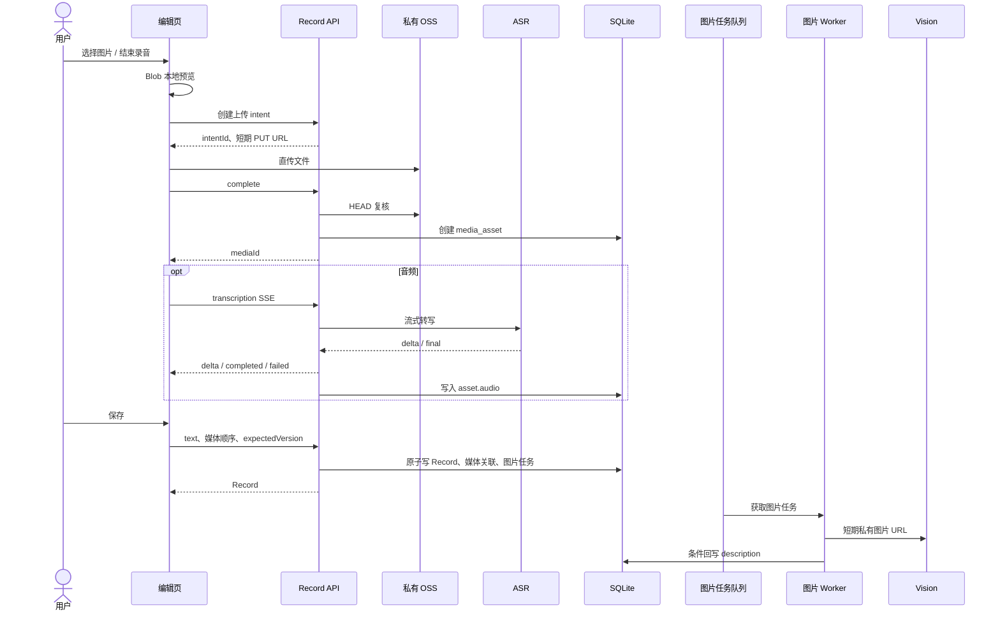

# Record 模块最终服务端技术方案

## 1. 产品与系统边界

Record 是用户主动保存的一次原始记录，支持文字、图片和音频。一条 Record 最多 3 张图片、1 段音频、4 个媒体项，文字最长 20,000 字符。

本模块提供：安全上传、私有媒体读取、编辑态音频转写、保存后的图片理解、Record 创建/编辑/读取/删除媒体与生命周期清理。

不提供：Topic、Agent、向量检索、视频、链接、自动归类、标签管理或聊天。它们可在未来独立消费 Record，但不得耦合到本模块的保存与媒体处理链路。

## 2. 最终行为

### 2.1 音频：保存前完成

音频在编辑页上传完成后立即通过 SSE 转写。中间文字只推送给当前浏览器连接；只有完整、有效的最终转写写入媒体资产。用户可以编辑转写文稿；保存时它成为该 Record 的文本快照。未完成转写的音频不能保存。

### 2.2 图片：保存后异步理解

图片上传成功即可本地预览且不阻塞保存。Record 提交事务成功后，服务端原子创建图片理解任务；worker/listener 调用视觉模型，将结果条件回写到仍为同一版本、仍包含该图片的 Record block。图片理解失败不影响 Record 保存。



## 3. 数据模型

### 3.1 `records`

```text
id              UUID PK
user_id         UUID / text，索引
content         JSON TEXT，见下文
version         INTEGER NOT NULL，创建为 1
created_at      ISO-8601
updated_at      ISO-8601
```

```ts
type RecordContent = {
  text: string;
  blocks: Array<
    | { mediaId: string; description?: string }
    | { mediaId: string; transcript: string; language: string | null; emotion: string | null }
  >;
};
```

- blocks 数组顺序就是展示顺序；同一 `mediaId` 在同一 Record 内不可重复。
- `mediaId` 是图片异步任务的稳定定位符，不另设 block ID。
- 图片 listener 回写 description 不增加 `version`；所有用户保存导致 version 增加。
- content 不存 object key、URL、上传状态、任务状态、模型响应或中间转写。

### 3.2 `media_assets`

完成服务端 HEAD 校验后的稳定媒体资产。

```text
id              UUID PK（mediaId）
user_id         UUID / text，索引
object_key      私有 OSS key，唯一，不对客户端返回
media_type      image | audio
mime_type       白名单 MIME
bytes           已复核字节数
ext_data        JSON TEXT
created_at      ISO-8601
updated_at      ISO-8601
```

```json
{
  "recordId": "Record UUID 或 null",
  "capture": { "width": 1536, "height": 1024, "durationMs": null },
  "audio": { "transcript": "完整转写", "language": "zh", "emotion": null }
}
```

`audio` 只由转写成功写入；用户编辑后的 transcript 不回写 asset。每次更新 ext_data 都必须深合并，不能覆盖其他命名空间。

### 3.3 `upload_intents`

前端直接上传私有 OSS 前的短期授权，不是业务媒体本身。

```text
id, user_id, object_key, media_type, mime_type, bytes
status                  pending | completed | cancelled | expired
media_id                nullable；complete 后写入
transcription_status    not_applicable | idle | processing | completed | failed | cancelled
expires_at, created_at, updated_at
```

上传 intent 永远不可被 Record 直接引用；只有它完成并生成的 `mediaId` 可以保存。

### 3.4 `image_understanding_jobs`

这是图片保存后异步处理的可靠队列。

```text
id, record_id, user_id, media_id, record_version
status          queued | running | succeeded | failed | cancelled
attempts, max_attempts, available_at, lease_until
last_error_code, created_at, updated_at
UNIQUE(record_id, media_id, record_version)
```

任务由 Record 保存事务创建。worker 使用租约领取任务；网络/5xx 可在有限次数内退避重试，格式/鉴权/模型拒绝等终态失败不重试。任务失败可查询和告警，但不改 Record 状态。

### 3.5 `idempotency_keys`

```text
user_id, scope, key      复合唯一键
request_hash             防止同 key 改变请求体
response_status, response_body
expires_at, created_at
```

适用于创建 intent、complete、创建 Record 与 PATCH，避免网络重试重复创建对象、资产或 Record。

### 3.6 `media_cleanup_jobs`

记录已解除关联或已过期资源的对象删除任务。数据库主事务只提交业务状态和清理任务；删除 OSS 失败由 worker 重试并保留可观测错误，不能回滚已成功的用户编辑。

## 4. 一致性与并发规则

### Record 保存

`POST /records` 与 `PATCH /records/:id` 在单一数据库事务中执行：

1. 校验媒体归属、类型、未被其他 Record 关联及请求中的顺序/数量。
2. 对音频校验 `media_assets.ext_data.audio.transcript` 非空；否则返回 `409 AUDIO_TRANSCRIPTION_PENDING`。
3. 构造 blocks：音频复制最终转写或用户编辑 transcript；图片初始没有 description。
4. 创建或更新 Record；PATCH 必须匹配 `expectedVersion`，成功后 version 加 1。
5. 设置新媒体 `recordId`，解除移除媒体的 `recordId`，并为解除的资产创建 cleanup job。
6. 为无 description 的图片创建当前版本的 `image_understanding_jobs`。

版本冲突返回 `409 VERSION_CONFLICT` 与当前完整 Record DTO。任何资产、任务或清理异常都不可导致跨用户访问。

### 图片条件回写

worker 在同一事务中确认：Record 属于消息用户、`records.version === record_version`、block 仍含 mediaId、asset 仍为图片且关联同一 Record。仅满足全部条件才写 `description`，否则把任务标记 `cancelled`/`succeeded`（无操作）并不回写。

若用户 PATCH 仅修改文字，旧图片任务因版本失效；保存逻辑会为该图片建立新版本任务，确保最终仍能得到描述。

### 音频取消

转写请求必须把 `AbortSignal` 传入上游模型请求。删除 intent、连接断开和超时均中止 fetch，并在写最终结果前再次检查 intent 归属、状态与未取消性。取消后的结果必须丢弃。

## 5. 服务端目录结构

```text
apps/server/src/
├── main.ts                         # 组装依赖、迁移、启动 HTTP 与 worker
├── server.ts                       # Hono 根路由、中间件、错误映射
├── config/
│   └── env.ts                      # 环境变量与启动期配置校验
├── domain/
│   ├── records/
│   │   ├── record-content.ts       # Zod codec、block 构造、纯函数
│   │   ├── record-policy.ts        # 数量、版本、关联规则
│   │   └── record.types.ts
│   ├── uploads/
│   │   ├── upload-intent.ts        # 状态转移与校验
│   │   └── upload.types.ts
│   └── media/
│       ├── media-asset.ts          # ext_data 合并与类型约束
│       └── image-job.ts            # 任务状态与重试策略
├── application/
│   ├── records/
│   │   ├── create-record.ts
│   │   ├── update-record.ts
│   │   ├── get-record.ts
│   │   └── list-records.ts
│   ├── uploads/
│   │   ├── create-intent.ts
│   │   ├── complete-upload.ts
│   │   ├── cancel-upload.ts
│   │   └── transcribe-audio.ts
│   ├── media/
│   │   ├── read-media.ts
│   │   ├── delete-unlinked-media.ts
│   │   └── cleanup-media.ts
│   └── images/
│       ├── enqueue-understanding.ts
│       ├── process-understanding.ts
│       └── reconcile-understanding.ts
├── interfaces/
│   ├── auth.ts                     # 当前用户解析
│   ├── object-storage.ts            # 签名、HEAD、删除
│   ├── audio-transcriber.ts         # 支持 AbortSignal 与流事件
│   ├── image-understander.ts
│   ├── clock.ts
│   └── logger.ts
├── infrastructure/
│   ├── database/
│   │   ├── database.ts
│   │   ├── schema.ts
│   │   ├── migrations/
│   │   └── repositories/
│   │       ├── sqlite-record.repository.ts
│   │       ├── sqlite-media.repository.ts
│   │       ├── sqlite-upload-intent.repository.ts
│   │       ├── sqlite-image-job.repository.ts
│   │       ├── sqlite-cleanup-job.repository.ts
│   │       └── sqlite-idempotency.repository.ts
│   ├── storage/aliyun-oss.ts
│   ├── ai/qwen-audio.ts
│   ├── ai/qwen-vision.ts
│   ├── auth/session-auth.ts
│   ├── logging/pino-logger.ts
│   └── time/system-clock.ts
├── routes/
│   ├── health.ts
│   ├── uploads.ts
│   ├── records.ts
│   └── media.ts
├── workers/
│   ├── image-understanding.worker.ts
│   └── media-cleanup.worker.ts
├── scheduler/
│   └── record-maintenance.ts        # lease 回收、过期 intent、补偿扫描
└── test/
    ├── fakes/
    ├── integration/
    └── unit/
```

application 只编排用例和事务；domain 不依赖 Hono、SQLite、OSS 或模型 SDK；routes 不直接访问数据库；worker 不依赖 HTTP 上下文。

## 6. HTTP API

所有 `/api/*` 路由使用 Cookie/Session 鉴权；本地开发允许 `x-user-id`。JSON 响应统一为：

```ts
type ApiResponse<T> = { success: boolean; result?: T; errorCode: string | null; errorMsg: string | null };
```

### 6.1 上传与编辑态音频

| Path | Headers | Request body | Success response | 主要失败 |
| --- | --- | --- | --- | --- |
| `POST /api/uploads/intents` | Auth, `Content-Type: application/json`, `Idempotency-Key` | `{fileName, mediaType, mimeType, bytes}` | `201 {intentId, uploadUrl, expiresAt}` | `400 INVALID_INPUT` |
| `GET /api/uploads/intents/:id` | Auth | 无 | `200 {intentId,status,mediaId,transcriptionStatus,expiresAt}` | `404 NOT_FOUND` |
| `POST /api/uploads/intents/:id/complete` | Auth, JSON, Idempotency-Key | `{capture?: {width?,height?,durationMs?}}` | `200 {mediaId,mediaType,mimeType,bytes}` | `409 UPLOAD_MISMATCH` / `UPLOAD_INCOMPLETE` |
| `POST /api/uploads/intents/:id/transcription` | Auth, `Accept: text/event-stream` | 无 | `200 text/event-stream` | `404 NOT_FOUND`, `409 TRANSCRIPTION_ACTIVE` |
| `DELETE /api/uploads/intents/:id` | Auth | 无 | `204` | `404 NOT_FOUND` |

SSE 事件：`delta {text}`、`completed {transcript,language,emotion}`、`failed {code,message}`。客户端不得提交 transcript 以外的模型结果。

### 6.2 Record

| Path | Headers | Request body | Success response | 主要失败 |
| --- | --- | --- | --- | --- |
| `POST /api/records` | Auth, JSON, Idempotency-Key | `{text, media:[{mediaId, transcript?}], source?}` | `201 RecordDto` | `400 INVALID_MEDIA`, `409 AUDIO_TRANSCRIPTION_PENDING` |
| `PATCH /api/records/:id` | Auth, JSON, Idempotency-Key | `{text, media:[{mediaId, transcript?}], expectedVersion}` | `200 RecordDto` | `404 NOT_FOUND`, `409 VERSION_CONFLICT`, `409 AUDIO_TRANSCRIPTION_PENDING` |
| `GET /api/records?cursor=&limit=` | Auth | 无 | `200 {data: RecordDto[],hasMore,nextCursor,pageSize}` | `400 INVALID_CURSOR` |
| `GET /api/records/:id` | Auth | 无 | `200 RecordDto` | `404 NOT_FOUND` |

`RecordDto` 含 `id`、`content`、`version`、时间及按 block 原顺序 hydrate 的媒体 DTO：

```json
{
  "media": [
    { "id": "uuid", "type": "image", "url": "/api/media/uuid", "description": "图片描述或 null" },
    { "id": "uuid", "type": "audio", "url": "/api/media/uuid", "durationMs": 12000, "transcriptPreview": "…" }
  ]
}
```

### 6.3 媒体

| Path | Headers | Request body | Success response | 主要失败 |
| --- | --- | --- | --- | --- |
| `GET /api/media/:mediaId` | Auth；音频可带 `Range` | 无 | `302 Location: 短期私有 OSS URL` | `404 NOT_FOUND` |
| `DELETE /api/media/:mediaId` | Auth | 无 | `204`，仅未关联媒体 | `404 NOT_FOUND` / `409 MEDIA_LINKED` |
| `GET /health` | 无 | 无 | `200 {status,timestamp}` | - |

对象上传是浏览器对签名 `uploadUrl` 的 `PUT`，不经过应用服务器；该 URL 不是公共 API，也不可持久化。

## 7. 安全、可观测性与运行

- OSS bucket 为私有；PUT/GET 签名短期有效；不记录或返回 AccessKey、object key、签名 URL、文件内容、完整模型响应。
- MIME 白名单：JPEG、PNG、WebP、MP4、MP3、WAV；complete 强制 HEAD 复核 MIME 与大小。
- 所有资源按 user_id 隔离，不存在与无权统一返回 404；随机 UUID 不作为唯一保护手段。
- 图片 worker 与清理 worker 在主进程启动；用数据库 lease 支持未来水平扩展。
- scheduler 每分钟处理可用 job、回收过期 lease；每日清理 24 小时未完成 intent 与未关联 asset；每小时扫描无 description 图片补偿漏任务。
- 指标：上传 complete 成功率、SSE 首 delta/完成耗时、图片任务积压/失败数、清理失败数、版本冲突数。日志携带 requestId、userId、recordId、mediaId、jobId。

## 8. 迁移与发布

新增迁移只能前滚，绝不修改已在生产执行的 migration 文件。发布顺序：

1. 新增表和索引，保持旧读取兼容。
2. 部署读取兼容版本，回填必要的旧 Record content。
3. 部署新写路径、worker 和 HTTP API。
4. 完成隔离数据库验收、灰度上传/转写/图片任务观测后再停止旧写路径。

回滚仅停用新路由与 worker，不删除已上传对象、资产、Record 或任务记录。

## 9. 验收标准

1. 图片选择后立即本地预览；保存后最终出现描述。
2. 音频上传后编辑页收到 SSE，可编辑转写，未完成时不能保存。
3. 图片旧任务在 Record 更新、图片移除或版本变化后绝不回写。
4. 进程重启后，未完成图片任务和无描述图片最终被重新处理。
5. 列表/详情无 N+1，可预览图片、播放和 Range 拖动音频。
6. 所有跨用户、过期、重复、冲突、取消和对象删除失败场景都有确定响应与可观测记录。
7. 单元、repository、HTTP、worker 集成测试和 `pnpm typecheck` 全部通过。
