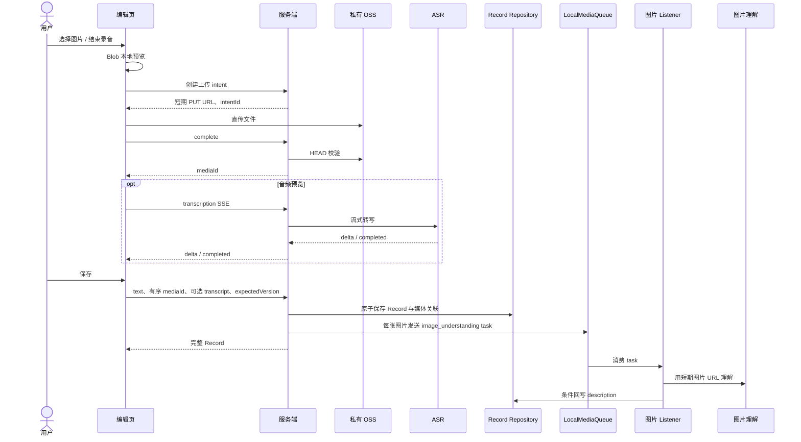

# Record 模块最终最小技术方案

## 1. 边界

Record 支持四种有效内容：纯文本、文本加图片、纯音频、图片加音频。文字可为空，但文字和媒体不能同时为空；图片最多 3 张、音频最多 1 段、媒体总数最多 4 个。

音频转写是编辑页的只读预览提示：用户不能编辑，转写可以不存在，音频也可以在没有转写文本时保存。图片描述是保存后的异步增强：它不阻塞保存，由 queue 的 listener 生成并回写 Record。

本阶段只关注最终保存的媒体。编辑态取消、离开页面、未保存对象删除、重试清理、持久化任务、任务 worker、幂等键、Topic、Agent、向量、视频、链接均不实现。

## 2. 核心流程



音频 SSE 的中间与最终文本仅保留在当前编辑页内存。保存时，客户端可附带当前预览到的 transcript；服务端把它作为 Record audio block 的可选字段写入。它是用户本次保存内容的一部分，不写入 `media_assets`，也不需要由服务端再次验证为模型输出。

## 3. 数据模型

### 3.1 `records`

```text
id, user_id, content, version, created_at, updated_at
```

```ts
type RecordContent = {
  text: string;
  blocks: Array<
    | { mediaId: string; description?: string }
    | { mediaId: string; transcript?: string }
  >;
};
```

- `blocks` 的顺序就是展示顺序。
- 同一 Record 内的 mediaId 不可重复。
- 创建时 `version = 1`；每次 PATCH 成功后 `version + 1`。
- 图片 listener 回写 description 不增加 version。
- 内容不保存 object key、上传状态、任务状态、模型信息或音频转写状态。

### 3.2 `media_assets`

```text
id, user_id, object_key, media_type, mime_type, bytes,
ext_data, created_at, updated_at
```

这是通过 OSS HEAD 校验后的稳定媒体索引。`object_key` 只在服务端使用；`ext_data` 当前仅保存：

```json
{
  "recordId": "关联的 Record UUID 或 null",
  "capture": { "width": 1536, "height": 1024, "durationMs": null }
}
```

不保存音频转写结果。

### 3.3 `upload_intents`

```text
id, user_id, object_key, media_type, mime_type, bytes,
status, media_id, expires_at, created_at, updated_at
```

状态只需 `pending | completed | expired`。它提供短期上传授权；complete 后创建 media asset 并返回 mediaId。无需取消状态、分析状态、消费状态或额外任务表。

## 4. 图片 queue 与 listener

queue 是进程内消息分发，不持久化、不使用 jobs 表、不使用 worker。它的 task 是：

```ts
type ImageUnderstandingTask = {
  recordId: string;
  userId: string;
  mediaId: string;
  version: number;
};

interface LocalMediaQueue {
  publish(type: "image_understanding", task: ImageUnderstandingTask): void;
  on(type: "image_understanding", listener: (task: ImageUnderstandingTask) => Promise<void>): void;
}
```

Record 创建或 PATCH 提交成功后，为当前 Record 中所有没有 `description` 的图片发布 task。PATCH 产生新版本：旧 task 因 version 不匹配被丢弃，而新版本会重新发布 task。

listener：

1. 读取 Record，确认 userId、version 和目标 mediaId；任一不符即丢弃。
2. 确认 asset 属于该用户、类型为 image 且 `ext_data.recordId` 为该 Record。
3. 生成短期 OSS GET URL，调用 `infrastructure/media/image-understanding.ts`。
4. 在事务中再次校验 Record version 和图片 block 仍存在，仅写该 block 的 `description`。
5. 失败只记录日志，不影响已保存 Record，也不自动重试。

## 5. 保存与并发

`POST /api/records` 与 `PATCH /api/records/:id` 接受 `text`、按展示顺序排列的媒体数组，以及每段音频可选 transcript：

```json
{
  "text": "傍晚散步",
  "media": [
    { "mediaId": "image-uuid" },
    { "mediaId": "audio-uuid", "transcript": "风有点大" }
  ],
  "expectedVersion": 1
}
```

服务端在一个事务中：校验媒体归属与未被另一 Record 关联；按 media type 构造 block；创建或更新 Record；更新 media asset 的 `recordId`；解除被移除媒体的关联。不会删除 OSS 对象或未保存资产。

PATCH 必须带 `expectedVersion`。不匹配返回 `409 VERSION_CONFLICT` 和当前 Record，禁止静默覆盖。创建与更新完成后才发布图片 task；队列调用失败只记录错误，不回滚 Record。

## 6. 服务端目录结构

```text
apps/server/src/
├── main.ts                              # 组装依赖、注册 listener、启动服务
├── server.ts                            # Hono 根应用与中间件
├── application/
│   ├── records/
│   │   ├── create-record.ts
│   │   ├── update-record.ts
│   │   ├── get-record.ts
│   │   └── list-records.ts
│   ├── uploads/
│       ├── create-upload-intent.ts
│       ├── complete-upload.ts
│       └── upload.types.ts
│   └── media/
│       └── transcribe-audio.ts          # 编辑态音频 SSE 编排
├── domain/
│   ├── records/
│   │   ├── record-content.ts            # codec、数量与内容校验
│   │   └── record-policy.ts             # version、关联与回写纯规则
│   └── uploads/
│       └── upload-intent.ts             # intent 状态与 MIME 规则
├── infrastructure/
│   ├── database/
│   │   ├── database.ts
│   │   ├── schema.ts
│   │   ├── migrations/
│   │   └── repositories/
│   │       ├── sqlite-record.repository.ts
│   │       ├── sqlite-media.repository.ts
│   │       └── sqlite-upload-intent.repository.ts
│   ├── oss-storage.ts                   # 私有 PUT/GET 签名、HEAD
│   ├── local-media-queue.ts             # queue 与 ImageUnderstandingTask
│   └── ai/
│       ├── image-understanding.ts       # Qwen3-VL-Flash 图片理解适配
│       └── audio-transcription.ts       # 音频 SSE 模型适配
├── listeners/
│   └── image-understanding.listener.ts
├── routes/
│   ├── uploads.ts
│   ├── records.ts
│   └── media.ts
└── test/
    ├── fakes/
    ├── integration/
    └── unit/
```

`application/` 下没有 `images/`，但保留 `media/transcribe-audio.ts`：它负责编辑态 SSE 的编排，不保存转写结果。图片任务发布属于 Record 保存用例，图片理解的外部调用属于 `infrastructure/ai/image-understanding.ts`，消费逻辑在 listener。

## 7. 图片理解模型接口与提示词

### 7.1 应用层依赖的接口

listener 只依赖以下接口，不能了解 Qwen HTTP 协议：

```ts
export interface ImageUnderstanding {
  describe(input: {
    imageUrl: string;       // 服务端生成的短期私有 OSS GET URL
    signal?: AbortSignal;
  }): Promise<{ description: string }>;
}
```

每个 `ImageUnderstandingTask` 只处理一个图片 `mediaId`。不为单条 Record 把多图合并为一次模型调用，以便每个 block 可以独立重试、回写和失效。

### 7.2 Qwen3-VL-Flash 适配

`infrastructure/ai/image-understanding.ts` 使用 OpenAI compatible Chat Completions API：

```text
POST https://ws-2gkw6cbbhgg7bqz5.cn-beijing.maas.aliyuncs.com/compatible-mode/v1/chat/completions
Authorization: Bearer ${DASHSCOPE_API_KEY}
Content-Type: application/json
```

请求结构：

```json
{
  "model": "qwen3-vl-flash",
  "messages": [
    {
      "role": "user",
      "content": [
        {
          "type": "image_url",
          "image_url": { "url": "短期私有 OSS GET URL" }
        },
        {
          "type": "text",
          "text": "提示词内容"
        }
      ]
    }
  ]
}
```

适配器只读取 `choices[0].message.content`。只有 HTTP 成功、`finish_reason = "stop"` 且内容经清理后非空时才返回 description；其余情况抛出可诊断错误交给 listener 记录。不得记录完整请求 URL、模型原始响应或图片内容。

### 7.3 Record 图片描述提示词

```text
你正在为个人记录中的一张图片生成简洁、客观的中文描述，供用户稍后回顾。

请用 1 到 3 句完整中文描述：
1. 可见的主体、环境、动作或事件；
2. 图片中清晰可读的文字（若有）；
3. 对理解画面有帮助的显著物品、地点特征或时间线索（仅限画面明确可见）。

严格遵守：
- 只陈述画面直接可见的事实；不猜测人物身份、姓名、关系、职业、地点、时间、动机、情绪或故事背景。
- 不评价美丑、质量、构图或摄影风格；不使用“可能”“似乎”等不确定推断填充内容。
- 不写标题、列表、Markdown、免责声明或“这张图片展示了”等套话。
- 若画面信息有限，只描述确实可见的内容。
```

该提示词刻意避免示例响应中关于“深厚感情”“野性”“氛围”“意图”等不可从图像直接验证的推断，使 description 可以作为 Record 的客观补充。

## 8. HTTP 接口

通用约定：`/api/*` 使用 Cookie/Session 鉴权；本地开发允许 `x-user-id`。JSON 响应为 `{success,result,errorCode,errorMsg}`。客户端永远不能提交 object key、MIME/字节数复核值或图片 description。

| 方法与 Path | 请求头 | 请求体 | 成功响应 | 失败响应 |
| --- | --- | --- | --- | --- |
| `POST /api/uploads/intents` | Auth, `Content-Type: application/json` | `{fileName,mediaType,mimeType,bytes}` | `201 {intentId,uploadUrl,expiresAt}` | `400 INVALID_INPUT` |
| `POST /api/uploads/intents/:id/complete` | Auth, JSON | `{capture?:{width?,height?,durationMs?}}` | `200 {mediaId,mediaType,mimeType,bytes}` | `404 NOT_FOUND`, `409 UPLOAD_MISMATCH`, `409 UPLOAD_INCOMPLETE` |
| `POST /api/uploads/intents/:id/transcription` | Auth, `Accept: text/event-stream` | 无 | SSE：`delta {text}`、`completed {transcript?}`、`failed {message}` | `404 NOT_FOUND`, `409 TRANSCRIPTION_ACTIVE` |
| `POST /api/records` | Auth, JSON | `{text,media:[{mediaId,transcript?}]}` | `201 RecordDto` | `400 INVALID_INPUT/INVALID_MEDIA` |
| `PATCH /api/records/:id` | Auth, JSON | `{text,media:[{mediaId,transcript?}],expectedVersion}` | `200 RecordDto` | `404 NOT_FOUND`, `409 VERSION_CONFLICT` |
| `GET /api/records?cursor=&limit=` | Auth | 无 | `200 {data,hasMore,nextCursor,pageSize}` | `400 INVALID_CURSOR` |
| `GET /api/records/:id` | Auth | 无 | `200 RecordDto` | `404 NOT_FOUND` |
| `GET /api/media/:mediaId` | Auth，可携带 `Range` | 无 | `302` 到短期私有 OSS URL | `404 NOT_FOUND` |

浏览器使用 `uploadUrl` 直接 PUT 文件到 OSS；这不是应用 API。编辑态不提供删除接口；未保存上传对象不在本阶段处理。

`RecordDto` 的 `media` 按 block 顺序 hydrate：图片包含 `id,type:"image",url,description`；音频包含 `id,type:"audio",url,durationMs,transcriptPreview`。列表以 `created_at,id` 复合游标分页，并按当前页全部 mediaId 一次性查询，避免 N+1。

## 9. 安全与验收

- OSS bucket 私有；PUT/GET 签名短期有效；HEAD 强制复核 MIME 与字节数。
- MIME 白名单为 JPEG、PNG、WebP、MP4、MP3、WAV。
- mediaId 为随机 UUID；无权限和不存在统一返回 404；不记录签名 URL、密钥、文件内容或完整模型响应。
- 音频读取支持 Range；图片和音频只能通过鉴权后的内部 media URL 访问。

验收：

1. 文本、图文、音频、图音均能保存。
2. 音频预览转写可出现也可不存在；用户不能编辑，缺失时仍可保存。
3. 图片保存后异步写入 description；模型失败或旧 task 不会影响/覆盖 Record。
4. PATCH 版本冲突、跨用户媒体、MIME/字节不符和未上传对象均正确失败。
5. 列表/详情可预览图片、播放音频；所有测试与 `pnpm typecheck` 通过。
