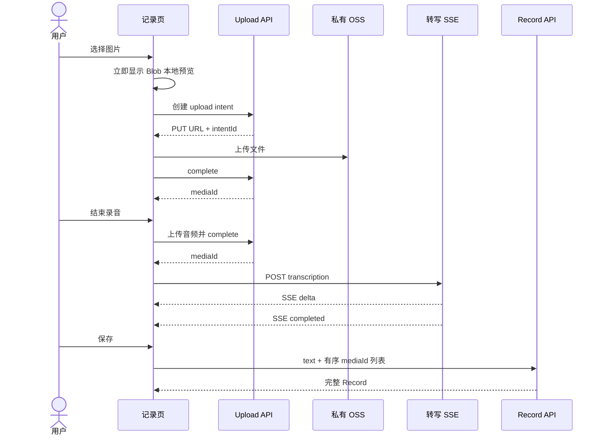

# Record 模块服务端完整方案

## 1. 产品边界

Record 只在用户点击保存时创建或修改一次。图片上传、音频转写、预览和删除全部发生在记录编辑页；保存后的 Record 不再触发媒体处理或异步回写。

支持文字、图片、音频、私有 OSS、图片预览、音频播放、录音完成后的 SSE 转写、列表页媒体预览。非范围：Topic、Agent、向量化、视频、链接、持久化队列、自动重试。

## 2. 数据模型

```ts
type RecordContent = {
  text: string;
  // 数组顺序即媒体展示顺序；block 不含独立 id 或 objectKey
  blocks: Array<
    | { mediaId: string; description?: string }
    | { mediaId: string; transcript?: string; language?: string | null; emotion?: string | null }
  >;
};
```

`records.version` 是唯一内容版本号：创建为 1，每次 PATCH 加 1。JSON content 不包含 version、上传状态或处理状态。

`media_assets` 是媒体与 OSS 的稳定索引：

```text
id              # mediaId，UUID
user_id
object_key      # 私有 OSS key，仅服务端可见
media_type      # image | audio
mime_type
bytes
ext_data        # JSON
created_at
updated_at
```

`ext_data` 约定：

```json
{
  "recordId": "保存后关联的 Record UUID 或 null",
  "capture": { "width": 1536, "height": 1024, "durationMs": null },
  "audio": { "transcript": "今天……", "language": "zh", "emotion": null }
}
```

图片 `description` 是 Record 对该图片的内容快照，只存对应 block。音频 `audio` 是文件本身可复用的转写结果；保存时复制到 audio block。更新一个 `ext_data` 命名空间不得覆盖其他键。

`upload_intents` 仅服务安全上传，保存 intent、user、object key、媒体基本数据、状态、过期时间和完成后的 mediaId；不承担媒体处理任务。

## 3. 编辑页流程



图片在本地立即预览，上传状态由前端管理。音频完成上传后马上请求转写 SSE；目标为 1～5 秒开始出现首个 delta，不承诺硬 SLA。流式半成品只发送给当前 SSE 连接，只有完整结束且 transcript 非空才写 `media_assets.ext_data.audio`。

保存前删除图片或音频：前端删除本地预览并调用 `DELETE /api/uploads/intents/:id` 或 `DELETE /api/media/:mediaId`。服务端取消活跃转写、删除 OSS 对象和未关联媒体资产；后续结果一律丢弃。

## 4. HTTP API

| 接口 | 作用 |
| --- | --- |
| `POST /api/uploads/intents` | 校验类型/大小，返回短期 OSS PUT URL 与 intentId |
| `POST /api/uploads/intents/:id/complete` | HEAD 复核 MIME/字节数，创建并返回 mediaId |
| `GET /api/uploads/intents/:id` | 编辑页恢复临时上传/转写状态 |
| `POST /api/uploads/intents/:id/transcription` | 音频 SSE：delta、completed、failed |
| `DELETE /api/uploads/intents/:id` | 删除尚未完成或未使用上传 |
| `DELETE /api/media/:mediaId` | 删除未关联媒体；若已关联则由 Record 编辑接口处理 |
| `GET /api/media/:mediaId` | 统一媒体读取，鉴权后 302 到短期 OSS GET URL |
| `POST /api/records` | 用 text 与有序 mediaId 列表创建完整 Record |
| `PATCH /api/records/:id` | 携带 expectedVersion 更新文字和有序媒体列表 |
| `GET /api/records` | 游标分页列表，直接返回可预览/播放的媒体 DTO |
| `GET /api/records/:id` | 完整 Record DTO |

客户端永远不能提交 object key、MIME/大小复核值、图片 description、language 或 emotion。可允许提交用户编辑后的 audio transcript；它只覆盖 Record block 快照，不回写媒体资产。

## 5. 保存、并发与删除

创建/修改 Record 在一个数据库事务中完成：校验所有 mediaId 属于当前用户；音频必须已有完整 `ext_data.audio.transcript`，否则返回 `409 AUDIO_TRANSCRIPTION_PENDING`；按请求数组顺序生成 blocks；写入 Record；更新 `records.version`；把每个媒体的 `ext_data.recordId` 写为 Record ID。

PATCH 必须带 `expectedVersion`。不匹配返回 `409 VERSION_CONFLICT` 和当前 Record；禁止静默覆盖另一设备的编辑。

编辑已保存 Record 时，服务端比对原、新 mediaId：移除的媒体清除其 ext_data.recordId，异步删除 OSS 对象与 media asset；新增媒体按上述规则关联。对象删除失败不回滚数据库，但必须记录可追踪错误。

## 6. 查询与渲染

列表使用 `created_at, id` 复合游标。服务端查询当前页 Record、解析 blocks，收集全部 mediaId，再用一次 `WHERE id IN (...) AND user_id = ?` 查询 media_assets，按 blocks 原顺序 hydrate，避免 N+1。

列表 DTO 的每个媒体返回 `id`、`type`、`url: /api/media/:id` 和渲染所需摘要：图片 description；音频 duration、transcriptPreview。前端列表可直接 `` 预览、`<audio controls preload="metadata">` 播放。浏览器媒体认证必须使用 Cookie/Session；开发环境固定用户仅用于本地调试。音频读取必须支持 Range；媒体地址不暴露 object key。

## 7. 安全与清理

- OSS bucket 私有；PUT 和 GET 都是短期签名 URL；不下发 AccessKey。
- MIME 白名单：JPEG/PNG/WebP、MP4/MP3/WAV；complete 必须 HEAD 校验大小和 MIME。
- mediaId 为随机 UUID；无权限或不存在统一返回 404，防枚举。
- 未完成/未保存资源 24 小时过期清理；清理删除 OSS 对象、intent 和未关联 asset。
- 上传、complete、保存均支持幂等键，防网络重试产生重复对象/Record。
- 不记录签名 URL、密钥或完整模型响应。

## 8. 模块边界

```text
application/uploads/  # intent、complete、取消、转写结果
application/records/  # 保存、编辑、媒体关联/移除
domain/uploads/       # 状态和校验规则
domain/records/       # content、version、block 构建
interfaces/           # OSS、ASR、图片理解
routes/uploads.ts     # HTTP 与 SSE
routes/records.ts
infrastructure/       # OSS、Qwen、SQLite
```

音频转写服务直接为编辑页 SSE 提供数据，不能作为保存后 listener。图片描述可以在编辑态产生，但只能在保存时写入 Record block。
