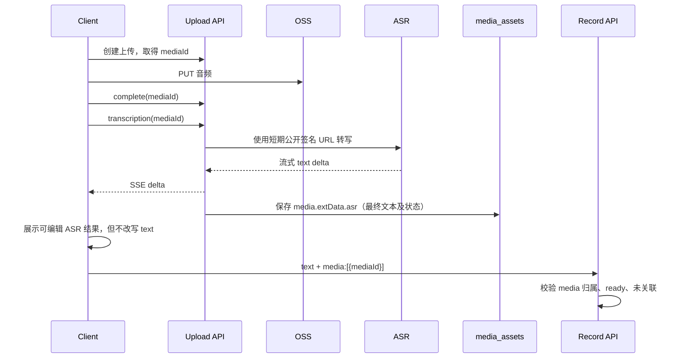

# 媒体、OSS 与 Agent 基础设施升级方案

## 目标与边界

本方案解决四件事：音频 ASR 文本与 `mediaId` 的职责分离、OSS endpoint 的单一配置来源、将 Agent 升级到 Pi `AgentHarness + SessionStorage + Tool Calling`、对外提供原始消息列表。

不改变 Record 创建接口中 `media` 仅接收 `{ mediaId }` 的约束；不把模型密钥或对象存储凭证暴露给客户端；不将 Agent 的 bash 能力直接暴露到宿主机或其他用户的文件空间。

## 现状与问题

- `POST /api/records` 已经只接收有序 `mediaId`；服务端从 `media_assets.media_type` 判断图片或音频。这是正确的归属校验边界。
- `POST /api/uploads/:mediaId/transcription` 只通过 SSE 返回转写文本，转写完成后没有写入 `media_assets.ext_data`，因此刷新页面、断线或稍后创建 Record 都无法恢复结果。
- `.env` 中配置了 `OSS_ENDPOINT`，但 `main.ts` 只传入 `OSS_REGION`；当前 endpoint 配置被忽略，签名 URL 实际按默认 region 生成。
- Agent 目前直接使用 `Agent`，`SessionManager` 只在进程内 `Map` 保存 runtime。`messages` 表存的是 Agent 事件的 JSON，而不是已定义、可稳定查询的原始会话消息；路由也没有读取接口。
- 当前锁定的 Pi core 版本包含 `AgentHarness`、`SessionStorage`、`createBashTool` 与 `NodeExecutionEnv`。其 README 明确说明 SQLite Session 后端位于独立包 `@earendil-works/pi-session-backend-sqlite-node`，当前依赖中尚未接入该包。

## 1. 音频 ASR 与 Record 创建

### 结论

ASR 文本不是用户输入的 `text`，也不应塞入 `media` 的请求对象。`text` 始终表示用户显式输入/编辑的文本；音频与输入文本可同时存在且必须分别保留。客户端仍只在 `media` 中提交 `mediaId`：

```json
{
  "text": "用户手写的补充内容",
  "media": [{ "mediaId": "audio-uuid" }]
}
```

不能让客户端在 `media` 内传入 `transcript`，也不应将 ASR 结果拼接或复制到 `text`。否则既混淆手写内容与机器转写，也会绕过媒体归属/状态校验。Record 的 audio block 保持 `{ type: "audio", mediaId }`，读取时服务端依据 `mediaId` 关联返回 ASR 视图。

### 流程



### 数据与接口约定

- 在 `media_assets.ext_data` 增加 `asr` 命名空间：`status`（`pending|running|succeeded|failed`）、`transcript`、`model`、`completedAt`、可选的 `errorCode`。更新该命名空间时必须保留 `recordId` 和 `capture` 等既有键。后续若需要允许用户修订转写，保存为 `asr.editedTranscript`，保留原始 `asr.transcript`，不要写入 `text`。
- 转写为幂等操作：已成功时直接返回最终文本；进行中时可订阅同一任务或返回可恢复状态；失败允许显式重试并记录新的尝试。不要以进程内 `Set` 作为唯一并发锁。
- 上传完成后可由客户端立即发起转写；第一期保持该显式行为，避免所有音频一上传即产生 ASR 成本。Record 创建不等待 ASR：用户可选择保存原音频或等待/编辑转写；这两种内容均不影响用户 `text`。
- `GET /api/media/:mediaId` 的媒体元数据视图增加可选 `asr` 摘要，供编辑器恢复；私有原音频仍只通过原有鉴权读取地址返回。

## 2. OSS endpoint 统一

### 配置契约

将配置集中到 `loadConfig()`，避免 `main.ts` 直接读取多个 `process.env`：

```text
OSS_REGION=oss-cn-hangzhou
OSS_ENDPOINT=https://oss-cn-hangzhou.aliyuncs.com   # 可选；私有/自定义 endpoint 时必填
OSS_BUCKET=fanto
OSS_ACCESS_KEY_ID=...
OSS_ACCESS_KEY_SECRET=...
```

- `OSS_REGION` 是 SDK 必填的地域语义；`OSS_ENDPOINT` 是可选覆盖，传给 `ali-oss` 的 `endpoint` 参数。两者不得互相替代。
- 启动时校验 bucket、region、凭证，以及 endpoint 是否为完整 HTTPS URL；缺失或格式错误即失败，禁止以空 bucket 启动。
- 用同一个 `OssStorage` 配置生成 PUT、GET 签名 URL；ASR/VL 使用的 URL 必须是模型服务可访问的公网 URL。拒绝 `-internal` endpoint，或分离 `OSS_PUBLIC_ENDPOINT` 用于模型读取。
- 更新 `.env.example`、部署配置和媒体 API 文档；真实 `.env` 不进入文档或版本控制。另将 ASR/VL base URL 分拆为 `DASHSCOPE_ASR_BASE_URL` 与 `DASHSCOPE_VL_BASE_URL` 并在构造依赖时实际使用，消除现有“已配置却未消费”的同类问题。

## 3. AgentHarness、持久会话与工具

### 推荐目录

```text
apps/server/src/agent/
  bootstrap.ts              # 组合 models、session repo、工作区工厂
  harness-factory.ts        # 每个会话打开 Session 并创建 AgentHarness
  session-repository.ts     # Pi SessionStorage/Repo 适配与 user/session ownership
  workspace.ts              # 工作区路径、生命周期、隔离校验
  tools/
    index.ts                # 工具白名单与注册
    bash.ts                 # bash 的 prepare 策略、审计和输出限制
  events/
    sse-projector.ts        # Harness 事件到 SSE 的稳定投影
  messages/
    projector.ts            # Pi Entry 到对外 RawMessage 的投影
  routes.ts                 # 请求校验和 HTTP 语义
```

旧的 `runtime.ts`、`session.ts`、`persistence.ts` 只在迁移完成后删除；不能同时以旧 `messages` 事件流和 Harness session log 作为两个写入真相源。

### 存储模型

- 采用 Pi 的 SQLite Session backend 与项目现有 SQLite 数据库（或独立同机数据库文件）。`SessionStorage` 是 Harness 的事件溯源真相源，保存 message entry、tool result、运行记录、队列与压缩记录。
- `sessionId` 是全局唯一的会话、持久存储和工作区隔离边界：SessionStorage 的 session 主键、Harness cache key 与 workspace 根目录均只使用它。会话元数据可保留 `userId` 作为访问授权归属；HTTP 层仅在鉴权后确认“该用户拥有此 sessionId”，不将 `userId` 拼入 session key 或目录路径。前提是 sessionId 由服务端生成、不可预测且全局唯一，不能接受可枚举的短字符串作为隔离标识。
- 原进程内 manager 只保留一个有上限、带空闲关闭的 Harness cache，不能承担持久化职责。服务重启后从 storage 打开同一 session，并用 Harness 的 suspended-operation 恢复语义处理未结束任务。
- 首期将每个 session 映射到 Harness 的 `main` lane；分支/lane API 暂不对外开放，内部存储仍保留其能力，为后续对话分叉预留空间。

### Tool Calling 与 bash

- 以 `AgentHarness` 的 `tools` 注册原生 `createBashTool`；工具执行使用 `NodeExecutionEnv`，而不是将模型生成的命令交给应用服务器当前工作目录执行。
- workspace 根目录固定为 `AGENT_WORKSPACE_ROOT/<sessionId>`，以服务端生成的安全 sessionId 构成；启动前创建。`cwd` 和所有文件工具路径规范化、解析软链接后必须仍位于该根目录。
- bash 使用白名单工具集合，`prepare` 钩子强制设置 cwd、最小化环境变量、超时、输出大小上限和审计字段。默认禁止网络、凭证文件、父目录路径、提权命令及破坏性命令；若业务确有需要，将每类高风险能力拆为独立、显式授权的工具，而不是放宽通用 bash。
- 写文件、编辑文件与 bash 均记录调用者、sessionId、命令/参数摘要、exit code、耗时和截断标识。工具结果落入 Pi Session，SSE 仅发送实时投影。
- 模型提供方必须验证 tool call 协议；没有原生 tool-calling 的模型不能悄悄用文本模拟执行。配置检查应在启动阶段拒绝该组合，或明确只允许无工具模式。

## 4. 原始消息列表接口

### 是否支持

支持。`AgentHarness.session.findEntries()` 能读取持久 Session 的全部 entry，Pi 的 `Session` 也记录 tool result 和运行记录。因此不再依赖当前 `messages` 表中以 `event.type` 作为 role 的非稳定事件 JSON。

“原始”在接口中定义为：不重新生成、不压缩为聊天气泡、不丢弃工具调用和工具结果的、可 JSON 序列化的 Session entry。它不是模型供应商 HTTP 请求/响应字节流，也不应包含密钥、Authorization 头或完整环境变量。

### 接口

`GET /api/agent/sessions/:sessionId/messages?cursor=<entry-seq-or-id>&limit=50`

- 鉴权：沿用 `x-user-id`，先以 `sessionId` 查找会话，再验证其 metadata 中的归属用户；不存在与无权统一返回 `404`，避免枚举。
- 顺序：稳定的 session sequence 升序；游标使用 `seq + entryId` 复合值，限制 1–100 条。
- 返回：`data`、`hasMore`、`nextCursor`。每项包括 `entryId`、`seq`、`kind`、`createdAt`、`message` 或 `tool`/`result` 的原始安全 payload。
- 对 tool 的 `command`、输出、文件路径保留原始语义但执行脱敏和长度上限；系统消息、内部运行记录是否返回由 `include=messages|all` 明确控制，默认 `messages`，`all` 仅供已授权调试客户端。
- SSE 与列表共享同一 projector/DTO，保证实时事件最终都可由列表重放。Harness 内部记录可多于 UI 显示，但不得让 DTO 随 Pi 内部类型变动而破坏兼容性。

## 迁移与验收

1. 先修正配置契约与启动校验，再以隔离 bucket/path 验证签名 PUT/GET、模型拉取 URL 与错误配置失败路径。
2. 在不改现有 Record 请求结构的前提下，增加 ASR 持久状态、重试/并发规则和读 DTO；覆盖刷新恢复与用户编辑后保存。
3. 安装并验证 Pi SQLite backend；用其 conformance 测试或等价集成测试确认 storage 原子写、会话重开、崩溃恢复。
4. 以独立路由或 feature flag 接入 Harness，完成稳定 SSE projector 后再切换 `/api/agent/stream`。
5. 最后启用 bash。验收必须覆盖跨用户、跨 session、`..`、软链接、超时、输出截断、敏感环境变量和危险命令拒绝。
6. 添加 raw messages GET，在重启、工具调用、失败、会话隔离下验证列表能够稳定重放，且无敏感信息泄漏。

## 关键风险与决策

- bash 不是“启用一个工具”即可安全交付：单纯 per-session cwd 无法阻止绝对路径、软链接和网络访问。生产环境建议使用容器/微虚拟机作为每 session 的执行环境；Node 本地环境只适合作为受限开发模式。
- 若使用 Pi JSONL storage，可较快验证 Harness，但难以复用现有 SQLite 备份、权限与查询治理；本方案选 SQLite backend。若该 backend 与当前 `better-sqlite3/Kysely` 连接方式不兼容，应实现符合 Pi conformance 的项目 adapter，不要退回内存 Map。
- 现有 `messages` 表可短期只读保留以便回溯旧数据；新 Agent 会话不能继续写它。待读接口和数据迁移策略确认后再删除旧表。
