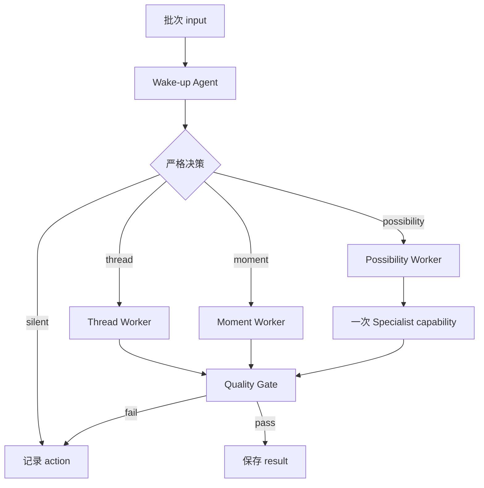

# 主动 Agent 第五阶段验证：设计方案

## 1. 结论与边界

本轮建设一个**隔离、可重复运行、可人工复盘的实验台**，而不是把 Moments、Threads、Possibilities 接入现有产品。

实验台接收固定的、带时间顺序的合成 Record fixture；按五个批次依次唤醒 Fanto；将每一次决策、工具使用、Thread 版本、候选产物和校验结论写入一个不可覆盖的 run 目录；最后由一个只读的本地 review 页面帮助人工逐项评分。

本轮的成功不是「三类结果都生成一次」，而是验证以下假设：

1. Thread 能跨批次更新，并保留证据、变化和不确定性，而不反复创建同义 Topic。
2. Moment 只在少量具体、忠实的记录上出现，且具有独立的情绪回报。
3. Possibility 在证据积累后才调用一次专业能力，并获得可查看的具体产物。
4. 至少一至两次 wake-up 选择 silent，且没有重复打扰。

不在本轮范围内：生产 HTTP API、真实用户数据、`topics`/`creations` 表、自动展示给用户、通知调度、正式鉴权、并行子 Agent 编排、联网检索，以及将结果写入主领域数据库。

## 2. 与当前仓库的衔接

当前服务已经有 Pi `AgentHarness`、持久 session、每个 session 独立 workspace，且已提供 `search_records` 和 `get_records`。Record Memory 以 `userId` 隔离。实验应复用这两个读取语义，但**不得**复用真实数据库、真实 session 或线上 Agent workspace。

因此新增 `apps/server/src/experiments/proactive-agent/`，由独立的 CLI 创建临时/隔离的实验 session 与输出目录。fixture 中的 memory adapter 用内存实现 `searchRecords` / `getRecords`，保证每次运行得到相同的检索候选；模型调用本身仍可存在随机性，但输入、Prompt、工具边界和评估数据固定。

不要修改 `contemplate/`、Record repository、routes 或 migrations。本实验是替代当前自动 Topic 验证的旁路，不是其重构。

## 3. 目录和命令

```text
experiments/proactive-agent/
├── fixtures/
│   ├── user-001.records.json
│   ├── user-001.batches.json
│   └── user-001.oracle.json             # 人工评估参考，运行时绝不读取
├── prompts/
│   ├── wake-up.md
│   ├── thread-worker.md
│   ├── moment-worker.md
│   ├── possibility-worker.md
│   └── quality-gate.md
├── runs/<run-id>/
│   ├── manifest.json
│   ├── batch-01/ … batch-05/
│   │   ├── input.json
│   │   ├── trace.json
│   │   ├── threads.before.json
│   │   ├── threads.after.json
│   │   ├── candidate.json
│   │   ├── quality-gate.json
│   │   └── result.json
│   ├── outputs/{html,image,research}/
│   └── review.json
└── review/                              # 静态只读 review 小页面
```

提供两个命令：

```text
pnpm --filter @fanto/server experiment:proactive -- --fixture user-001 --seed 42
pnpm --filter @fanto/server experiment:proactive:review -- --run <run-id>
```

第一个命令新建 run 目录；若目标 runId 已存在则失败，避免覆盖结果。第二个命令仅启动或生成本地只读 review 页面，不触发 Agent、不写 fixture 和 run trace；人工评分只写入同一 run 的 `review.json`，并要求填写评估者和时间。

## 4. 固定测试集与时间流

使用一名虚构用户的 20 条 Record，ID 固定为 `rec_001` 到 `rec_020`，按真实时间排序。每条包含 `id`、`createdAt`、`text`、可选 `imageDescription`、可选 `audioTranscript` 和 `batch`。fixture 应包含文本、图、音频及混合记录，但媒体都使用稳定的文字描述/转写，不依赖媒体服务。

批次固定为 `001–004`、`005–008`、`009–012`、`013–016`、`017–020`。每批写入后执行一次 wake-up。隐藏 oracle 只给评估页面的说明区使用，不能作为模型 input；其中标出：工作消耗与自主创作的长期线索、可能的反例、可保留的生活瞬间、无关记录，以及何时不应触发 Possibility。

每次 wake-up 的初始上下文严格为：

1. 本批新 Record；
2. 最近十条 Record；
3. 当前 active Thread 的摘要；
4. 最近十次 action 的摘要；
5. 受预算限制的 memory 工具；
6. 三个可用 capability 的名称和契约。

完整历史只可经 `search_records` 后再用 `get_records` 获取。这样既测试记忆使用，也避免模型把整套 fixture 当成一次性作文题。

## 5. 调度协议与预算

每批由 Wake-up Agent 返回严格 JSON 决策：`silent | thread | moment | possibility`，并给出 `reason`、`evidenceRecordIds`、`duplicateCheck` 与可选 `nextCapability`。解析或业务校验失败立刻将该批标记为 failed，保存原始输出；不自动重试、不自修复。



每次 wake-up 的硬上限为：8 个模型步骤、3 次 memory search、1 次 specialist delegation、1 个用户可见结果。超过上限即停止并写入 `budget_exhausted`，不能悄悄降级成产物。所有 action 都需对同一 `sourceRecordIds` 与近十次 action 进行去重检查；近似同一意图、相同证据而没有新增信息时，默认 silent。

## 6. 三种行为的输入输出契约

### Thread Worker

Thread 是可演化的结构，永远以已有 `threadId` 更新或以明确理由新建：

```json
{
  "threadId": "thread_creative-autonomy",
  "title": "从工作消耗到自主创作",
  "thesis": "…",
  "evidence": ["rec_002", "rec_004"],
  "changes": [{ "recordId": "rec_020", "change": "…" }],
  "openEdges": ["…"],
  "status": "candidate | active | dormant"
}
```

约束：只有至少两条跨时间证据才能创建 active Thread；新增 Thread 必须写出为何不能更新已有 Thread；每次更新必须有本批新增证据；必须保留一个不确定性或反例。Thread 不是面向用户的 AI 文章。

### Moment Worker

Moment 的候选必须只围绕一条具体 Record，输出一个短文本及可选的 `image` artifact request。不得把瞬间解释成成长、人格或人生启示。若调用 Image capability，生成的图片/提示词、源 Record 和文件路径必须写入 trace；若该 capability 不可用，Moment 可以只输出短文本，但 `artifactKind` 必须诚实标记为 `text`。

### Possibility Worker

Possibility 需要至少三条跨批次来源、一个尚未被用户明确要求但有依据的新方向，以及明确的 capability brief。它不能仅给建议：Quality Gate 只有在实际产物文件或研究报告存在时才允许 `present`。第一轮每次最多调用一个 Specialist；Research → Coding 的串联留到下一轮。

## 7. Specialist capability 的最小实现

用 adapter interface 隔离真实能力，避免主 Agent 直接拥有宽泛 bash 权限：

```ts
type Specialist = {
  kind: "research" | "code" | "image";
  run(brief: SpecialistBrief, outputDir: string): Promise<SpecialistResult>;
};
```

第一轮不接入外部联网 Research。`ResearchAgent` 只基于已获取的 Record 写 evidence report；`CodingAgent` 只允许在当前 run 的 `outputs/html/` 内产生一个静态 HTML/CSS/JS 成品；`ImageAgent` 只有在项目已配置合法的图像生成 provider 时启用，未配置时必须返回 `unavailable`，而不是伪造图片。对 `unavailable` 的动作，主 Agent 应当选择 text Moment 或 silent。

每个 adapter 返回：`status`、`summary`、`sourceRecordIds`、`artifacts[]`、`rawOutputPath`。artifact 路径必须在该 run 输出目录下，并经路径穿越校验。这样第一轮可以真正确认「是否做出了可检查的东西」，又不会把测试权限扩展到宿主机、网络或用户数据。

## 8. Trace、校验与失败分类

每批必须持久化一个可机器读取的 trace：

```json
{
  "schemaVersion": 1,
  "runId": "…",
  "batchId": "batch-05",
  "inputRecordIds": ["rec_017", "rec_018", "rec_019", "rec_020"],
  "initialDecision": {},
  "toolCalls": [],
  "delegations": [],
  "threadUpdates": [],
  "candidateResults": [],
  "finalDecision": "present | silent | failed",
  "diagnostics": [],
  "timingsMs": {}
}
```

程序化 Quality Gate 只做可判定检查：JSON schema、ID 存在和归属、无重复 source、行为预算、Thread 更新规则、Moment 单一来源规则、Possibility 最少三条跨批次来源、artifact 文件存在且位于 run 内、无敏感/高风险建议、以及 action 去重。它不评判“感人”或“有洞察”，这些留给人工。

失败分类至少包括：`model_output_invalid`、`invalid_record_reference`、`budget_exhausted`、`duplicate_action`、`insufficient_evidence`、`artifact_missing`、`capability_unavailable`、`quality_rejected`、`runtime_error`。保存原始输出、解析诊断及耗时，绝不把失败覆盖成 silent。

## 9. Review 小页面与人工标准

review 页面按时间线展示五个批次：当时新 Record、Agent 决策、调用过的记忆、Thread diff、产物预览、Quality Gate 与 trace。它提供单条打分和总览，不提供重跑按钮。

评分使用以下固定表单：

| 维度 | 评分 |
|---|---|
| Thread：连续性、准确性、演进性、非重复 | 1–5，各项必填 |
| Moment：具体、忠实、情绪价值、愿意保存 | 1–5，各项必填 |
| Possibility：新颖、来源依据、具体产物、值得继续 | 1–5，各项必填 |
| Worth interrupting | A 很想看到 / B 还不错 / C 没必要 / D 烦 |
| Silent 是否合理 | 是 / 否，并写原因 |

评估者先阅读结果，随后才能展开 oracle，以减少被预期答案锚定。成功门槛：五批后有一条持续演进的 Thread、至少一个 A/B 的 Moment、一个有可打开 artifact 的 Possibility、至少一到两次合理 silent；并且没有编造来源、重复推送或高风险建议。保留每次 prompt/adapter 版本，后续只改变一个变量再对同一 fixture 对比。

## 10. 验收与后续决策

第一轮完成的验收物是：fixture、可重复 CLI、五批完整 run、无覆盖 trace、至少一个 review JSON 与静态 review 页。它不是某次漂亮输出的截图。

若 Thread 独占优势，下一阶段验证记忆产品方向；若 Moment 的 A/B 占优，验证轻量个人创作伙伴；若 Possibility 在严格 evidence/产物门槛下仍有价值，再讨论真实 specialist、调度和数据模型。任何一种结果都不自动授权把实验对象引入主业务表或用户界面。
