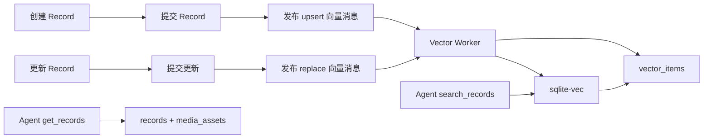

# Record 向量记忆与 Agent Memory 方案

## 目标与边界

Record 创建或更新完成后异步向量化。音频 ASR 文本在保存 Record 时已同步就绪，索引内容包括 Record 的用户输入文本和其关联音频的 ASR 文本；图片暂不参与向量化。

每条向量数据以 `type=record`、`outerId=recordId` 关联业务对象。原始 Record、图片和音频仍保存于现有 `records`、`media_assets` 与 OSS；向量库不保存媒体二进制，也不引入 chunk/source 类型。

`get_records(recordIds)` 只查询原始 Record，不读取或依赖向量数据。

## 现状

- `records.content` 保存用户 `text` 和有序媒体 block，更新拥有版本控制。
- 音频 ASR 保存于 `media_assets.ext_data.asr.transcript`；图片 description 已存在但本期不使用。
- SQLite 启动时已加载 `sqlite-vec`，且已有 embedding 的模型和维度配置；目前尚未建立向量表、嵌入客户端或异步消费链路。
- Agent 已使用 Tool Calling，可将 Memory 工具注入 Harness。

## 架构



## 数据模型

### `vector_items`

| 字段 | 用途 |
| --- | --- |
| `id` | 内部整数主键，同时关联 sqlite-vec rowid |
| `user_id` | 查询时的权限过滤 |
| `type` | 固定为 `record`，为未来对象类型过滤预留 |
| `outer_id` | 固定为 `recordId`，用于溯源、更新和删除 |
| `content` | 拼装后的向量化文本和检索摘要，不保存二进制 |
| `content_hash` | 幂等与避免无变化重嵌入 |
| `status`、`error_code`、`indexed_at` | 索引状态与故障可观测性 |

### `vector_embeddings`

sqlite-vec 虚拟表，仅保存 `vector_item_id` 的 embedding。维度启动时与 `EMBEDDING_DIMENSION` 校验。业务过滤统一在查询时按 `user_id`、`type`、`outer_id` 回表完成。

### 异步消息

Record 保存成功后直接发布进程内异步消息，至少包括 `userId`、`recordId` 与 `operation`（`upsert|replace`）。消费者读取当前原始 Record 并执行向量化。

不引入 `vector_outbox`、失败重试或补偿机制。embedding 失败时仅记录日志并忽略本次向量化，不影响 Record 保存。

## 向量化内容

消费者每次都读取当前原始 Record，并以固定顺序拼装一个向量化输入：

1. `records.content.text` 的用户输入文本；
2. 当前仍关联该 Record 的音频 `media_assets.ext_data.asr.transcript`。

两类文本允许同时存在，带清晰来源前缀，例如：

```text
用户记录：傍晚散步时想到周末徒步
音频转写：周六早上去西山，带水和雨衣
```

保存 Record 时音频 ASR 文本已经就绪，因此只读取当前关联音频的 ASR 文本。图片、图片 description 和原始媒体二进制均不进入本期索引。

## 消息与索引流程

### 创建

`POST /api/records` 完成 Record 与媒体关联的数据库事务后，发布 `upsert` 消息。消费者读取当前内容（含同步保存的音频 ASR 文本），生成 embedding，并写入 `type=record, outerId=recordId` 的向量数据。

重复消费必须幂等：若已有相同 `type + outerId + contentHash` 的 indexed 数据，不重复调用 embedding 或插入向量。embedding 失败仅记录日志并结束本次消费。

### 更新

`PATCH /api/records/:id` 先完成原始 Record 更新与媒体重关联并提交，再发布 `replace` 消息。消费者顺序为：

1. 删除 `type=record AND outerId=recordId` 对应的 sqlite-vec 行和 `vector_items`；
2. 重读更新后的原始 Record；
3. 拼装用户文本和当前音频 ASR 文本，调用 embedding；
4. 写入新的 `vector_items` 与 embedding。

重复 `replace` 的删除范围固定，因此可安全处理重复消息。若删除后 embedding 失败，仅记录日志并忽略；检索不会返回该 Record 的旧向量内容。

## Memory 工具

### `search_records`

输入：

```json
{"query":"周末徒步计划", "limit":8}
```

执行：验证参数 → 将 query 向量化 → sqlite-vec KNN 查询 → 回表并过滤 `user_id=当前 Agent 用户`、`type=record`、`status=indexed` → 返回结果。

输出：

```json
{
  "matches":[
    {"recordId":"...","snippet":"用户记录及音频转写的相关内容…","score":0.82}
  ]
}
```

`recordId` 直接来自 `outerId`。查询必须以 `type=record` 过滤；空 query、模型失败或无索引返回明确工具错误或空结果，不能跨用户全文扫描。

### `get_records`

输入：

```json
{"recordIds":["record-id-1","record-id-2"]}
```

最多 20 个 ID。该工具只按当前 Agent 的 `userId` 查询原始 Record：返回用户 `text`、有序媒体、图片 description、音频 ASR、createdAt/updatedAt。图片/音频通过 `mediaId` 和受鉴权的 `/api/media/:mediaId` 溯源；不读取向量表、不暴露 OSS object key 或其他用户内容。

Agent 系统提示要求先 `search_records`，再针对少量结果调用 `get_records`，防止整个历史记录反复注入上下文。

## Agent 集成

新增 `agent/tools/record-memory.ts`。Harness tool context 注入当前 `userId`、`RecordMemoryService` 与原始 Record 查询服务；模型输入不得指定 userId、type 或任意数据库字段。

工具名固定为 `search_records` 和 `get_records`，在 `activeToolNames` 显式启用。调用过程和返回值沿用现有 Agent SessionStorage 持久化，原始消息接口可回放其中的 recordId。

## 验收

1. 创建含用户文本、图片和音频的 Record：仅用户文本及已成功 ASR 文本进入 `type=record` 向量索引。
2. 更新 Record 后：消费者先删除其 `type + outerId` 的旧向量，再存储更新后内容；旧内容不可被召回。
3. 不存在 ASR 完成触发链路；图片理解完成也不触发向量化。
4. `search_records` 的全部结果属于当前用户且均携带 recordId。
5. `get_records` 不访问向量数据，能返回原始 Record 和媒体溯源信息；跨用户 ID 不泄露内容。
6. embedding 失败不影响 Record 保存；失败仅记录日志并忽略本次向量化。

## 风险与决策

- `replace` 存在删除与新写入之间的短暂不可检索窗口；若新 embedding 失败，按当前范围直接忽略，不保留旧向量也不补偿。
- sqlite-vec 不可用时应明确标记 Memory 不可用，不可静默将语义检索伪装为成功。
- embedding 模型或维度变化时需整体重建 `type=record` 向量，不能混用不同模型生成的向量。
