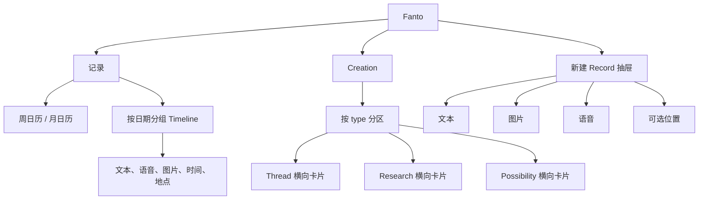
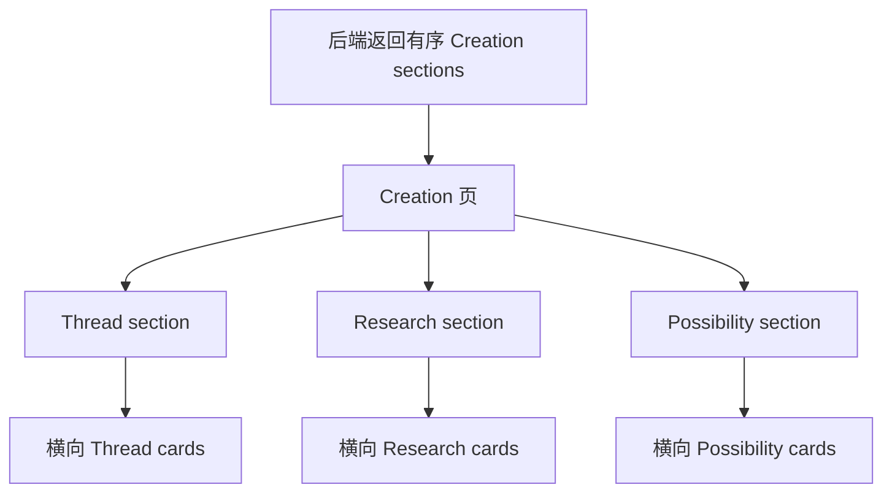

# Fanto iOS：Records 与 Creations 体验设计

> 状态：产品与交互方案。范围为下一阶段 iOS 目标体验；本方案不修改现有代码、服务端或数据模型。

## 1. 产品形态

Fanto 的主线是：用户自然留下 Record，按时间回看生活；Fanto 仅在真正有价值时形成可继续生长的 Creation。

```text
随手留下 Record → 按时间回看生活 → Fanto 形成 Creation → 继续探索
```

主导航只有两个目的地：**记录**（用户原始事实、媒体和时间）与 **Creation**（Fanto 的长期产出）。`+` 是全局“新建 Record”动作，不是第三个目的地。Creation 详情、Session 对话、来源浏览不在本阶段实现，卡片仅保留稳定 ID 和未来导航入口。

当前 iOS 是 iOS 17 的只读“记录 / 回声”原生 `TabView`，仓库约定尚未允许创建入口、定制底栏或抽屉。本方案描述目标能力；实施前需同步确认现有约定与后端 Creation API。

## 2. 信息架构



## 3. 底部导航与创建入口

目标是“浮动双目的地胶囊 + 中央独立加号”：

```text
                ┌───────────────────────────┐
                │    记录        Creation    │
                └────────────┬──────────────┘
                             ＋
                          新建记录
```

- 胶囊只包含“记录”和“Creation”；选中态通过填充图标、字重、背景共同表达。
- `+` 居中并略高于胶囊，语义为独立按钮，材质与导航连续；不放在记录页右上角或导航最右侧。
- iOS 26+ 优先系统 Liquid Glass；iOS 17–25 退化为系统 Material、清晰描边和阴影。
- 详情、键盘、全屏媒体预览时隐藏全局控件；两个目的地独立保留滚动位置。
- 不使用透明全屏点击层，不抢占 Timeline 滚动与系统返回手势。

## 4. 记录页

### 4.1 结构

```text
记录                                      今天

九月 2026                           [展开/关闭]
‹  9/8   9/9  [9/10]  9/11  9/12  ›       ← 默认周视图

今天 · 9 月 10 日
│
├─ 今天在写这个产品方案时，突然觉得……
│  [图片预览]
│  2026-09-10 21:42:16 · 中国-杭州-西湖区
│
├─ 🎙 00:42  下午散步时想到……
│  2026-09-10 17:08:02 · 中国-杭州-拱墅区
└─ …
```

`selectedDate` 是唯一日期状态。周日历、月日历、标题、Timeline 查询/定位、“今天”均从它派生，禁止日期选中态与内容列表分裂。

### 4.2 默认周日历

默认只显示一行完整的一周；每个日期格有星期、日期和可选的 Record 圆点。

- 左右滑动切换相邻周，只更新 week anchor，不隐式修改 `selectedDate`。
- 点选日期更新 `selectedDate` 并更新 Timeline。
- “今天”同时重置 week anchor 与 `selectedDate`。
- 选中日期使用柔和深绿圆形、字重和辅助状态；记录点不只依赖颜色。
- 日期需有完整辅助功能标签，例如“9 月 10 日，周三，已选中，2 条记录”。

### 4.3 展开月日历

点击“展开月历”后，在原位置展开当前锚点月份；不是跳转页面。

```text
九月 2026                           [关闭]
                    [上一月] [下一月]
一   二   三   四   五   六   日
1   2   3   4   5   6   7
8   9  [10] 11  12  13  14
15 16  17  18  19  20  21
22 23  24  25  26  27  28
29 30
```

- 上月/下月只改变 month anchor，不改变 `selectedDate`。
- 点选日期后更新 Timeline，并收起到包含该日期的一周。
- 关闭仅收起，保留选中日期与 week anchor。
- 月标题与日期网格由同一状态派生；布局随动态字体自然长高。

### 4.4 Timeline Record 行

按日期分组。每条 Record 为轻量内容行：文本优先；语音显示播放动作、时长和转写预览；图片位于正文下一行且左对齐，多图显示叠层和数量；底部显示完整 `yyyy-MM-dd HH:mm:ss` 与可选“国家-城市-区”。点击预留 Record 详情，长按预留编辑、删除、查看关联 Creation。时间轴线只协助阅读，不表达 AI 状态。

## 5. 新建 Record 抽屉

点击 `+` 后从底部呈现约屏幕高度 3/4 的 Composer：

```text
新记录                                      关闭

想到什么，就记下来。
┌─────────────────────────────────────┐
│                                     │
└─────────────────────────────────────┘

[图片] [图片]                         添加附件
[照片]       [按住说话]       [位置]          保存
```

- 默认焦点在文本区；文本、图片、语音可同属一条 Record。
- 录音结束作为附件，显示转写；原始音频不可被转写替代。
- 位置由用户主动添加，定位失败不阻断保存。
- 明确维护 `draft / recording / saving / failed` 状态；录音中关闭可保留草稿或放弃。
- 保存成功后 Sheet 原路径收回并在 Timeline 插入新行；失败保留输入、附件与重试入口。

## 6. Creation 总览

Creation 不采用跨 type 的统一时间线，也不由客户端自行排序。后端返回的 section 顺序、展示 type 和每个 section 内卡片顺序均为权威。



建议接口：

```ts
type CreationSection = {
  type: "thread" | "research" | "possibility";
  title: string;
  creations: CreationSummary[]; // 顺序即后端权威顺序
};
```

未知 type 应作为后端提供标题的通用 section 渲染，不能在客户端丢弃。

```text
Creation
Fanto 从记录中留下值得继续看的内容

Thread                                      查看全部
┌──────────────────────────┐  ┌───────────
│ 从工作消耗到自主创作       │  │ …
│ Thread · 今天更新          │  │
│ 最近的三条记录让这个线索    │  │
│ 更具体：……                 │  │
│ 继续聊 →                   │  │
└──────────────────────────┘  └───────────

Research                                    查看全部
┌──────────────────────────┐  ┌───────────
│ 关于独立创作节奏的研究     │  │ …
│ Research · 9 月 4 日       │  │
│ 3 个发现 · 2 个仍未确定的  │  │
│ 问题                       │  │
└──────────────────────────┘  └───────────

Possibility                                 查看全部
┌──────────────────────────┐  ┌───────────
│ 一周小项目试验             │  │ …
│ Possibility · 9 月 8 日    │  │
│ 一个可立即尝试的 7 天计划  │  │
└──────────────────────────┘  └───────────
```

- 每个 type 是纵向 section，内部横向浏览多个卡片。
- 卡片宽度为可视区域约 78–86%，露出下一张的一部分；横向滚动有分页感但不强制整页吸附。
- 仅后端明确还有数据时才显示“查看全部”；空 section 不显示，整体为空时才显示空态。
- 本阶段不实现 Creation 详情。

共同卡片结构为：type 标签和更新时间、标题、2–3 行摘要、可选动作。类型以文字、图标、布局共同表达：

| type | 主表达 | 底部动作 |
|---|---|---|
| `thread` | 新线索、未确认之处、持续变化 | 继续聊 / 查看变化 |
| `research` | 结论、发现数量、限制或待验证项 | 查看研究 |
| `possibility` | 真实产物或低风险尝试 | 打开成果 / 继续探索 |

## 7. 视觉、动效与可访问性

设计气质是安静、私密、可信、有生长感。背景使用系统 grouped background / 纸白，文本使用语义动态色，主强调采用柔和深绿（约 `#2E7D5A`）；状态使用系统语义色并始终搭配文字或图标。使用 SF Symbols 与 Dynamic Type；正文为 Body，元信息为 Caption。玻璃只用于浮动导航与短时创建层，不叠加在内容卡片上。

| 触发 | 常规动效 | Reduce Motion |
|---|---|---|
| 周切换 | 水平连续分页 | 短淡入或即时更新 |
| 展开/收起月历 | 原位伸展/收回，保留日期锚点 | 短淡入淡出 |
| 打开 Composer | `+` 与 Sheet 连续展开 | 系统 Sheet 淡入 |
| 保存 Record | Sheet 收回、Timeline 插入新行 | 收回后直接刷新 |
| 横向 Creation 浏览 | 手势跟手、自然减速 | 保留直接手势 |

月历只可处于 `collapsed / expanded`；Composer 只可处于 `idle / editing / recording / saving / failed`。每个状态有单一所有者，不依赖任意延时或多个无关布尔值。

无障碍要求：图标有本地化标签，点击目标至少 44pt；最大 Dynamic Type 下不得裁剪日期或关键信息；Reduce Transparency 改用不透明系统表面；VoiceOver 在月历展开后聚焦月份标题，收起后回到展开按钮；选中、录音、保存、错误不只依赖颜色。

## 8. 验收与未决项

### 验收

1. 周日历、月日历、Timeline 对应同一个 `selectedDate`。
2. 展开、关闭、切换月份不丢失当前选择；月历选日后回到相应周。
3. 单条 Record 可同时保存文字、图片、语音；保存失败不丢草稿。
4. Creation section 和卡片严格遵守后端返回顺序，客户端不重排。
5. 每类 Creation 可横向浏览，整体页面可稳定纵向滚动。
6. Dynamic Type、VoiceOver、Reduce Motion、Reduce Transparency、深色模式下均可完成主流程。

### 未决项

- 后端 `CreationSection[]` 的排序、分页、空 section、未知 type 契约。
- 图片、语音、位置权限、上传队列与本地草稿持久化。
- Creation 详情、`sessionId` 对话、source 浏览和“查看全部”页面。
- iOS 26 Liquid Glass 的实际 API、最低版本与 iOS 17 回退策略。
