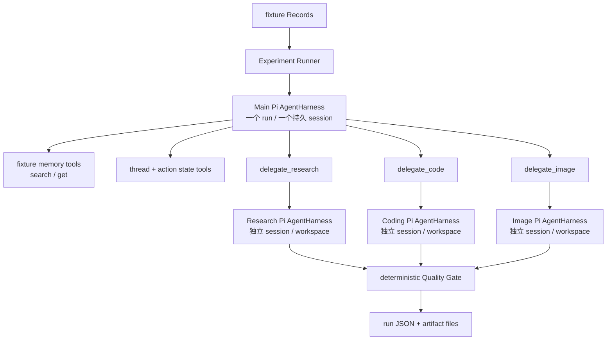

# Pi 主子 Agent 架构验证：最小实现方案

## 1. 本轮要验证什么

实现一个**可手动运行的独立实验工程**，用固定 JSON Record 测试集驱动一个 Pi 主 Agent；主 Agent 在需要时通过 tool 委派给独立的 Pi 子 Agent；全部结果保存在实验目录，供人工阅读。

这轮同时验证两件事，缺一不可：

1. 行为：Thread、Moment、Possibility 与 Silent 是否有价值。
2. 架构：主 Agent 是否只做判断与编排，专业执行是否真正发生在独立、最小权限的 Pi 子 Agent 中。

当前仓库的 `AgentHarnessManager` 已采用 Pi `AgentHarness + SqliteSessionRepository`，并有按 session 隔离的 workspace 与 `search_records` / `get_records`。这可以复用为实现模式，但本实验必须有自己的 session 数据库与工作目录，不能读取真实用户数据库、真实 session 或 `contemplate`。

此前新增的 `apps/server/src/experiments/proactive/run.ts` 是直接调用模型的单 Agent 脚本；它不满足本方案，实施时应删除并由本工程替换。

## 2. 为什么是「一个主 Harness + 按委派创建的子 Harness」

Pi 当前版本没有内建的 `spawn_subagent` API。它提供 `AgentHarness.create()`、独立 `Session`、工具执行和事件流。因此最小而真实的主子架构是：

- 每个实验 run 创建一个持久的主 `AgentHarness`；它横跨五个 batch。
- 主 Harness 唯一可见的专业能力是三个 delegation tool：`delegate_research`、`delegate_code`、`delegate_image`。
- 每次 tool 调用由 `SpecialistRunner` 创建一个新的子 session、子 Harness 和子 workspace；子 Agent 完成后关闭。
- 子 Agent 的最终文本、其 Pi session entry、工具调用、耗时和产物路径作为 tool result 返回主 Agent。

这使主 Agent 无法绕过委派直接写文件、执行 shell 或生成图片，也使每个 specialist 的身份、权限、花费和产物可审计。



主与子均使用同一个受配置的 Pi model catalogue；是否用不同模型只作为实验参数，第一轮默认相同模型，避免把模型差异误判为架构收益。

## 3. 目录、输入和执行命令

```text
apps/server/
├── src/experiments/pi-proactive/
│   ├── run.ts                    # 唯一 CLI 入口与批次循环
│   ├── main-agent.ts             # 创建主 Harness 与其工具
│   ├── specialist-runner.ts      # 创建、运行、关闭子 Harness
│   ├── tools.ts                  # fixture memory / state / delegation tools
│   ├── schemas.ts                # 输入、决策、trace、结果校验
│   ├── quality-gate.ts           # 不调用模型的确定性校验
│   └── prompts.ts                # 主 Agent 与三个子 Agent prompt
└── experiments/pi-proactive/
    ├── fixtures/user-001.json
    └── runs/<run-id>/
        ├── manifest.json
        ├── sessions.sqlite
        ├── batch-01/ … batch-05/
        │   ├── input.json
        │   ├── main-entries.json
        │   ├── trace.json
        │   ├── threads.json
        │   └── result.json
        ├── delegations/<delegation-id>/
        │   ├── request.json
        │   ├── child-entries.json
        │   ├── result.json
        │   └── workspace/
        └── artifacts/{html,image,research}/
```

唯一的手动命令：

```bash
pnpm --filter @fanto/server experiment:pi-proactive
```

可选参数只保留 `--fixture <path>` 和 `--run-id <id>`。runId 已存在立即失败，禁止覆盖。运行者直接打开 `runs/<run-id>/result.json`、各 batch 的 `trace.json`、HTML 或图片 artifact 做人工评估；本轮不做 review UI。

## 4. 运行时状态与五次 Wake-up

fixture 固定包含 20 条合成 Record，按 4 条一批、五批时间流运行。每一批向同一个主 Harness prompt 一次；主 session 因而保留前一次对话，而 runner 还通过 tool context 提供真实状态。

主 Agent 每轮只能直接获得：本批新 Record、最近十条 Record 摘要、active Threads、最近十次 action，以及以下工具：

| 工具 | 作用 | 不做什么 |
|---|---|---|
| `search_records` / `get_records` | 读取 fixture 中的历史记录 | 不访问真实向量库或用户数据 |
| `get_threads` / `save_thread` | 读取、保存实验 Thread | 不写 Topic 表 |
| `get_recent_actions` | 去重和避免打扰 | 不读产品行为日志 |
| `delegate_research` | 启动 Research 子 Agent | 主 Agent 不获得搜索/写文件能力 |
| `delegate_code` | 启动 Coding 子 Agent | 主 Agent 不获得 bash/write 能力 |
| `delegate_image` | 启动 Image 子 Agent | 主 Agent 不直接调用图像 provider |
| `save_result` / `dismiss` | 提交候选或明确 silent | 不调用产品 API |

主 Agent 的系统目标是：观察变化、决定是否值得行动、选择行为模式与 specialist、读回 specialist 结果、再调用 `save_result` 或 `dismiss`。它不得自己产出代码、研究报告或图片提示词来规避 delegation。

每个 batch 硬限制：最多 8 个主 Agent turn、3 次 memory search、1 次 delegation、1 个面向用户的结果。Runner 监听 Pi `turn_start` 与 tool 事件；到达上限时停止该 batch 并记为 `budget_exhausted`。子 Agent最多 6 个 turn；子 Harness 不可再获得 delegation tool，因此没有递归派生。

## 5. 三个子 Agent 的最小权限和协议

### Research Agent

输入为主 Agent 提供的 brief、明确的 source Record ID 与原文。它只允许 `get_records`，输出一份 `research.md`：证据、反例、未知项和不超过三个下一步可能性。第一轮不联网；这样验证的是「子 Agent 能把探索做深」，而不是搜索引擎质量。

### Coding Agent

输入为 artifact brief、source Record 和绝对输出目录。它只允许 Pi 的受根目录限制的 read/write/edit 工具，另可使用受限 bash 做静态文件检查；所有写入必须位于 `artifacts/html/<delegation-id>/`。它交付可打开的 `index.html`，并在最终 JSON 中声明该路径。不得访问仓库源码、用户数据、网络或父 workspace。

### Image Agent

输入为 Moment brief 与单一 source Record。它只允许 `generate_image` tool；该 tool 是对已配置图像 provider 的窄适配，输出必须保存到 `artifacts/image/<delegation-id>/`。若项目未配置图像 provider，工具必须返回 `capability_unavailable`；子 Agent 与主 Agent 均不得伪造图像文件。主 Agent 可以改为文本 Moment 或 `dismiss`。

三个 specialist 都必须最终返回严格 JSON：`status`、`summary`、`sourceRecordIds`、`artifactPaths`、`limitations`。`SpecialistRunner` 将 Pi child entries、最终消息、工具事件及该 JSON 一起落盘，再将结构化结果作为 delegation tool result 回给主 Agent。

## 6. Thread、结果和 Quality Gate

Thread 仍是实验 JSON，而不是 Topic：

```json
{
  "id": "creative-autonomy",
  "title": "从工作消耗到自主创作",
  "thesis": "…",
  "evidence": ["rec_002", "rec_004"],
  "changes": [{ "recordId": "rec_020", "change": "朋友开始使用" }],
  "openEdges": ["自主性还是任务类型尚不确定"],
  "status": "candidate | active | dormant"
}
```

`quality-gate.ts` 不再调用模型，只验证：所有 Record ID 属于 fixture、无重复来源、Thread 新建至少有两条跨时间证据、更新引用了当批新 Record、Moment 只引用一条记录、Possibility 至少三条跨批次来源且有真实 artifact、artifact 在当前 run 根目录内、以及 action 没有与最近十次重复。失败时保留 candidate 和原因，最终状态为 `silent`，而不是伪装成成功。

## 7. 可审计 trace 与人工判断

每个 batch 的 `trace.json` 至少包含：主 Agent prompt/entry IDs、所有 main tool call、memory 查询与返回 ID、delegation request/child session/child result、Thread 前后 diff、Quality Gate、最终 `present | silent | failed` 和耗时。这样能区分以下失败：主 Agent 根本没委派、委派对象错误、子 Agent 没完成、主 Agent 无视子结果、或质量门拒绝。

人工阅读时按顺序检查：

1. Batch 1–2 是否能合理 silent，而不是过早总结；
2. 同一 Thread 是否在后续批次更新而不是重建；
3. Moment 是否具体、忠实，且未被强行升华；
4. Possibility 是否在 Batch 5 前保持克制，之后是否真实委派且产生可打开的产物；
5. `delegations/` 中是否确有独立 Pi child session 和受限 workspace，而非主 Agent 直接完成工作。

成功标准：至少一条演进 Thread、一个值得保留的 Moment、一个有 specialist child trace 且有真实 artifact 的 Possibility、至少一至两次合理 silent；同时没有越权 workspace 写入、伪造 artifact、错误 source 引用或重复行动。

## 8. 实施后的边界

这是实验工程，不接入 records API、HTTP routes、真实记忆、现有 `AgentHarnessManager` session 或领域表。只有经过人工 review，才讨论将主/子 Agent 生命周期、持久化模型与产品触发器迁入正式链路。
