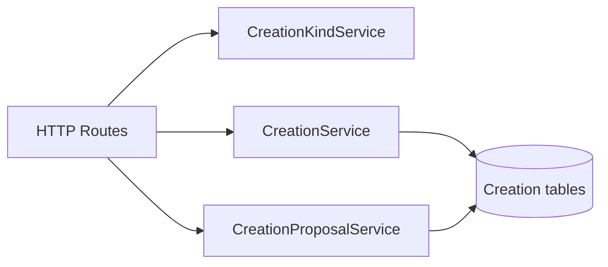

# Creation 业务模块与 HTTP 接口方案

## 1. 目标与范围

本方案建立 Creation、Creation Proposal 和 Record 关联的服务端业务基础设施，使 iOS、H5 或未来客户端可通过 HTTP 查询并渲染：

- 动态的 Creation 类型；
- 首页的“继续跟踪”和类型统计；
- Proposal 卡片、详情和来源 Record；
- 按类型浏览的正式 Creation 列表、详情和来源 Record；
- 关联实体的双向查询。

本次不实现任何业务写入：不实现确认、拒绝、创建、更新、归档或恢复；也不实现 Agent、Planner、Task、Heartbeat 或任何异步生成链路。

## 2. 核心原则

1. Record 是原始事实，Creation / Proposal 只保存摘要与 Markdown 内容。
2. 本轮 API 全部为读取接口，不暴露任何用户侧写入端点。
3. 类型由服务端目录管理，客户端根据接口返回的类型数量、名称和标题动态渲染，不依赖固定 UI 枚举。
4. 关联关系使用全局唯一业务 ID，而非表内自增主键；一行关系同时支持正向与反向读取。
5. 列表和关联查询全部使用稳定的复合键集游标；为这些查询建立必要索引。
6. 当前服务不承载旧 Agent、Task 或主动创作工作流；开发数据库允许删除并重建，不迁移旧 Creation 数据。

## 3. 数据库设计

### 3.1 `creation_kinds`

```text
creation_kinds
- kind_id          TEXT PRIMARY KEY          -- UUID，全局唯一
- owner_user_id    TEXT NULL                 -- NULL 为系统类型，预留用户自定义类型
- name             TEXT NOT NULL
- title            TEXT NOT NULL
- created_at       TEXT NOT NULL
- updated_at       TEXT NOT NULL
```

`kind_id` 是关联使用的稳定标识，`name` 是稳定机器标识，`title` 是面向用户的显示名称。本轮只读取系统类型；`owner_user_id` 仅为未来用户自定义类型预留，不实现对应写入能力。初始类别：

| name | title |
| --- | --- |
| `thread` | 持续线索 |
| `project` | 正在推进 |
| `collection` | 收藏与素材 |

`creations.kind_id` 和 `creation_proposals.kind_id` 存储 `creation_kinds.kind_id`。每条脉络本轮只有一个主类型；类型目录动态返回，客户端不得依赖固定枚举。

### 3.2 `creations`

复用现有表名、主键、`session_id`、`summary` 与 `version`，删除 `source`：

```text
creations
- id               INTEGER PRIMARY KEY AUTOINCREMENT
- creation_id      TEXT NOT NULL UNIQUE
- user_id          TEXT NOT NULL
- title            TEXT NOT NULL
- kind_id          TEXT NOT NULL
- session_id       TEXT NOT NULL
- summary          TEXT NOT NULL
- content          TEXT NOT NULL
- status           TEXT NOT NULL            -- active | resting | archived
- version          INTEGER NOT NULL
- created_at       TEXT NOT NULL
- updated_at       TEXT NOT NULL
```

`summary` 保留既有 JSON 结构：

```json
{ "schemaVersion": 1, "overview": "一到三句面向用户的概览", "summaryVersion": 1 }
```

业务对象以 `summary` 为公共字段，不引入顶层 `overview` 字段。来源 Record 仅通过 `entity_relations` 表达。

### 3.3 `creation_proposals`

复用现有表名、确认状态机与 `session_id`。保留 `summary`，移除 `source`；将 `failure_code`、`failure_message` 合并为 JSON `error`：

```text
creation_proposals
- id                       INTEGER PRIMARY KEY AUTOINCREMENT
- proposal_id              TEXT NOT NULL UNIQUE
- user_id                  TEXT NOT NULL
- creation_id              TEXT NULL
- base_creation_version    INTEGER NULL
- operation                TEXT NOT NULL     -- create | update
- session_id               TEXT NOT NULL
- title                    TEXT NULL
- kind_id                  TEXT NULL
- summary                  TEXT NULL
- content                  TEXT NULL
- ext_data                 TEXT NULL         -- JSON，展示扩展字段待后续定义
- status                   TEXT NOT NULL
- error                    TEXT NULL
- created_at               TEXT NOT NULL
- updated_at               TEXT NOT NULL
```

状态沿用：`generating`、`pending_confirmation`、`confirmed`、`rejected`、`superseded`、`failed`。

`error` 示例：

```json
{ "code": "INVALID_AGENT_OUTPUT", "message": "Proposal content is invalid" }
```

`operation=create` 时，`creation_id` 与 `base_creation_version` 为空；`operation=update` 时两者必填。待确认更新 Proposal 同一目标 Creation 最多一条。

### 3.4 `entity_relations`

使用通用、有方向的双端点关系表。一行表示一个来源实体与一个目标实体的关系；两端均使用全局唯一业务 ID。方向只定义存储和排序方式，不限制双向查询。

```sql
CREATE TABLE entity_relations (
  relation_id TEXT PRIMARY KEY,
  user_id TEXT NOT NULL,
  source_entity_id TEXT NOT NULL,
  source_entity_type TEXT NOT NULL,
  target_entity_id TEXT NOT NULL,
  target_entity_type TEXT NOT NULL,
  relation_type TEXT NOT NULL,
  source_created_at TEXT NOT NULL,
  created_at TEXT NOT NULL,
  UNIQUE (user_id, source_entity_id, target_entity_id, relation_type)
);
```

当前关系约定：

| relation_type | source | target |
| --- | --- | --- |
| `record_creation` | `records.record_id` | `creations.creation_id` |
| `record_creation_proposal` | `records.record_id` | `creation_proposals.proposal_id` |

同一行同时支持两个方向的读取：

```text
Creation 的来源 Record：`relation_type=record_creation` 且 `target_entity_id=creation_id`
Record 关联的 Creation：`relation_type=record_creation` 且 `source_entity_id=record_id`
```

`relation_type` 与两端 `entity_type` 都是受服务端控制的枚举；未来写服务必须验证两端实体存在且归属同一 `user_id`。`source_created_at` 是来源 Record 不可变 `created_at` 的查询投影，仅用于稳定分页，不复制或修改 Record 内容。

### 3.5 索引与关联 Record 游标

```sql
CREATE INDEX idx_entity_relations_target_records
ON entity_relations (
  user_id,
  target_entity_type,
  target_entity_id,
  relation_type,
  source_created_at DESC,
  source_entity_id DESC
);

CREATE INDEX idx_entity_relations_source
ON entity_relations (
  user_id,
  source_entity_type,
  source_entity_id,
  relation_type,
  target_entity_type,
  target_entity_id
);

CREATE INDEX idx_creations_user_status_updated
ON creations (user_id, status, updated_at DESC, creation_id DESC);

CREATE INDEX idx_creations_user_kind_status_updated
ON creations (user_id, kind_id, status, updated_at DESC, creation_id DESC);

CREATE INDEX idx_creation_proposals_user_status_updated
ON creation_proposals (user_id, status, updated_at DESC, proposal_id DESC);

CREATE UNIQUE INDEX idx_creation_kinds_system_name
ON creation_kinds (name)
WHERE owner_user_id IS NULL;

CREATE UNIQUE INDEX idx_creation_kinds_user_name
ON creation_kinds (owner_user_id, name)
WHERE owner_user_id IS NOT NULL;
```

`GET /api/creations/:creationId/records` 与 Proposal 对应接口不使用 JOIN，固定采用两段查询：

1. 只查询 `entity_relations`，按 `source_created_at DESC, source_entity_id DESC` 以键集游标读取 `limit + 1` 条关系；
2. 将当页 `source_entity_id` 批量传给 Record Repository，以 `user_id + record_id IN (...)` 读取 Record；服务层按第一步的关系顺序重组响应。单页 `limit` 上限为 100，避免无界 `IN` 查询。

游标编码 `{ sourceCreatedAt, sourceEntityId }`。下一页条件为：

```sql
source_created_at < :sourceCreatedAt
OR (
  source_created_at = :sourceCreatedAt
  AND source_entity_id < :sourceEntityId
)
```

关联写入必须保证来源 Record 存在，因此第二步预期能找回每一个 ID；若违反这一不变量，服务记录数据完整性错误，不能静默改变排序或跳过关联。

## 4. 服务模块



### 4.1 `CreationKindService`

- 查询全部类型与单个类型；
- 校验 `kindId` 合法性；
- 为 Creation / Proposal 查询补齐类型元数据；
- 本次仅提供类型目录查询。

### 4.2 `CreationService`

- 首页概览：活跃 Creation 中最近更新的前三条“继续跟踪”；
- 类型统计：按 `kindId` 聚合数量与最近更新预览，仅返回当前用户非空类别；
- 按 `kindId`、`status`、关键词、游标查询 Creation；
- 查询 Creation 详情与关联 Record 数量；
- 基于 `entity_relations` 分页查询 Creation 的 Record；
- 基于 `entity_relations` 反向查询 Record 的 Creation；
- 本次不提供 Creation 创建、更新、归档、恢复或乐观锁写入能力。

### 4.3 `CreationProposalService`

- 按状态、操作类型、游标查询 Proposal；
- 查询 Proposal 详情、`extData`、关联 Record 数量与更新目标 Creation 摘要；
- 基于 `entity_relations` 分页查询 Proposal 的 Record；
- 基于 `entity_relations` 反向查询 Record 的 Proposal；
- 本次不提供 Proposal 创建、确认、拒绝、失效或任何状态写入能力。

本次只实现查询 HTTP 接口。

## 5. HTTP 接口与作用

### 5.1 类型接口

| 接口 | 作用 |
| --- | --- |
| `GET /api/creation-kinds` | 查询服务端定义的全部 Creation 类型。 |
| `GET /api/creation-kinds/:kindId` | 查询单个类型及其有效性。 |

### 5.2 Creation 接口

| 接口 | 作用 |
| --- | --- |
| `GET /api/creations/overview` | 返回继续跟踪前三条、类型统计和各类型最近更新预览。 |
| `GET /api/creations` | 按 `kindId`、状态、关键词及游标查询 Creation 列表。 |
| `GET /api/creations/:creationId` | 返回 Creation 的完整 Markdown 内容、summary、类型和关联 Record 数量。 |
| `GET /api/creations/:creationId/records` | 游标查询该 Creation 关联的 Record。 |
本次不提供任何 Creation 写入接口，包括创建、更新、归档或恢复。

### 5.3 Proposal 接口

| 接口 | 作用 |
| --- | --- |
| `GET /api/creation-proposals` | 按状态、操作类型和游标查询 Proposal 列表；待确认列表用于卡片展示。 |
| `GET /api/creation-proposals/:proposalId` | 返回 Proposal 内容、summary、extData、类型、目标 Creation 摘要和关联 Record 数量。 |
| `GET /api/creation-proposals/:proposalId/records` | 游标查询 Proposal 关联的来源 Record。 |
本次不提供任何 Proposal 写入接口，包括创建、确认、拒绝或状态变更。

### 5.4 通用关联接口

| 接口 | 作用 |
| --- | --- |
| `GET /api/entity-relations` | 按实体 ID 和关系类型查询关联对象；支持 Record 反向查询 Creation 或 Proposal。 |

Creation / Proposal 下的 Record 接口是客户端便利接口；底层统一使用实体关联查询能力。

## 6. 写入边界（延期）

数据库保留 `operation`、`version` 和 Proposal 状态字段，为未来工作流接入预留；本轮不会调用任何写服务，也不会实现确认事务。

未来若开放写入能力，必须另行定义 Proposal 的创建、确认、拒绝、版本冲突和实体关系复制规则。

## 7. 迁移策略

1. 删除开发数据库及其旧业务数据，按最终 schema 重建；不迁移 `source`、失败字段或旧状态。
2. 新建 `creation_kinds` 并写入初始系统类型。
3. 创建最终结构的 `creations`、`creation_proposals` 与 `entity_relations`，并创建本方案的查询索引。
4. 将现有主动创作、Agent、Task 和对应写入路由从当前服务装配中移除；后续另行以新业务模型设计生成与确认链路。

## 8. 验收标准

- 服务端类型目录可被客户端动态读取；空类型不出现在用户首页概览中。
- 首页概览的继续跟踪固定为 active Creation 最近更新的前三条。
- 分类统计与列表均以服务端 `kindId` 为准，列表排序稳定且可游标分页。
- Creation 与 Proposal 详情只返回关联 Record 数量；Record 内容由独立关联查询接口分页读取。
- 任一 Record 可反向查到关联的 Creation 与 Proposal，且不需要写入重复关系行。
- Creation / Proposal 来源 Record 查询先分页关系表、再批量读取 Record，不使用 JOIN；相同时间戳下不漏项、不重复。
- 用户不能查询其他用户的 Creation、Proposal 或关联 Record。
- 本次 HTTP 路由全部为 `GET`，不出现任何 Creation、Proposal 或实体关联的业务写入接口。
- 本次不出现 Agent、Task、Heartbeat 或异步生成 HTTP 接口。
