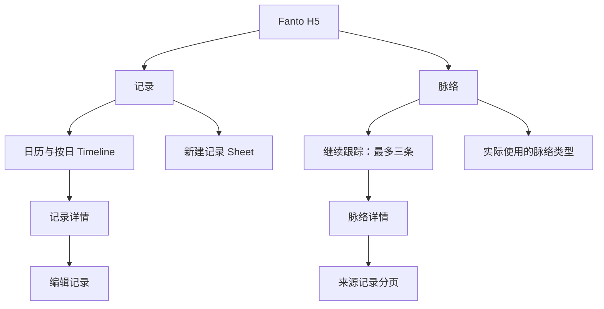
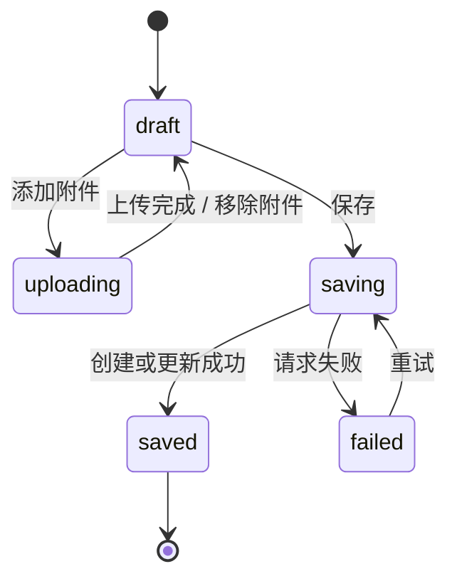

# H5「记录 / 脉络」体验实施方案

> 状态：方案讨论，未实施。目标是在 `apps/h5` 实现与当前 iOS 信息架构一致的 H5，并同时适配移动端与桌面端。

## 1. 目标与边界

H5 的主体验与 iOS 对齐：用户在「记录」按日期回顾、创建原始记录；在「脉络」查看服务器已经确认的长期线索及其来源。桌面端不是将移动界面简单放大，而是用更稳定的导航和双栏空间提高浏览效率。

本期使用当前服务的 Record、Upload、Media、Creation Read API。以下能力不进入本期：

- Proposal 抽卡、长期跟踪 / 暂不保留写入；服务未挂载 Proposal API。
- 脉络按类型完整列表、搜索和筛选；服务只提供 3 条 active 概览和类型目录。
- Creation 自动生成或更新；服务未提供运行入口。
- 正式登录、用户切换与权限系统。

## 2. 必要的最小服务端补充

记录页允许用户从日历任意选择某天。现有 `GET /api/records` 只有全局倒序游标，前端无法正确且高效地判断很久以前某天是否无记录；全量拉取历史也不可接受。

推荐只扩展原有端点，不引入新资源：

```text
GET /api/records?date=2026-09-13&timezone=Asia/Shanghai&limit=20&cursor=
```

- `date` 是可选的本地自然日；缺省时保持当前全量列表语义和兼容性。
- 服务端把该日的开始、结束转换为 UTC / 存储时区范围，再沿用 `(createdAt, recordId)` 复合游标。
- `timezone` 缺省为服务器约定的 `Asia/Shanghai`；后续正式用户设置接入后可由服务端决定，客户端不再传入。
- 同时提供该日的 `total` 或 `hasRecords`，让日历标记可避免逐日请求。若本期不扩展聚合能力，月视图的记录点仅对已加载日期显示，不能暗示完整覆盖。

除这一个查询能力外，附件链路可直接使用现有：创建上传凭据 → 客户端直传 OSS → complete → 将 mediaId 写入 Record。

## 3. 信息架构与路由



建议 Hash 路由：

| 路由 | 页面 |
| --- | --- |
| `#/records` | 记录日历与 Timeline |
| `#/records/:id` | 记录详情 |
| `#/records/:id/edit` | 编辑记录 |
| `#/creations` | 脉络概览 |
| `#/creations/:id` | 脉络详情 |

取消旧的 `topics`、`topic-detail` 与 `/contemplate` 运行时入口，避免 H5 调用当前服务未注册的路由。旧地址可在过渡期重定向到 `#/creations`，而不继续维护一个失效页面。

## 4. 响应式布局

| 尺寸 | 主导航 | 记录页 | 脉络页 |
| --- | --- | --- | --- |
| ≤ 767px | 底部两项导航；中央新建按钮 | 单列；日历全宽；Timeline 在下 | 单列列表；详情全屏推进 |
| 768–1199px | 左侧窄栏导航；新建按钮置顶 | 主内容最大 720px | 主列 720px；详情仍单列 |
| ≥ 1200px | 240px 侧栏；右侧内容区 | 日历 / Timeline 双栏，日历栏 sticky | 概览 2 列卡片；详情为正文列 + 来源记录侧栏 |

所有断点使用 CSS container / media query，不以 User-Agent 判断设备。内容列保留可读的最大行宽；桌面端扩大留白与信息密度，移动端保留底部安全区和触控最小命中面积 44px。

## 5. 记录页

### 5.1 日历与时间线

状态只有 `selectedDate`、`calendarMode`（week / month）和 `calendarAnchor`。周日为第一天，周视图左右切换一周，月视图左右切换一个月；两种状态共享同一个日历容器，使用高度、网格列和透明度的连续过渡，不能叠加两份日历。

移动端：日历在页面顶部，选择日期后 Timeline 原地刷新并将焦点落在日期标题。桌面端：日历保持在左侧，Timeline 在右侧；选择日期不会打断正在阅读的主列滚动。

Timeline 分组标题使用中文，如「9 月 13 日 · 周日」，每条记录显示文本、图片缩略图（最多三张不叠放）、音频播放与时长、创建时间和记录状态。媒体为空时显示文字；图片和音频均可进入预览 / 播放，不在列表展示音频摘要。

### 5.2 新建和编辑

移动端从底部弹出 Sheet，桌面端使用居中 Dialog。两端共享相同的草稿、上传、保存与错误状态：



照片使用 file input；音频第一阶段使用已有音频文件上传，浏览器录音（MediaRecorder）可作为独立增强项。上传中的媒体不能随记录提交。成功后使对应日期查询失效、关闭呈现层、将 Timeline 更新到新记录。

## 6. 脉络页

脉络概览调用 `GET /api/creations/overview`：

- 标题为「脉络」，首段「继续跟踪」按服务排序展示至多 3 条 active Creation。
- 每项显示类型、标题、摘要、最近更新时间；点击进入详情。
- 「脉络类型」只显示服务返回的实际类型及图标，不做没有 API 支持的分类跳转。
- 返回空数组时显示产品空态；请求失败时显示失败态与重试；使用 skeleton，不因加载状态跳动整体布局。

详情页并行读取 `GET /api/creations/:id` 与首批 `GET /api/creations/:id/records`。正文按 Markdown 安全渲染，来源记录按服务顺序分页追加。移动端来源记录在正文下方；桌面端固定在右侧辅助栏，窄屏回落到正文下。

## 7. 数据层与契约

建立显式的 `recordsApi`、`uploadsApi`、`creationsApi`，由 TanStack Query 管理：

| Query key | 失效时机 |
| --- | --- |
| `records/date/{date}` | 新建、编辑、删除（未来）当前所选日期 |
| `record/{id}` | 编辑成功 |
| `creations/overview` | 进入页面、下拉刷新 |
| `creation/{id}` | 进入详情 |
| `creation/{id}/records` | 加载更多来源记录 |

补齐 H5 本地 DTO：`RecordRead` 的 `media` 字段、Creation Overview / Detail / SourceRecord。保留服务端 snake_case 到前端 camelCase 的单一映射层，UI 不直接解析 API JSON 或摘要字符串。

开发用户在一个明确的开发环境配置中提供；不再散落在 `model.ts`。正式认证接入前，H5 与 iOS 需使用相同的固定演示用户，才能读取同一份数据。

## 8. 交互、可访问性与性能

- 使用语义化 `nav`、`main`、`article`、`time` 与有名称的按钮；日历日期提供完整中文 aria-label。
- 键盘操作支持切换日期、展开日历、打开新建记录、关闭 Sheet/Dialog；焦点不丢失。
- 尊重 `prefers-reduced-motion`；展开仅使用 180–240ms 的 ease-out，高度与布局变动避免 transform 导致文字模糊。
- 日历记录点取月聚合数据或已加载日期，禁止为 42 个日期并发请求。
- 列表、来源记录按页加载；桌面双栏不复制两份相同数据。

## 9. 验收标准

1. 移动端和桌面端均只有「记录 / 脉络」两个主目的地，导航在各自断点符合布局规则。
2. 日历周日起始，周 / 月切换动画连续；选中日期与 Timeline 数据始终一致。
3. 任意日期的空态只在服务端确认该日无记录后展示，不因未加载历史而误判。
4. 文本、图片、音频文件可以走现有上传与 Record 保存链路；失败不丢失草稿。
5. 脉络概览、详情和来源记录只调用当前已注册的 Creation Read API；没有伪造 Proposal 或类型详情。
6. 主要页面通过键盘、屏幕阅读器和 reduced motion 检查；375px、768px、1440px 截图无横向溢出。
