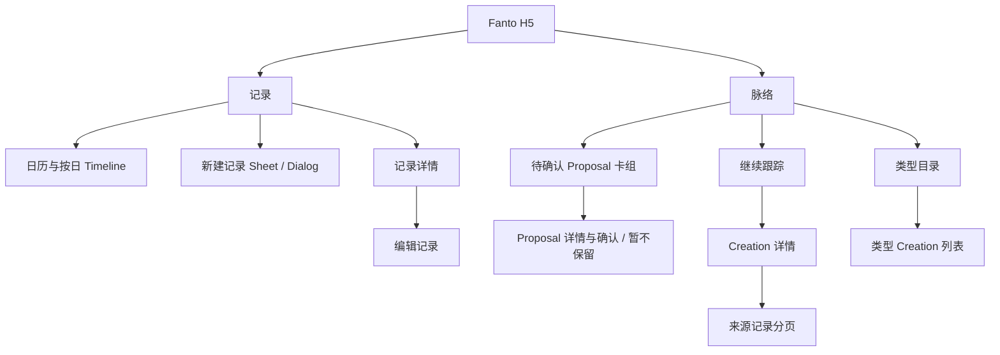

# H5「记录 / 脉络」iOS 与服务端对齐实施方案

> 状态：待实施。本文件只定义重建 `apps/h5` 的范围和设计，不恢复已删除的旧 H5 源码。

## 1. 目标、基线与边界

目标是从零重建独立的 Vite + React + TypeScript H5，使其完整覆盖当前 iOS 的两项主导航、页面层级、状态反馈与主要交互，并以当前已注册的服务端 HTTP API 作为数据真相。

“对齐”指信息架构、文案语义、状态和服务端结果一致；不要求逐像素复制 SwiftUI 系统控件。H5 以纸白底、绿色点缀、清晰时间线为视觉基线；窄屏保留 iOS 的底部两栏，宽屏转为更适合浏览的侧栏与双栏布局。

本期包含：

- 记录：周日为首日的周历 / 月历、按日 Timeline、新建记录、记录详情与编辑、图片和已有音频文件上传。
- 脉络：概览、待确认 Proposal 卡组与详情、确认长期跟踪 / 暂不保留、Creation 详情、来源记录分页、按真实类型浏览完整列表。
- 服务端已提供的 Record、Upload、Media、Creation Read、Creation Proposal 全部读取和写入链路。

本期不扩展：正式认证、浏览器录音、Creation 自动生成、搜索与按状态筛选（服务端未提供）、离线同步。音频在 H5 中使用原生 `<audio>` 播放；不展示 ASR 摘要，和 iOS Timeline 一致。

### 与当前 iOS 的必要校正

当前 iOS 的“新记录”只写入本地 Store，且类型目录页调用能力虽已在服务端注册但文档尚未更新。H5 不能复刻本地假写入：新建、编辑、Proposal 决策必须调用真实服务端，成功结果再更新缓存。这样既沿用 iOS 页面逻辑，也符合“服务端接口为真相源”的目标。

## 2. 接口契约和数据边界

所有请求使用相对 `/api`、`x-user-id` 开发配置、20 秒读取超时；写入失败明确告知“保存状态未确认”，不把失败乐观提交为成功。API JSON 在单一 mapper 层转成 H5 View Model，组件不得读取 snake_case 字段、解析 `content` JSON 字符串或自行拼接媒体 URL。

| 体验 | 接口 | H5 行为 |
| --- | --- | --- |
| 记录列表 / 时间线 | `GET /api/records?limit&cursor` | 首批 100 条供 iOS 对齐的日历标记及所选日 Timeline；继续分页后合并去重。 |
| 记录详情 / 编辑 | `GET/PATCH /api/records/:id` | 编辑携带 `expectedVersion`；409 显示冲突并允许刷新最新版本。 |
| 附件 | `POST /api/uploads` → 直传 URL → `POST /complete` | 仅 `ready` 的 `mediaId` 能提交；图片读取 `/api/media/:id`，音频以原生播放器呈现。 |
| 脉络概览 / 类型 | `GET /api/creations/overview`、`GET /api/creation-kinds`、`GET /api/creations?kindId` | 概览只展示服务返回的至多三条 active；类型页读取完整列表。 |
| 脉络详情 | `GET /api/creations/:id`、`GET /api/creations/:id/records` | 并行读取详情和首批来源；按游标追加。 |
| 待确认卡片 | `GET /api/creation-proposals?status=pending_confirmation`、`GET /:id`、`POST /confirm`、`POST /reject` | 卡组横向决定、纵向切卡；操作成功后同步移除卡片并刷新 overview。 |

记录接口没有“按自然日”或“月度有记录日期”聚合。为保证与 iOS 当前行为相同，本期首批请求 `limit=100`，日历记录点只代表已加载集合；不能将月视图点位解释为全量历史。若产品要求任意历史日的准确空态，应另立服务端需求，为 `GET /api/records` 增加自然日筛选和月度聚合，不能在前端并发逐日查询。

## 3. 信息架构、路由与状态所有权

采用 Hash 路由，避免静态部署刷新路径的回退依赖：

| 路由 | 页面 |
| --- | --- |
| `#/records` | 日历与 Timeline |
| `#/records/new` | 新建呈现层 |
| `#/records/:id` | 记录详情 |
| `#/records/:id/edit` | 编辑呈现层 |
| `#/creations` | 脉络概览 |
| `#/creations/:id` | 脉络详情 |
| `#/creations/kinds/:kindId` | 指定类型列表 |
| `#/proposals/:id` | Proposal 详情呈现层 |

根路由重定向 `#/records`；旧 `topics` 路由重定向 `#/creations`，不恢复 Topic / Contemplate UI。页面状态严格归属：日历只有 `selectedDate`、`calendarMode`、`weekAnchor`、`monthAnchor`；卡组只有 `currentIndex` 与一次拖动手势状态；服务端数据全部归 TanStack Query。

## 4. 响应式界面与设计系统

| 视口 | 导航 | 记录 | 脉络与详情 |
| --- | --- | --- | --- |
| ≤767px | 固定底部“记录 / 脉络”，顶部新建动作 | 日历和 Timeline 单列 | 列表单列，详情全屏推进，Proposal 以卡组呈现 |
| 768–1199px | 左侧窄导航和显式新建按钮 | 最大 720px 单列 | 概览单列，详情内容与来源分区 |
| ≥1200px | 240px 侧栏 | 日历 sticky 左栏 + Timeline 右栏 | 概览卡片两列；Creation 正文左、来源记录右辅助栏 |

共享 tokens 覆盖纸白背景、墨黑正文、层次灰、绿色主色、圆角、阴影、间距与 44px 最小触控目标。移动端使用 `env(safe-area-inset-bottom)`；桌面不用伪造系统 Tab Bar。使用 Lucide 图标映射 iOS 的 SF Symbol 语义，不将图标作为唯一文本说明。

## 5. 关键页面与交互

### 记录

- 周历和月历在同一日历容器内连续展开 / 收起；周日为第一列。翻页只移动对应锚点，选中月历日期后回到该日所在周。
- Timeline 仅显示所选日期，按创建时间倒序；行包含正文、最多三张真实图片缩略图、音频播放时长、时间。无数据、加载失败与重试文案对齐 iOS。
- 新建使用移动 Sheet / 桌面 Dialog，支持文本、图片和已有音频选择。上传过程有进度、取消、失败重试、移除；上传未完成时禁用保存。成功后关闭呈现层、使 records 查询失效并切换到创建当天。
- 详情页可查看完整正文和媒体；编辑保留原媒体、提交 `expectedVersion`，遇到版本冲突不覆盖远端内容。

### 脉络

- 概览的加载、空、失败、下拉/按钮刷新与 iOS 状态语义一致；“继续跟踪”只显示 overview 返回的 active 数据，类型目录只显示服务真实返回类型。
- Proposal 卡组同一手势分类：右滑确认、左滑暂不保留、上/下滑切卡；提供清晰按钮、键盘和屏幕阅读器等价操作。确认成功刷新 overview，拒绝只移除当前 Proposal；失败保留卡片并提示。
- Proposal 详情读取最新详情与 sources，显示类型、标题、洞察、依据和决定动作。
- Creation 详情安全渲染 Markdown，展示状态/更新时间，并行读取来源记录；来源游标分页追加。桌面辅助栏、移动正文下方均复用同一个数据源。

## 6. 数据、错误和可访问性

Query keys 至少为 `records/list`、`record/id`、`creations/overview`、`creations/kinds`、`creations/list/kindId`、`creation/id`、`creation/id/records`、`proposals/pending`、`proposal/id`。写入成功按最小范围失效；记录与 Proposal 写入不采用会掩盖失败的乐观更新。

Markdown 使用 `markdown-it` 后经 DOMPurify 净化。所有日期按浏览器本地时区展示；日期 aria-label 使用完整中文日期。Sheet/Dialog 焦点可关闭且回到触发项；支持键盘激活、可见焦点、`prefers-reduced-motion`（动画缩短为淡入淡出），不以颜色单独表达状态。主文字不低于 16px，常用标签不低于 14px。

## 7. 测试与验收

1. 在 375px、768px、1440px 无横向溢出；导航、内容层级和新建入口符合断点定义。
2. 日历以周日开头，周 / 月 / 选中日期 / Timeline 始终一致；记录点仅来源已加载记录并有明确测试覆盖。
3. Record 创建、上传完成、详情、编辑、版本冲突、媒体播放均走真实接口约定。
4. 脉络概览、类型列表、Proposal、详情、来源分页及确认/拒绝均使用已注册接口，无 mock 数据、失效 Topic 请求或浏览器模型密钥。
5. 覆盖加载、空、错误、重试和 reduced-motion；核心键盘流、焦点恢复和中文 aria-label 可验证。
6. 通过 H5 typecheck/build、针对 mapper 与日期工具的单元测试，以及隔离 API 的浏览器流程测试。浏览器自动化使用模拟/隔离 API，绝不触发真实整理或修改用户数据库。

## 8. 文档同步

实现完成时更新 `docs/clients/h5.md`，并校正 `docs/api/http-api.md` 对 Creation 列表接口已注册、Proposal 接口已注册的过时描述；若因 H5 需求新增服务端日期查询，再同步 API 文档和相关测试。
