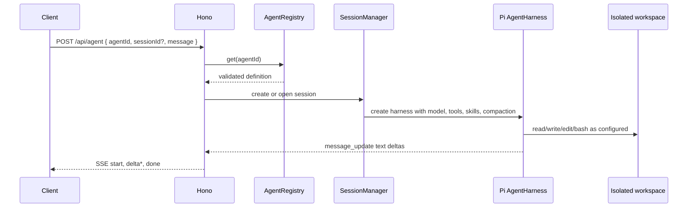

# 配置驱动 Agent 服务设计

## 目标

将 `apps/agent` 演进为一个可由项目根目录 `agents.yaml` 定义多个 Agent 的云端服务：HTTP 请求指定 `agentId`，服务按该配置创建或恢复对应的 Pi `AgentHarness`。Agent 可按配置启用 Pi 自带的 `read`、`write`、`edit`、`bash` 工具，并为后续自定义工具和 Skills 留出明确扩展点。

用户列出了 edit、bash、read 三项，但 Pi 当前的内置文件工具共有四项。为符合项目既有约定，本设计把第四项 `write` 一并纳入支持范围。

## 现状与关键结论

当前 `apps/agent` 在每次请求中创建并关闭 `MemorySessionRepo`，只有单轮上下文。Pi 0.85.1 的 `AgentHarnessOptions` 原生接受 `compaction`，结构为：

```ts
{
  enabled: boolean;
  reserveTokens: number;
  keepRecentTokens: number;
}
```

因此压缩策略可以直接由 YAML 配置。Pi 默认值是 `enabled: true`、`reserveTokens: 16384`、`keepRecentTokens: 20000`；触发条件是已用上下文超过 `model.contextWindow - reserveTokens`。但在现有一次性内存会话中，压缩没有实际价值。本设计将会话改为持久化 SQLite Session，并允许调用方续传 `sessionId`，使压缩与多轮工具调用真正生效。

## 配置文件

配置文件固定为项目根目录 `agents.yaml`，由服务在启动时读取和验证。配置无效时服务拒绝启动；不做热加载，变更通过重启或重新部署生效。配置中禁止出现密钥，模型凭据始终从服务端环境变量读取。

```yaml
version: 1

defaults:
  provider: deepseek
  model: deepseek-v4-pro
  tools: [read, write, edit, bash]
  compaction:
    enabled: true
    reserveTokens: 16384
    keepRecentTokens: 20000

agents:
  - id: general
    description: 通用的中文助手
    systemPrompt: |
      你是一个准确、简洁的中文助手。
    skills: []

  - id: coding
    description: 在隔离工作区内完成代码任务
    systemPrompt: |
      你在隔离工作区中工作。先阅读相关文件，再做最小改动。
    model: deepseek-v4-pro
    tools: [read, write, edit, bash]
    skills: [repo-conventions]
    compaction:
      enabled: true
      reserveTokens: 16384
      keepRecentTokens: 24000
```

`defaults` 与每个 Agent 的可覆盖字段合并，`agents` 是每项显式声明 `id` 的列表，该 `id` 就是 `agentId`。校验规则如下：

- `version` 仅接受 `1`；`agentId` 必须匹配 `[a-z0-9][a-z0-9_-]{0,63}`，且不可重复。
- `provider`、`model`、`systemPrompt` 为非空字符串；启动时用 Pi 的 `builtinModels()` 验证模型存在。
- `tools` 只能是 `read`、`write`、`edit`、`bash`，不重复；空数组显式表示无工具。
- `skills` 只能引用已加载的 Skill ID，不重复。
- `compaction` 三字段完整合并后传给 Pi；`reserveTokens` 与 `keepRecentTokens` 必须为非负安全整数，且二者之和小于模型 context window。`enabled: false` 仍保留数值字段，便于日后直接启用。
- `description` 仅供 `/health` 或未来 Agent 目录使用，不作为模型提示词的一部分。

## HTTP 与会话

接口维持 SSE，但请求体改为：

```json
{ "agentId": "coding", "sessionId": "可选 UUID", "message": "检查当前项目" }
```

`agentId` 必填。没有 `sessionId` 时创建 UUID 并建立一个新的 SQLite Session；传入时恢复该 Session。`start` 事件返回 `sessionId` 与 `agentId`，客户端保存该 ID 用于后续多轮请求。现有 `message` 限制、Bearer Token、心跳、120 秒超时、断连取消和文本 `delta` 事件保持不变。

每个 Session 首次写入 `fanto.agent_config` custom entry，保存 `agentId`。恢复时必须与请求的 `agentId` 相同，否则返回 409；不能把既有对话切换到另一套系统提示词、模型或工具。当前使用服务级 Token，暂不引入用户账户；因此 Session 的访问范围等同于持有该 Token 的调用方。

SQLite Session Repo 使用 `AGENT_SESSION_DB` 指定的专用数据库文件；`AGENT_WORKSPACE_ROOT/<sessionId>` 是该 Session 唯一的工作目录。内存中的 Harness 缓存以 `sessionId` 为键，进程重启后从 SQLite 打开并重建 Harness。运行中的同一 Session 拒绝并发 `prompt`，避免同一分支的工具和消息互相覆盖。



## 工具与隔离

`ToolRegistry` 是唯一创建工具的地方。它按 Agent 配置生成 Pi 的 `createReadTool()`、`createWriteTool()`、`createEditTool()` 与 `createBashTool()`，再将工具数组和同名 `activeToolNames` 传入 Harness。未来自定义工具只需在 Registry 注册，不修改 YAML 读取、会话或 HTTP 层。

工具必须只看见 Session 工作区。文件工具在 `before_tool` 钩子中将每个路径规范化并拒绝工作区外路径、绝对路径逃逸和符号链接逃逸。bash 的 cwd 固定为该工作区，清空继承环境，并应用严格超时和输出上限。

路径检查和危险命令黑名单不足以保护云端宿主机。生产环境启用 `bash` 的前提是每个 Session 使用无特权容器或微虚拟机：只挂载该 Session 工作区、不注入模型/API 密钥、限制 CPU/内存/进程数/磁盘、在超时后销毁。若需要禁止 bash 访问公网，模型请求应通过服务侧代理完成。开发环境可以使用 `NodeExecutionEnv`，但不视为生产隔离方案。

## Skills 与目录

目标目录保持职能边界清晰，并避免为当前单一接口引入无意义的 Service 层：

```text
apps/agent/
├── src/
│   ├── bootstrap/
│   │   ├── app.ts                 # Hono 组装和进程关闭
│   │   └── main.ts
│   ├── http/
│   │   ├── agent-route.ts         # 解析请求、SSE 事件与 HTTP 错误
│   │   └── schemas.ts
│   ├── config/
│   │   ├── agent-config.ts        # YAML 读取、schema、默认项合并
│   │   └── agent-registry.ts      # 按 ID 查询已验证定义
│   ├── harness/
│   │   ├── harness-factory.ts     # Pi options 与 hooks
│   │   ├── session-manager.ts     # SQLite Session、缓存、所有权
│   │   └── workspace.ts           # Session 工作区定位与校验
│   ├── tools/
│   │   ├── registry.ts            # 内置与未来自定义工具注册
│   │   └── builtin.ts             # read/write/edit/bash 的安全包装
│   ├── skills/
│   │   └── loader.ts              # 加载允许的 SKILL.md
│   └── security/
│       └── sandbox-policy.ts      # 命令、路径与隔离边界
├── skills/
│   └── repo-conventions/SKILL.md
├── test/
├── agents.yaml.example
└── README.md
```

项目根 `agents.yaml` 只引用 Skill ID；`SkillLoader` 仅从 `apps/agent/skills/<skillId>/SKILL.md` 加载，解析其 front matter 与全文为 Pi `resources.skills`。YAML 不接受任意本地路径，避免让配置决定可读取的宿主机文件。后续自定义 Skill 与工具分别放入这两个稳定扩展点。

## 不在本次范围

- 多用户认证、按用户隔离 Session、配额、审计存储和限流。
- 配置热加载、配置管理后台或在 HTTP 中新建 Agent。
- 容器/微虚拟机的具体供应商实现；本次定义宿主侧接口和生产启用条件。
- 新的业务数据库、Fanto 既有 Record/Creation API 的接入。

## 成功标准

- 服务只能从根 `agents.yaml` 的已验证配置创建 Harness，未知 `agentId` 返回 404。
- `agentId` 在 HTTP 请求和持久会话之间一致，任意进程重启后会话可恢复。
- 配置可完整表达并实际传递 Pi 的三项压缩参数；多轮会话具备触发自动压缩的条件。
- 每个 Agent 只获得 YAML 指定的内置工具、指定 Skills 和自己的工作区。
- 运行态目录可清楚区分 HTTP、配置、Harness/Session、工具、Skills 和安全策略；添加一种工具或 Skill 不需要修改 Route。
