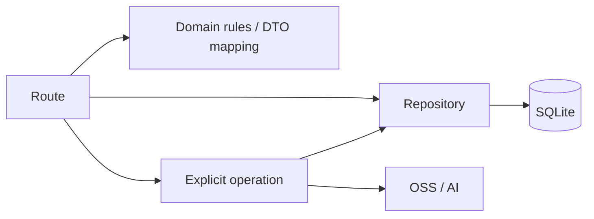

# Server 目录重构设计

## 目标

以当前实际运行的 Record、媒体、Creation、Proposal 为边界重组 `apps/server/src`。取消“为了分层而分层”的 `application/` 与 `modules/`：普通 HTTP CRUD 由 Route 直接调用 Repository；Domain 只保存实体、校验、游标和状态规则。

本次目录重构不改变 HTTP 契约、数据库 schema、SQLite 查询语义或异步处理行为。

## 当前问题

- Record 的实体、游标、Repository 接口在 `modules/record`，SQLite 实现在 `infrastructure/repositories`，路由还同时依赖 `domain/record-content`，同一能力跨三处。
- Creation 的读、Proposal 与遗留 workflow 仓储混在 `modules/creation`；当前运行时未装配的 Agent/Task 代码仍位于正常产品路径。
- `application/media` 只有一个转写操作，`application/memory` 只有一个索引操作；它们并不构成需要独立目录层级的应用服务层。

## 目标目录

```text
src/
├── bootstrap/
│   ├── main.ts                    # 组装运行时依赖、监听与 HTTP 服务
│   └── app.ts                     # Hono 中间件与路由挂载
├── routes/
│   ├── records.ts
│   ├── media.ts
│   ├── creations.ts
│   └── proposals.ts
├── domain/
│   ├── records/
│   │   ├── record.ts
│   │   ├── content.ts
│   │   ├── cursor.ts
│   │   ├── repository.ts
│   │   └── sqlite-repository.ts
│   ├── media/
│   │   ├── sqlite-repository.ts
│   │   └── transcription.ts
│   ├── creations/
│   │   ├── creation-repository.ts
│   │   └── proposal-repository.ts
│   └── memory/
│       └── record-index.ts
├── infrastructure/
│   ├── database/
│   ├── clients/
│   │   ├── oss-client.ts
│   │   ├── audio-client.ts
│   │   ├── image-client.ts
│   │   └── embeddings-client.ts
│   ├── queue/
│   ├── logging/
│   └── time.ts
├── listeners/
│   ├── image-understanding.listener.ts
│   └── record-vector.listener.ts
├── migrations/
└── scripts/
```

## 调用规则



- Route 负责 HTTP 校验、用户身份读取、DTO 映射和错误响应；共享的请求头解析放在 `routes/request-user.ts`。
- CRUD Route 可直接调用 Repository；不创建只转发调用的 Service。
- Domain 不持有 HTTP 概念；它表达输入校验、游标、状态转换、实体类型及所属 Repository。Repository 的 SQLite 查询与事务实现与同域规则放在一起，不再放入全局 `infrastructure/repositories`。
- `transcription.ts`、`record-index.ts` 是有外部副作用的 operation，不命名为 Service，也不为简单 CRUD 引入中间层。
- `infrastructure/clients` 存放所有对外依赖客户端，包括 OSS、音频转写、图像理解和 Embedding；其余 `infrastructure` 只容纳 SQLite 初始化、队列、日志等技术适配器。

## 历史主动创作处理

旧 Agent、Task 与 proactive workflow 已删除。当前业务服务只包含已挂载的 Record、Media、Creation 和 Proposal 能力；未来恢复自动生成时以新的 Creation/Proposal 数据模型重新设计，不复用旧路由。

## 成功标准

- Route 到 SQLite CRUD 的调用链不经过通用 Service。
- 每个运行态业务文件可由目录判断所属域。
- 运行态代码不再导入 `application/`、`modules/` 或 `infrastructure/repositories/`。
- Agent 遗留代码不会被生产入口装配或误当作当前能力。
- HTTP、迁移、Record 异步队列和 iOS 已使用接口无行为回归。
