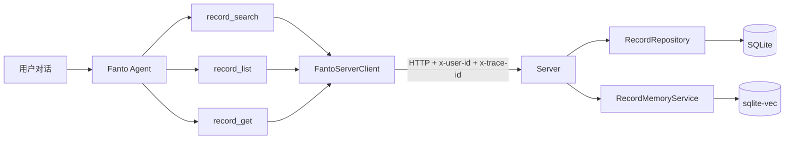
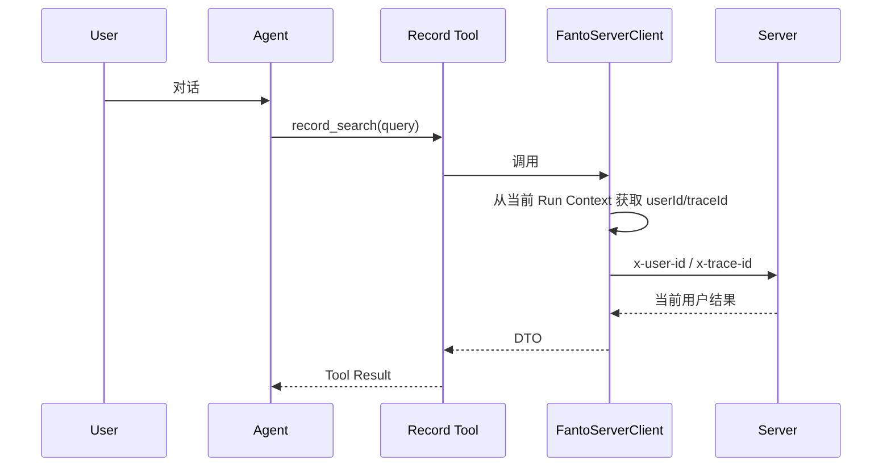

# Fanto Agent Record Tools & OSS Region 迭代设计

## 1. 背景与目标

本轮迭代服务于 `docs/product-direction.md` 中的阶段一「可信记忆」。

产品 P0 不是继续堆叠 AI 功能，而是让 Fanto 在用户主动对话时能够：

1. 准确找到与当前问题真正相关的历史 Record；
2. 在需要时读取 Record 原文和最近记录；
3. 保持来源可追溯，区分“用户记录过”与“Fanto 推断”；
4. 不为了表现“记得我”而机械引用历史。

因此本轮重点是打通：



同时修正当前 OSS Region 与 Endpoint 不一致的问题。

---

## 2. 当前实现确认

### 2.1 Record HTTP

Server 已有：

- `GET /api/records?limit=&cursor=`
- `GET /api/records/:id`

因此本轮不新增重复的 Get/List API，只在 Agent Tool 层复用。

当前缺少的是：

- Record 语义检索 HTTP API

### 2.2 Record 向量记忆

`apps/server/src/domain/memory/record-index.ts` 已实现：

- Record 创建/更新后的向量索引；
- `RecordMemoryService.search(userId, query, limit)`；
- `RecordMemoryService.getRecords(...)`。

因此本轮不重做 Embedding / sqlite-vec 基础设施。

当前问题：

`RecordMemoryService.search()` 先从全局 `record_vectors` 取 KNN 候选，再通过 `vector_items.user_id` 过滤用户。

这不会直接泄漏其他用户 Record，但多用户数据增多后，其他用户的高相似向量可能挤占候选，从而导致当前用户本应命中的结果没有进入候选集。

在 `record_search` 成为正式 Agent 能力之前，应修正为真正的 user-scoped retrieval。

### 2.3 Agent Harness

当前 `apps/agent`：

- 独立 Hono + Pi AgentHarness 服务；
- Session 固定绑定 `userId`；
- 每次执行已有 `userId / taskId / traceId` Run Context；
- Tool 目前仅支持：
  - `read`
  - `write`
  - `edit`
  - `bash`

当前不存在：

- Agent → Server HTTP Client；
- 自定义 Fanto 业务 Tool；
- Record Tool 配置能力。

### 2.4 OSS

当前实际配置：

```text
apps/server/.env
OSS_ENDPOINT=oss-rg-china-mainland.aliyuncs.com
OSS_REGION 未配置
```

而代码默认：

```ts
region: process.env.OSS_REGION ?? "oss-cn-hangzhou"
```

`.env.example` 同样还是：

```env
OSS_REGION=oss-cn-hangzhou
OSS_ENDPOINT=https://oss-cn-hangzhou.aliyuncs.com
```

因此当前本地运行时存在：

```text
Region:   oss-cn-hangzhou
Endpoint: oss-rg-china-mainland.aliyuncs.com
```

配置不一致。

目标统一为：

```env
OSS_REGION=oss-rg-china-mainland
OSS_ENDPOINT=https://oss-rg-china-mainland.aliyuncs.com
```

---

## 3. 本轮范围

### P0

实现三个 Agent Record Tools：

- `record_get`
- `record_list`
- `record_search`

其中：

- Get/List 复用现有 Server API；
- Search 新增 Server HTTP API；
- Agent 不直接访问业务数据库；
- Agent 不直接访问 sqlite-vec；
- `userId` 不作为 LLM Tool 参数暴露；
- 用户隔离由 Run Context → HTTP Client → Server 完成。

同时：

- 修正 Record RAG 用户范围；
- 增加 Agent 侧统一 Server Client；
- 校准 main Agent 的最小“可信记忆”行为；
- 修正 OSS Region 配置。

### 本轮不做

- Hybrid Search；
- reranker；
- 独立 Memory 数据表；
- Record create/update/delete Tool；
- Creation / Proposal 自动生成；
- 主动提醒与 heartbeat；
- 正式认证；
- 复杂 Record list filter；
- 将 score / embedding / threshold 等检索内部参数暴露给模型。

---

## 4. Server 设计

### 4.1 保留现有 Record API

直接复用：

```http
GET /api/records?limit=20&cursor=
GET /api/records/:id
```

不再为 Agent 单独复制一套 API。

### 4.2 新增 Record Search API

建议：

```http
POST /api/records/search
```

Request：

```json
{
  "query": "AI Coding 执行偏差",
  "limit": 10
}
```

约束：

- `query` 必填、去空格后不能为空；
- `limit` 默认 10；
- `limit` 限制在合理范围，例如 1–20；
- `userId` 只从 `x-user-id` 获取。

Response 保持现有统一 envelope：

```json
{
  "success": true,
  "result": {
    "data": [
      {
        "recordId": "...",
        "eventAt": "...",
        "snippet": "...",
        "content": {
          "text": "...",
          "blocks": []
        }
      }
    ]
  },
  "errorCode": null,
  "errorMsg": null
}
```

重点：

- 返回 Record 业务 ID；
- 返回足够支持 Agent 判断和引用的正文；
- 保留 `eventAt`；
- 不把底层 sqlite-vec distance 当成产品语义上的置信度；
- Agent 如需单条完整详情，继续调用 `record_get`。

### 4.3 Route 依赖

遵循当前 Server 架构：

```text
Route
  ↓
RecordMemoryService / RecordRepository
```

不创建只做透传的 Service 层。

`createRecordRoutes` 可以增加 memory 依赖，或将 search 独立为同一 Record 路由模块内的能力。

---

## 5. Record Search 用户范围修正

当前实现：

```text
全局 KNN limit * 4
    ↓
vector_items 按 userId 过滤
    ↓
取前 limit
```

问题：

当其他用户的相似向量大量占据全局 Top-K 时，当前用户的相关向量可能根本没有进入候选集。

目标：

```text
当前 user 的可检索 vector item
    ↓
user-scoped KNN
    ↓
Top-K
```

实现时应根据 sqlite-vec 当前能力选择最简单、稳定的方案。

如果需要调整当前空库 schema，可以直接修改 migration 基线；项目明确不承担历史 SQLite 原地升级兼容。

调整后通过：

```bash
pnpm vector:rebuild
```

重建索引。

必须新增多用户测试，验证：

- 用户 A 的相似结果不会挤掉用户 B 自己的结果；
- Search 始终只返回当前用户 Record。

---

## 6. Agent Server Client

新增统一 HTTP Client，建议位置：

```text
apps/agent/src/
├── clients/
│   └── fanto-server-client.ts
└── tools/
    ├── record-get.ts
    ├── record-list.ts
    ├── record-search.ts
    └── registry.ts
```

Client 负责：

- `FANTO_SERVER_BASE_URL`；
- request timeout；
- `x-user-id`；
- `x-trace-id`；
- JSON envelope 解包；
- 非 2xx / Server errorCode 转换；
- 网络错误统一处理。

新增环境变量：

```env
FANTO_SERVER_BASE_URL=http://127.0.0.1:3000
```

Tool 中不要重复编写 `fetch()` 和 Header 逻辑。

---

## 7. 用户上下文

LLM 不允许传：

```text
userId
```

三个 Tool 的参数都只描述业务意图。

执行链：



现有 `createRunContext()` 已经在每次 prompt 时写入 `userId / traceId`，本轮直接复用。

不要另建第二套 Session 用户状态。

---

## 8. Agent Tools

### 8.1 record_get

用途：

> 已经知道具体 Record ID，需要读取完整原始记录。

Schema：

```text
record_get(recordId)
```

调用：

```http
GET /api/records/:id
```

Tool description 要强调：

- 只在已有 ID 时使用；
- 不负责搜索历史。

### 8.2 record_list

用途：

> 最近记录了什么、按时间浏览最近 Record。

第一版保持最小参数：

```text
record_list(limit = 20, cursor?)
```

调用：

```http
GET /api/records?limit=&cursor=
```

暂不新增 status / date range 等 Server 过滤能力。

### 8.3 record_search

用途：

> 用户过去有没有记录过某主题、人物、经历、判断或想法。

Schema：

```text
record_search(query, limit = 10)
```

调用：

```http
POST /api/records/search
```

不向 LLM 暴露：

- embedding model；
- topK 内部倍率；
- threshold；
- vector distance；
- rerank 开关。

---

## 9. Tool Registry 与 Agent 配置

当前 `agent-config.ts` 的 Tool enum 固定为：

```text
read / write / edit / bash
```

本轮扩展为支持：

```text
record_get
record_list
record_search
```

`ToolRegistry` 根据配置构建对应 AgentHarnessTool。

Agent 权限继续由 `agents.yaml` 显式声明。

建议：

### main

拥有：

```yaml
tools: [record_get, record_list, record_search]
```

### coding

仍保持：

```yaml
tools: [read, write, edit, bash]
```

不默认给 coding Agent 用户生活历史访问能力。

---

## 10. main Agent 最小行为校准

当前 main Prompt 只是：

> 你是准确、简洁的中文助手。

本轮应补充最少的 Memory 使用原则，而不是一次构建复杂人格系统。

建议原则：

1. 当前问题确实可能受历史记录帮助时再搜索；
2. 不为了表现“记得用户”而强行引用历史；
3. “用户记录过的事实”和“Agent 的推断”必须区分；
4. 有引用时保留 Record 来源；
5. 搜索不到时不要假装记得；
6. 相关性不足时优先回答当前问题。

这直接对应产品方向：

> 默认安静，长期记得，偶尔有用。

---

## 11. OSS 配置变更

统一修改：

### apps/server/.env

新增：

```env
OSS_REGION=oss-rg-china-mainland
```

当前 Endpoint 保持：

```env
OSS_ENDPOINT=oss-rg-china-mainland.aliyuncs.com
```

### apps/server/.env.example

调整为：

```env
OSS_REGION=oss-rg-china-mainland
OSS_ENDPOINT=https://oss-rg-china-mainland.aliyuncs.com
```

### apps/server/src/bootstrap/config.ts

默认值：

```ts
process.env.OSS_REGION ?? "oss-rg-china-mainland"
```

目标是避免出现 Region 与 Endpoint 分属两套地域配置。

---

## 12. 测试

### Server

Record Search：

- 正常中文语义搜索；
- 英文 query；
- 空 query；
- limit 边界；
- 无结果；
- user isolation；
- 多用户候选污染测试。

现有 Record Get/List 不重写测试，只在 Agent 侧验证调用契约。

### Agent Client

验证：

- 自动带 `x-user-id`；
- 有 traceId 时带 `x-trace-id`；
- Server 4xx/5xx；
- 网络失败；
- invalid envelope；
- timeout。

### Tool

验证：

```text
record_get → 正确 URL + recordId
record_list → limit/cursor
record_search → query/limit
```

确保 Tool 参数不允许传 `userId`。

### Agent 行为 Smoke Test

Case 1：

```text
“我最近记录了什么？”
→ record_list
```

Case 2：

```text
“我之前有没有思考过 AI Coding 的问题？”
→ record_search
```

Case 3：

```text
“详细看看刚才搜索到的第一条。”
→ record_get
```

---

## 13. 验证命令

至少执行：

```bash
pnpm --filter @fanto/server typecheck
pnpm --filter @fanto/server test

pnpm --filter @fanto/agent typecheck
pnpm --filter @fanto/agent test
pnpm --filter @fanto/agent build
```

如修改向量 schema：

```bash
pnpm vector:rebuild
```

OSS 需要真实验证：

- Server 正常启动；
- 生成 PUT signed URL；
- 上传成功；
- complete 成功；
- GET media 跳转 signed URL 成功。

---

## 14. Definition of Done

本轮完成需满足：

- Server 现有 Record Get/List API 被 Agent 复用；
- 新增 Record Search HTTP API；
- Search 真正按当前用户范围召回；
- Agent 有统一 FantoServerClient；
- `record_get` 可用；
- `record_list` 可用；
- `record_search` 可用；
- Tool 不暴露 userId；
- main Agent 可使用三个 Record Tool；
- coding Agent 不默认获得 Record Tool；
- main Prompt 包含最小可信记忆行为约束；
- OSS Region / Endpoint 配置统一；
- Server / Agent typecheck 与 test 通过；
- 三个典型 Prompt Tool Selection 验证通过。

---

## 15. 后续衔接

本轮之后，阶段一「可信记忆」下一步应优先补：

1. 历史引用的前端来源展示；
2. 用户纠正错误记忆；
3. 用户排除某条 Record 不再参与 Memory；
4. 对 Record Search 质量做真实数据集验证；
5. 再进入 Proposal / Creation 的「克制发现」。

不要在检索链路尚未稳定时提前扩展主动 Agent 和复杂长期记忆抽象。
